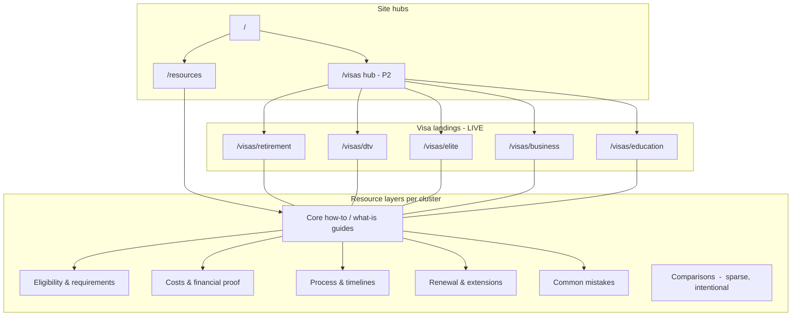

# SEO content roadmap  -  Thailand visa platform

Long-term topical authority plan aligned with live routes (`/visas/*`, `/resources/*`), `contentTopicTaxonomy` (`lib/content/related.ts`), and `EDITORIAL_WORKFLOW.md`.

**Operations:** launch sequencing, reviews, analytics cadence → [LAUNCH_AND_GROWTH_SYSTEM.md](./LAUNCH_AND_GROWTH_SYSTEM.md)

**Status key:** **LIVE** · **P1** (next ship) · **P2** (queue) · **P3** (later) · **STUB** (index only - publish or unlink before linking)

---

## Strategic intent

| Goal | How this roadmap supports it |
|------|------------------------------|
| **Long-tail SEO** | One primary question per URL; cluster-specific slugs, not mega-guides |
| **Semantic authority** | Every article links to a **visa landing** + siblings in the same topic cluster |
| **AI-search visibility** | FAQ-first answers, extractable leads, Article + FAQPage schema per guide |
| **Scalable publishing** | Cluster-complete phases before starting the next visa product |

**Avoid:** Random posts, duplicate intent vs visa H1s, comparison spam, unpublished URLs in `related` or schema.

---

## Information architecture

**Linking rule (every new article):** ≥1 visa page in cluster · ≥1 published sibling article · no STUB hrefs in live `related` blocks.

---

## Content prioritization strategy

### Priority tiers

| Tier | Rule | Example |
|------|------|---------|
| **P1** | Closes a gap on a **LIVE visa** with client demand or STUB already linked | DTV what-is, process timelines |
| **P2** | Deepens a cluster with **one clear intent** after P1 core guide exists | Retirement renewal guide |
| **P3** | Comparison or cross-cluster only when it **reduces confusion** | DTV vs tourist visa |
| **Defer** | Legal-risk, duplicate H1, or no visa tie-in | Generic “living in Thailand” |

### Cluster completion rule

> Finish **Phase A** (core + process + one eligibility) for a cluster before opening the next cluster’s Phase A.

Exception: **process** articles (`how-long-does-thai-visa-take`) serve all clusters - ship once in Foundation phase.

### Cannibalization check

| If the query is… | Publish on… |
|------------------|-------------|
| “Thailand retirement visa requirements” | Visa page + optional deep guide - not two competing H1s |
| “How to get retirement visa step by step” | Resource guide (`how-to-…`) |
| “Retirement vs Elite Thailand” | Single comparison article linked from both visa pages |

---

## Authority-building sequencing

| Phase | Timeline | Outcome |
|-------|----------|---------|
| **0  -  Baseline** | Now | 5 visa landings LIVE · 1 resource LIVE · 2 STUBs |
| **1  -  Foundation** | Months 1–2 | Process hub article LIVE · DTV + retirement cores · fix STUB links |
| **2  -  Cluster depth** | Months 3–5 | Retirement + DTV complete Phase B (eligibility, renewal, mistakes) |
| **3  -  Secondary clusters** | Months 6–8 | Business + education Phase A–B · Elite Phase A |
| **4  -  Hub & comparisons** | Months 9–12 | `/visas` hub LIVE · 3–4 high-intent comparisons · quarterly refresh cycle |

### Publishing cadence (team of 1–2 writers + reviewer)

| Phase | Articles / month | Visa page reviews |
|-------|------------------|-------------------|
| Foundation | 2 | 1 cluster / month |
| Growth | 2–4 | Quarterly all visas |
| Maintenance | 1–2 updates + 0–1 net new | As rules change |

Aligns with `EDITORIAL_WORKFLOW.md`.

---

## Cross-cluster content (shared)

These support **all** visa clusters and belong in the **process** / **comparisons** taxonomy - not inside one visa silo only.

| Slug (proposed) | Type | Priority | Notes |
|-----------------|------|----------|-------|
| `how-long-does-thai-visa-take` | Process | **P1 STUB** | Ship first; link from every visa `relatedResources` |
| `thailand-visa-extension-guide` | Process / renewal | P2 | 90-day reporting, extensions - nationality-specific caveats |
| `thailand-visa-document-checklist` | Process | P2 | Generic checklist; link out to visa-specific financial guides |
| `common-thailand-visa-mistakes` | Mistake-prevention | P2 | Cross-visa; link to cluster mistake articles when they exist |
| `tourist-visa-vs-long-stay-thailand` | Comparison | P3 | Funnel to DTV / retirement / Elite - not generic travel |
| `dtv-vs-tourist-visa-thailand` | Comparison | P2 | High intent for DTV cluster |
| `retirement-visa-vs-thailand-elite` | Comparison | P3 | After both clusters Phase A complete |

**FAQ opportunity (homepage / resources index):** Keep homepage FAQ general; add cluster-specific FAQs only on visa pages and articles.

---

# Cluster: Retirement Visa

**Topic ID:** `retirement` · **Landing:** `/visas/retirement` **LIVE**  
**Tags:** `retirement`, `retirement visa`, `long-stay`, `age 50`  
**Related visas (default):** DTV, Elite

## Core landing pages

| Asset | Path | Status |
|-------|------|--------|
| Retirement visa service page | `/visas/retirement` | **LIVE**  -  quarterly review |

## Supporting articles

| Slug | Type | Priority | Search intent (summary) |
|------|------|----------|-------------------------|
| `how-to-get-thailand-retirement-visa` | Core how-to | **LIVE** | Step-by-step application prep |
| `thailand-retirement-visa-requirements` | Eligibility | P2 | Age, financial proof, insurance - embassy variance |
| `retirement-visa-financial-requirements-thailand` | Eligibility / cost | P2 | Bank balance vs pension routes |
| `thailand-retirement-visa-renewal` | Renewal | P2 | Extensions, annual reporting, in-country steps |
| `retirement-visa-processing-time` | Process | P3 | Cluster-specific timeline (links to global process guide) |
| `retirement-visa-mistakes-to-avoid` | Mistake-prevention | P2 | Incomplete funds proof, wrong insurance, timing |
| `retirement-visa-for-couples-thailand` | Eligibility | P3 | Spouse / dependent angles |

## FAQ opportunities (article or visa page additions)

Pull from support channels; add to visa FAQ or dedicated guide FAQ:

- Can I apply from inside Thailand on a tourist visa?
- Does my nationality change the bank amount required?
- Can I use a combination of pension + savings?
- What happens if I am 49 turning 50 this year?
- Do I need a police clearance certificate?

## Comparison articles

| Slug | Priority | Link from |
|------|----------|-----------|
| `retirement-visa-vs-thailand-elite` | P3 | Retirement + Elite visa pages |
| `retirement-visa-vs-dtv-thailand` | P3 | For remote workers wrongly considering retirement |

## Process guides

| Slug | Priority |
|------|----------|
| `how-long-does-thai-visa-take` | **P1** (shared; retirement section in body) |
| `thailand-retirement-visa-application-process` | P3  -  only if not duplicated by LIVE how-to |

## Cost articles

| Slug | Priority | Framing |
|------|----------|---------|
| `thailand-retirement-visa-cost` | P2 | Embassy fees + insurance + proof costs - no fixed “package price” unless you publish offers |
| `retirement-visa-bank-balance-requirements` | P2 | Eligibility-first; typical figures as examples |

## Eligibility articles

| Slug | Priority |
|------|----------|
| `who-qualifies-thailand-retirement-visa` | P2 |
| `retirement-visa-health-insurance-requirements` | P2 |

## Renewal questions

| Slug | Priority |
|------|----------|
| `thailand-retirement-visa-renewal` | P2 |
| `retirement-visa-90-day-reporting` | P3 |

## Mistake-prevention articles

| Slug | Priority |
|------|----------|
| `retirement-visa-mistakes-to-avoid` | P2 |
| `retirement-visa-financial-proof-errors` | P3 |

### Retirement cluster sequence

1. **P1**  -  Publish STUB `how-long-does-thai-visa-take` (unblocks visa related links)  
2. **P2**  -  `thailand-retirement-visa-requirements` + `thailand-retirement-visa-renewal`  
3. **P2**  -  `retirement-visa-mistakes-to-avoid` + cost/eligibility split articles  
4. **P3**  -  Comparisons and couple-specific guides  

**Cluster complete when:** 1 LIVE how-to + 4–6 supporting articles + visa page FAQ refreshed + all `related` targets LIVE.

---

# Cluster: DTV Visa

**Topic ID:** `dtv` · **Landing:** `/visas/dtv` **LIVE**  
**Tags:** `dtv`, `digital nomad`, `remote work`, `destination thailand`  
**Related visas (default):** Retirement, Business

## Core landing pages

| Asset | Path | Status |
|-------|------|--------|
| DTV visa service page | `/visas/dtv` | **LIVE** |

## Supporting articles

| Slug | Type | Priority | Search intent |
|------|------|----------|---------------|
| `what-is-thailand-dtv-visa` | Core what-is | **P1 STUB** | Definition, who it fits, vs tourist |
| `how-to-apply-thailand-dtv-visa` | Core how-to | P2 | Application steps after what-is ships |
| `thailand-dtv-visa-requirements` | Eligibility | P2 | Activity proof, income, documents |
| `dtv-visa-income-requirements` | Eligibility | P2 | Financial thresholds (typical / embassy-specific) |
| `thailand-dtv-visa-duration` | Process | P2 | Stay length, entry rules |
| `dtv-visa-mistakes-to-avoid` | Mistake-prevention | P2 | Wrong activity proof, tourist misuse |
| `remote-work-thailand-dtv-visa` | Eligibility | P3 | Audience-specific angle |

## FAQ opportunities

- Who qualifies for DTV vs a tourist visa?
- Can freelancers use the DTV?
- Do I need a Thai bank account?
- Can I work for a foreign employer while on DTV?
- Where do I apply - embassy vs in-country?

## Comparison articles

| Slug | Priority |
|------|----------|
| `dtv-vs-tourist-visa-thailand` | **P2** |
| `dtv-vs-thailand-business-visa` | P3 |
| `dtv-vs-retirement-visa-thailand` | P3 |

## Process guides

| Slug | Priority |
|------|----------|
| `how-long-does-thai-visa-take` | **P1** (DTV subsection) |
| `thailand-dtv-visa-application-timeline` | P3  -  if not merged into how-to |

## Cost articles

| Slug | Priority |
|------|----------|
| `thailand-dtv-visa-cost` | P2  -  fees + proof costs |
| `dtv-visa-financial-proof-explained` | P2 |

## Eligibility articles

| Slug | Priority |
|------|----------|
| `thailand-dtv-visa-requirements` | P2 |
| `who-qualifies-for-dtv-thailand` | P2 |

## Renewal questions

| Slug | Priority |
|------|----------|
| `thailand-dtv-visa-extension` | P2 |
| `dtv-visa-renewal-documents` | P3 |

## Mistake-prevention articles

| Slug | Priority |
|------|----------|
| `dtv-visa-mistakes-to-avoid` | P2 |
| `using-tourist-visa-instead-of-dtv` | P3  -  comparison/mistake hybrid |

### DTV cluster sequence

1. **P1**  -  `what-is-thailand-dtv-visa` (STUB → LIVE)  
2. **P2**  -  `how-to-apply-thailand-dtv-visa` + `dtv-vs-tourist-visa-thailand`  
3. **P2**  -  requirements, cost, mistakes, extension  
4. **P3**  -  remote-work angle and business comparisons  

**Cluster complete when:** what-is + how-to + 4 supports LIVE; visa page links only to published URLs.

---

# Cluster: Elite Visa

**Topic ID:** `elite` · **Landing:** `/visas/elite` **LIVE**  
**Tags:** `elite`, `thailand elite`, `premium`, `membership`  
**Related visas (default):** Retirement, DTV

## Core landing pages

| Asset | Path | Status |
|-------|------|--------|
| Thailand Elite visa page | `/visas/elite` | **LIVE** |

## Supporting articles

| Slug | Type | Priority | Search intent |
|------|------|----------|---------------|
| `what-is-thailand-elite-visa` | Core what-is | P2 | Membership model, benefits overview |
| `thailand-elite-visa-cost` | Cost | **P2** | Package tiers - clear “prices change” disclaimer |
| `thailand-elite-visa-requirements` | Eligibility | P2 | Who typically considers Elite |
| `how-to-apply-thailand-elite-visa` | Core how-to | P3 | After what-is + cost |
| `elite-visa-vs-long-stay-options` | Comparison | P3 | Elite vs retirement path |
| `thailand-elite-visa-benefits` | Supporting | P3 | Privileges without sales tone |
| `elite-visa-mistakes-to-avoid` | Mistake-prevention | P3 | Wrong package, outdated agents |

## FAQ opportunities

- How is Elite different from a retirement visa?
- What does membership include vs a standard visa?
- Can family members be included?
- How long does Elite approval take?
- Is Elite a visa or a privilege program?

## Comparison articles

| Slug | Priority |
|------|----------|
| `retirement-visa-vs-thailand-elite` | P3 |
| `thailand-elite-vs-dtv` | P3 |

## Process guides

| Slug | Priority |
|------|----------|
| `how-long-does-thai-visa-take` | P1 (Elite subsection - often agent-led) |
| `thailand-elite-application-process` | P3 |

## Cost articles

| Slug | Priority |
|------|----------|
| `thailand-elite-visa-cost` | **P2**  -  primary commercial intent |
| `elite-visa-payment-options` | P3 |

## Eligibility articles

| Slug | Priority |
|------|----------|
| `thailand-elite-visa-requirements` | P2 |
| `who-should-consider-thailand-elite` | P3 |

## Renewal questions

| Slug | Priority |
|------|----------|
| `thailand-elite-membership-renewal` | P3 |
| `elite-visa-privilege-expiry` | P3 |

## Mistake-prevention articles

| Slug | Priority |
|------|----------|
| `elite-visa-mistakes-to-avoid` | P3 |
| `unauthorized-elite-visa-agents` | P3  -  trust angle |

### Elite cluster sequence

1. **P2**  -  `what-is-thailand-elite-visa` + `thailand-elite-visa-cost` (high-intent pair)  
2. **P2**  -  requirements + mistakes  
3. **P3**  -  how-to, comparisons, renewal  
*Note: Smaller search volume than retirement/DTV - fewer articles, higher quality.*

**Cluster complete when:** 4–5 LIVE articles + cost guide authoritative + comparisons to retirement only after both clusters ready.

---

# Cluster: Business Visa

**Topic ID:** `business` · **Landing:** `/visas/business` **LIVE**  
**Tags:** `business`, `work visa`, `employment`, `company`  
**Related visas (default):** DTV, Education

## Core landing pages

| Asset | Path | Status |
|-------|------|--------|
| Thailand business visa page | `/visas/business` | **LIVE** |

## Supporting articles

| Slug | Type | Priority | Search intent |
|------|------|----------|---------------|
| `thailand-business-visa-requirements` | Eligibility | P2 | Employer docs, role, company |
| `how-to-get-thailand-business-visa` | Core how-to | P2 | Application flow |
| `thailand-work-permit-vs-business-visa` | Comparison | P2 | Critical confusion reducer |
| `business-visa-documents-from-employer` | Process | P2 | HR letter, registration |
| `thailand-business-visa-processing-time` | Process | P3 | Links to global timeline |
| `business-visa-mistakes-to-avoid` | Mistake-prevention | P2 | Wrong visa category, missing WP plan |
| `thailand-business-visa-for-founders` | Eligibility | P3 | Startup / BOI angle if accurate |

## FAQ opportunities

- Do I need a work permit as well as a visa?
- Can I work remotely for a foreign company on a business visa?
- What documents does my employer provide?
- Can I change employers on the same visa?
- Business visa vs Non-Immigrant B - what clients actually ask

## Comparison articles

| Slug | Priority |
|------|----------|
| `thailand-work-permit-vs-business-visa` | **P2** |
| `business-visa-vs-dtv-thailand` | P3 |
| `business-visa-vs-education-visa` | P3 |

## Process guides

| Slug | Priority |
|------|----------|
| `how-long-does-thai-visa-take` | P1 |
| `thailand-business-visa-application-steps` | P3  -  merge into how-to if possible |

## Cost articles

| Slug | Priority |
|------|----------|
| `thailand-business-visa-cost` | P3  -  embassy fees; avoid implying WP fees |
| `employer-sponsored-visa-costs` | P3 |

## Eligibility articles

| Slug | Priority |
|------|----------|
| `thailand-business-visa-requirements` | P2 |
| `who-needs-thailand-business-visa` | P3 |

## Renewal questions

| Slug | Priority |
|------|----------|
| `thailand-business-visa-renewal` | P2 |
| `changing-jobs-thailand-visa` | P3 |

## Mistake-prevention articles

| Slug | Priority |
|------|----------|
| `business-visa-mistakes-to-avoid` | P2 |
| `working-without-work-permit-risks` | P3  -  careful, factual tone |

### Business cluster sequence

1. **P2**  -  `thailand-business-visa-requirements` + `how-to-get-thailand-business-visa`  
2. **P2**  -  `thailand-work-permit-vs-business-visa` + mistakes  
3. **P3**  -  renewal, founder angle, DTV comparison  

**Cluster complete when:** work-permit comparison LIVE + core how-to/requirements + visa page sync.

---

# Cluster: Education Visa

**Topic ID:** `education` · **Landing:** `/visas/education` **LIVE**  
**Tags:** `education`, `student`, `study`  
**Related visas (default):** Business, Retirement

## Core landing pages

| Asset | Path | Status |
|-------|------|--------|
| Thailand education visa page | `/visas/education` | **LIVE** |

## Supporting articles

| Slug | Type | Priority | Search intent |
|------|------|----------|---------------|
| `thailand-education-visa-requirements` | Eligibility | P2 | Enrollment, school docs |
| `how-to-get-thailand-education-visa` | Core how-to | P2 | Application via school |
| `thailand-student-visa-documents` | Process | P2 | Letter, passport, photos |
| `education-visa-mistakes-to-avoid` | Mistake-prevention | P2 | Enrollment gaps, wrong school |
| `thailand-education-visa-for-language-schools` | Eligibility | P3 | Language course angle |
| `education-visa-vs-tourist-visa` | Comparison | P3 | Study intent |
| `thailand-education-visa-renewal` | Renewal | P2 | Semester extensions |

## FAQ opportunities

- Do I need a confirmed offer letter before applying?
- Can I work part-time on an education visa?
- How long is the visa valid per enrollment?
- Can parents accompany students?
- What if my course is shorter than one year?

## Comparison articles

| Slug | Priority |
|------|----------|
| `education-visa-vs-tourist-visa` | P3 |
| `education-visa-vs-business-visa` | P3 |

## Process guides

| Slug | Priority |
|------|----------|
| `how-long-does-thai-visa-take` | P1 |
| `thailand-education-visa-timeline` | P3 |

## Cost articles

| Slug | Priority |
|------|----------|
| `thailand-education-visa-cost` | P3 |
| `student-visa-financial-proof` | P2 |

## Eligibility articles

| Slug | Priority |
|------|----------|
| `thailand-education-visa-requirements` | P2 |
| `who-qualifies-thailand-student-visa` | P3 |

## Renewal questions

| Slug | Priority |
|------|----------|
| `thailand-education-visa-renewal` | P2 |
| `extending-student-visa-thailand` | P3 |

## Mistake-prevention articles

| Slug | Priority |
|------|----------|
| `education-visa-mistakes-to-avoid` | P2 |
| `enrollment-letter-problems` | P3 |

### Education cluster sequence

1. **P2**  -  requirements + how-to + student documents  
2. **P2**  -  renewal + mistakes + financial proof  
3. **P3**  -  language-school angle, comparisons  

**Cluster complete when:** 5–6 articles LIVE; school-document guide linked from visa page.

---

## 12-month publishing calendar (summary)

| Month | Focus | Target ships |
|-------|--------|--------------|
| 1 | Foundation + STUBs | `how-long-does-thai-visa-take`, `what-is-thailand-dtv-visa` |
| 2 | Retirement depth | requirements, renewal, mistakes |
| 3 | DTV depth | how-to apply, DTV vs tourist, requirements |
| 4 | Retirement cost/eligibility | bank balance, insurance, cost |
| 5 | Business core | requirements, how-to, work permit comparison |
| 6 | Education core | requirements, how-to, documents |
| 7 | Elite core | what-is, cost, requirements |
| 8 | Cross-cutting | extension guide, common mistakes (site-wide) |
| 9 | Comparisons batch | retirement vs elite, DTV vs business (selective) |
| 10 | Hub + index | `/visas` hub LIVE, resources index refresh |
| 11–12 | Updates + gaps | Search Console-driven FAQ additions, `updatedAt` passes |

Adjust ±1 month for capacity; **do not** publish ahead of cluster sequence without clearing STUB links.

---

## Future expansion opportunities

### Product & architecture

| Opportunity | SEO / AI benefit |
|-------------|------------------|
| **`/visas` hub LIVE** | CollectionPage + ItemList; crawl all five services |
| **Visa-guides collection** (`/visas/guides/[slug]`) | Long guides without bloating visa landings |
| **Nationality hubs** (e.g. UK applicants) | Long-tail only after core clusters complete |
| **Extension hub** | `/resources/extensions` category for renewal content |
| **OG images per cluster** | Better AI/social citations |
| **Author / reviewed-by** on articles | Trust signals when editorial capacity exists |

### Content types (post–year 1)

- **Case-style timelines** (“typical retirement file from UK”) - anonymous, factual  
- **Checklist downloads** (PDF) with same FAQ schema as page  
- **Seasonal updates** (high season embassy delays) - short `updatedAt` notes, not new URLs  

### Metrics to steer year 2

- Impressions/clicks per cluster in Search Console  
- Indexed article count per `contentTopicId`  
- Internal link density (articles ↔ visa)  
- Conversion from article CTA to LINE/WhatsApp  

---

## Roadmap ↔ codebase checklist

When shipping any roadmap item:

1. `content/articles/resources/<slug>/meta.ts` + `content.mdx`  
2. `lib/content/registry.ts` + `articleEntriesSync`  
3. Remove from `lib/content/planned/resources.ts` if listed  
4. Update `lib/visas/content/*.ts` `relatedResources`  -  **published URLs only**  
5. `tags` + `relatedSlugs` aligned with `contentTopicTaxonomy`  
6. `EDITORIAL_WORKFLOW.md` checklists + `npm run build`  

---

## Long-term topical authority  -  verification

This roadmap supports sustained authority growth because it:

| Criterion | How |
|-----------|-----|
| **Semantic clustering** | Five visa topic IDs mirror `contentTopicTaxonomy`; shared process layer |
| **Scalable architecture** | Predictable slug types per cluster; hub + landings + resources |
| **AI-search** | FAQ and cost/requirements articles designed for direct answers + schema parity |
| **No spam** | Comparison caps; cluster completion gates; no duplicate H1 intent |
| **Practical ops** | P1/P2/P3 tied to LIVE/STUB state; 12-month calendar; links to editorial workflow |
| **Measurable** | “Cluster complete” definitions per visa; quarterly visa page reviews |

### Target corpus (steady state, ~18–24 months)

| Cluster | Target LIVE articles (excl. landing) |
|---------|--------------------------------------|
| Retirement | 8–10 |
| DTV | 8–10 |
| Business | 6–8 |
| Education | 5–7 |
| Elite | 4–6 |
| Cross-cluster process/comparison | 5–7 |

**Total:** ~35–45 focused URLs - not hundreds of thin posts.

---

## Related documents

- `EDITORIAL_WORKFLOW.md`  -  how to ship each item  
- `AI_SEARCH_OPTIMIZATION.md`  -  extractability standards  
- `lib/schema/INTERNAL_LINKING_STRATEGY.md`  -  linking rules  
- `lib/CONTENT_ARCHITECTURE.md`  -  technical registration  

---

*Aligned with platform state: five LIVE visa landings, one LIVE resource article, two planned STUBs.*
