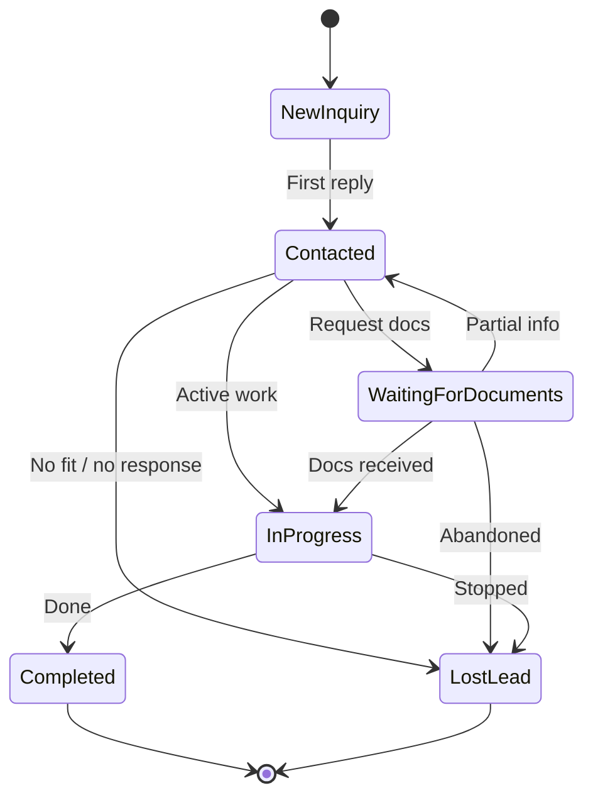

# CRM workflow system

**Thai Visa Company  -  lead qualification & operations**

Production-grade, trust-first workflow for a small team using **Airtable** as the CRM. Designed for mobile operations, consistent replies, and scalable volume without enterprise complexity.

**Related docs:** [AIRTABLE_CRM_ARCHITECTURE.md](./AIRTABLE_CRM_ARCHITECTURE.md) (schema) · [INQUIRY_RESPONSE_TEMPLATES.md](./INQUIRY_RESPONSE_TEMPLATES.md) (copy-paste messages) · [CONVERSION_INFRASTRUCTURE.md](./CONVERSION_INFRASTRUCTURE.md) (channels) · [CONVERSION_AUDIT.md](./CONVERSION_AUDIT.md) (UX) · [ENVIRONMENT_VARIABLES.md](./ENVIRONMENT_VARIABLES.md) (Airtable env)

**Code integration:** `POST /api/inquiry` → `processInquirySubmission` → `createLeadFromInquiry` (`lib/airtable/leads.ts`)

---

## 1. System goals

| Goal | How this workflow supports it |
|------|-------------------------------|
| **No lost inquiries** | Single Leads table, clear intake paths, zero-inbox rule |
| **Lead organization** | Visa category, source, status, assignee, follow-up date |
| **Response consistency** | Priority tiers, SLAs, message templates |
| **Higher conversion** | Qualification signals, timely follow-up, trust-oriented tone |
| **Scalable operations** | Same pipeline at 5 or 50 leads/week; optional automations later |

**Principles:** approachable, clear, human  -  not aggressive sales, not bureaucratic stages.

---

## 2. CRM foundation (Airtable)

### 2.1 Single table: **Leads**

Align field names with `lib/airtable/types.ts` (`airtableLeadFields`). Do not add columns without a documented reason.

| Field | Purpose |
|-------|---------|
| **Full Name** | Primary identifier |
| **Nationality** | Eligibility & embassy routing |
| **Visa Type Interest** | Category (see §4) |
| **Current Country** | Location / urgency context |
| **Lead Source** | Acquisition channel |
| **Inquiry Message** | First question in their words |
| **Status** | Pipeline stage (§5) |
| **Assigned To** | Owner for reply & follow-up |
| **Follow-Up Date** | Next action reminder |
| **Notes** | Internal context (incl. `Submitted from: /visas/…` from website) |
| **Date Created** | Intake timestamp |
| **Email / Phone / LINE ID / WhatsApp** | Filled as conversation progresses |

### 2.2 Recommended Airtable views (mobile-first)

Create these **views** so operators can work from phone in under 30 seconds:

| View | Filter / sort | Use |
|------|-------------|-----|
| **🔴 Action today** | Status = `New Inquiry` OR Follow-Up Date ≤ today; sort oldest first | Morning triage |
| **📱 New  -  unassigned** | Status = `New Inquiry`, Assigned To empty | Assign & first reply |
| **⏳ Waiting on client** | Status = `Waiting For Documents` | Gentle nudges |
| **🔄 In progress** | Status = `In Progress` | Active cases |
| **By visa** | Group by Visa Type Interest | Specialist routing |
| **Lost  -  learn** | Status = `Lost Lead` | Optional monthly review |

**Mobile tips:** Pin **Action today** and **New  -  unassigned**. Use Airtable app notifications for automations (§12). Keep field order matching the table above so scrolling is predictable.

---

## 3. Inquiry intake process

### 3.1 Intake channels (priority order on site)

1. **LINE**  -  primary; conversational, mobile-native  
2. **WhatsApp**  -  secondary messaging  
3. **Website inquiry form**  -  structured; auto-creates Airtable row  

All channels are valid. **Only the form auto-syncs to Airtable today.** Messaging leads must be logged manually (see §3.3).

### 3.2 Automated form intake

```
Visitor submits form
  → POST /api/inquiry
  → validate (name, nationality, visaInterest, currentLocation, message)
  → mapInquiryToLeadInput()
  → Airtable: Status = "New Inquiry", Date Created = submittedAt
  → Notes may include: "Submitted from: /visas/retirement"
  → User sees success + LINE/WhatsApp CTAs
```

**Form → Airtable mapping**

| Form field | Airtable field |
|------------|----------------|
| `name` | Full Name |
| `nationality` | Nationality |
| `visaInterest` | Visa Type Interest (human label, e.g. "Retirement visa") |
| `currentLocation` | Current Country |
| `message` | Inquiry Message |
| `leadSource` | Lead Source (Homepage, Visa Pages, Contact Page, …) |
| `pagePath` | Notes (prefix line) |

**Lead source values (website)**  -  `InquiryLeadSource` in code:

- Homepage  
- Visa Pages  
- Blog Articles  
- Contact Page  
- Footer  
- Website (other)  

**Manual lead sources** (add in Airtable when not from form):

- LINE  
- WhatsApp  
- Google Business  
- Referral  

### 3.3 Messaging intake (LINE / WhatsApp)

**Workflow:** every substantive messaging thread gets a Leads row within **2 hours** of first meaningful contact.

| Step | Action |
|------|--------|
| 1 | Open **New  -  unassigned** or create record |
| 2 | Full Name (or LINE display name), Visa Type Interest, Current Country if known |
| 3 | Lead Source = `LINE` or `WhatsApp` |
| 4 | Paste key message into Inquiry Message; ongoing detail in Notes |
| 5 | Add LINE ID / WhatsApp when available |
| 6 | Status = `New Inquiry` → assign → first reply |

**Why:** prevents “invisible leads” that never enter CRM or analytics.

### 3.4 Intake quality checklist (30 seconds)

Before first outbound message, confirm:

- [ ] Visa Type Interest set (or `Not sure yet` + note why)  
- [ ] Nationality or region captured  
- [ ] Current Country / “where are you now” captured  
- [ ] Lead Source set  
- [ ] Assigned To set  
- [ ] Follow-Up Date set after first reply (§7)  

---

## 4. Lead categories (visa types)

Matches website visa pages and `inquiryVisaOptions` (`lib/forms/inquiry/visa-options.ts`).

| Category | Airtable label (form) | Typical intent |
|----------|----------------------|----------------|
| **Retirement** | Retirement visa | Age 50+, financial proof, long-stay |
| **DTV** | DTV (Digital Nomad) | Remote work, destination Thailand |
| **Elite** | Thailand Elite | Premium long-stay, membership route |
| **Business** | Business visa | Work, company, employment |
| **Education** | Education visa | Study, school enrollment |
| **Other** | Another visa type | Tourist, marriage, etc.  -  clarify in Notes |
| **Unsure** | Not sure yet | Education-first reply; route to right visa |

**Routing:** assign by familiarity, not rigid territories. One person can own multiple categories at low volume; split by view when volume grows.

---

## 5. Lead qualification stages

Qualification is **lightweight**  -  enough to prioritize and reply well, not a long discovery call.

### 5.1 Operational stages (Airtable Status)

Canonical values (`airtableLeadStatuses`):

```
New Inquiry → Contacted → Waiting For Documents → In Progress → Completed
                                                      ↘ Lost Lead
```

| Status | Meaning | Entry criteria |
|--------|---------|----------------|
| **New Inquiry** | Not yet replied or row just created | Form submit or manual create |
| **Contacted** | First helpful reply sent | Substantive reply on LINE/WA/email |
| **Waiting For Documents** | Client owes info/files | You asked for specific items |
| **In Progress** | Actively working the case | Docs received or application underway |
| **Completed** | Closed won  -  supported through agreed outcome | Service delivered or handoff done |
| **Lost Lead** | Closed  -  no longer pursuing | Unresponsive, ineligible, chose elsewhere, withdrew |

**Rules**

- Never skip **Contacted** after a real first reply.  
- Do not use **In Progress** for “thinking about it”  -  use **Contacted** + Follow-Up Date.  
- **Lost Lead** requires one line in Notes (reason code: `no-response` / `ineligible` / `competitor` / `timing` / `other`).

### 5.2 Qualification depth (internal  -  not extra Airtable fields)

Record in **Notes** using a short template after first exchange:

```
Q1 Situation: [1 sentence]
Q2 Timeline: [when they need visa / travel]
Q3 Blocker: [docs, eligibility, cost, confusion]
Fit: [Strong / Possible / Weak / Unknown]
```

**Strong fit examples**

- Retirement: age + financial question aligned with route  
- DTV: remote work + nationality with known DTV policy context  
- Business: employer or company mentioned with role clarity  

**Weak fit examples**

- Requirements clearly not met  -  note politely, offer alternatives or **Lost Lead**  

---

## 6. Qualification signals & urgency indicators

Use signals to set **priority** (§7), not to bombard the client with questions.

### 6.1 Qualification signals (positive)

| Signal | Where to spot it | Implication |
|--------|------------------|-------------|
| Named visa type | Form or message | Faster routing |
| Specific nationality | Form | Eligibility check ready |
| “Already in Thailand” | Current Country / message | Often higher urgency |
| Embassy or deadline mentioned | Message | Time-sensitive |
| Documents list question | Message | Near **Waiting For Documents** |
| Repeat visitor / referral | Notes / source | Higher trust  -  prioritize tone |
| Visa page source | Notes `Submitted from: /visas/dtv` | Pre-educated  -  shorter explainer |

### 6.2 Urgency indicators

| Indicator | Priority bump |
|-----------|----------------|
| Visa expiring / overstay risk mentioned | → **P1** |
| Flight or move date within 2 weeks | → **P1** |
| “Already in Thailand” + immediate need | → **P1** |
| Submitted during Thai business hours | → **P2** (same-day target) |
| “Just researching” / no timeline | → **P3** |
| `Not sure yet` + vague message | → **P3** (clarify visa in first reply) |

### 6.3 Disqualification signals (handle with care)

- Hostile or spam → **Lost Lead** `other`, no argument  
- Clear ineligibility → honest answer, resources if helpful, **Lost Lead** `ineligible`  
- Only price shopping with no engagement after one clear answer → **Lost Lead** `timing` or follow up once at **P3**  

Stay trust-first: explain *why* briefly, offer a path if any exists.

---

## 7. Response prioritization & lead priority handling

### 7.1 Priority tiers

Use **Notes** prefix or Airtable **color** (optional): `P1` / `P2` / `P3`.

| Tier | Who | First response target | Follow-up cadence |
|------|-----|----------------------|-------------------|
| **P1  -  Urgent** | Expiry, travel &lt;2 weeks, stuck in Thailand | **&lt;2 hours** (business hours) | Daily until resolved or Waiting For Documents |
| **P2  -  Standard** | Form + clear visa; normal planning | **Same business day** | Every 2–3 business days if no reply |
| **P3  -  Nurture** | Unsure, early research | **Within 24 hours** | One follow-up at 5–7 days, then weekly max 2 |

Aligns with public promise: *“typically same business day”* ([CONVERSION_AUDIT.md](./CONVERSION_AUDIT.md)).

### 7.2 Daily triage routine (15–20 min, mobile OK)

1. Open **Action today** view.  
2. Sort: **P1** first → unassigned **New Inquiry** → due Follow-Up Dates.  
3. Assign **Assigned To** before replying (accountability).  
4. Send first replies; set Status **Contacted**; set **Follow-Up Date**.  
5. End of day: zero rows in **New Inquiry** older than 24h unless waiting on internal info.

### 7.3 Response-time standards

| Metric | Target | Measurement |
|--------|--------|-------------|
| First response (form) | ≤8 business hours; aim same day | `Date Created` → first `Contacted` (manual or Notes timestamp) |
| First response (LINE/WA) | ≤2h for P1; same day for P2 | Thread + CRM row time |
| Follow-up while waiting on client | Every 2–3 business days | Follow-Up Date |
| Document review after receipt | ≤2 business days | Notes + status change |
| Stale lead (no client reply) | 14 days → one closing message → **Lost Lead** `no-response` | Follow-Up Date + Notes |

**Business hours:** align with Thailand-centric operations (e.g. 09:00–18:00 ICT, Mon–Fri); weekend messages queued for Monday unless P1.

---

## 8. Follow-up process & timing

### 8.1 Follow-up date rules

| Situation | Set Follow-Up Date to |
|-----------|------------------------|
| After first reply | +2 business days if waiting on their answer |
| Asked for documents | +3 business days (gentle reminder) |
| Client said “will send next week” | Their date +1 day |
| Application submitted | +7 days or embassy-specific date |
| Nurture (P3) | +5 to +7 days |

**Always** update Follow-Up Date when the ball moves  -  stale dates cause lost leads.

### 8.2 Follow-up message principles

- One clear ask per message  
- Reference their words (“You mentioned UK passport and retirement…”)  
- No pressure close  -  “When you’re ready” / “Happy to clarify”  
- Same channel they used (LINE → LINE)  

**Copy-paste templates:** [INQUIRY_RESPONSE_TEMPLATES.md](./INQUIRY_RESPONSE_TEMPLATES.md)  -  first reply, follow-up, documents, scheduling, completion, review, delays.

### 8.3 Waiting For Documents

1. List requested items in **Notes** (bullets).  
2. Status → **Waiting For Documents**.  
3. Follow-Up Date per §8.1.  
4. When received → **In Progress** + note receipt date.  

---

## 9. Lead assignment workflow

### 9.1 Assignment rules

| Volume | Approach |
|--------|----------|
| 1–2 operators | Assign to primary owner; backup checks **Action today** |
| 3+ operators | Round-robin **New Inquiry** by visa view OR assign by language/nationality familiarity |

**Assignment must happen before first reply** so nothing is orphaned.

### 9.2 Handoff

When reassigning:

1. Update **Assigned To**  
2. Note in **Notes**: `Handoff [date]: [summary]  -  next step: …`  
3. New owner sets **Follow-Up Date**  

### 9.3 Escalation handling

| Trigger | Action |
|---------|--------|
| Eligibility unclear / edge case | Note `Escalate: eligibility`; tag senior reviewer in Notes; reply within SLA: “Checking with our team…” |
| Complaint or distress | Note `Escalate: service`; owner + one senior; calm, factual reply same day |
| Legal/overstay risk | Note `Escalate: urgent`; P1; no casual advice  -  stick to documented guidance |
| Technical failure (form not in CRM) | Check Airtable/API logs; manually create row; reply to client if delay &gt;8h |

**No** multi-level approval chains  -  escalate = one knowledgeable person weighs in.

---

## 10. Status management (operational consistency)

### 10.1 Allowed transitions



### 10.2 Weekly hygiene (10 min)

- **New Inquiry** &gt;48h → assign or reply  
- **Contacted** with past Follow-Up Date → follow up or **Lost Lead**  
- **In Progress** without Notes update in 14d → check client  
- Duplicate rows (same LINE + name) → merge Notes, close duplicate as **Lost Lead** `other`  

---

## 11. Trust-oriented communication principles

### 11.1 Tone

- **Clear** over clever  -  plain English, short paragraphs  
- **Honest** about uncertainty (“Rules can depend on nationality  -  for UK passports we usually see…”)  
- **Calm**  -  no countdown timers, no “limited slots”  
- **Respectful** of their timeline  -  no obligation to proceed  

### 11.2 First-reply structure (LINE / WhatsApp / email)

1. Thank them / acknowledge question  
2. One-sentence understanding of their situation  
3. Clear next step OR 1–2 clarifying questions (max)  
4. When to expect your follow-up  

### 11.3 What to avoid

- Aggressive upsell or multiple visa pitches in one message  
- Guarantees of approval  
- Sharing other clients’ details  
- Long walls of text on mobile  -  use line breaks  

Matches site conversion philosophy: [CONVERSION_INFRASTRUCTURE.md](./CONVERSION_INFRASTRUCTURE.md).

---

## 12. Conversion tracking workflow

### 12.1 Definitions

| Term | Operational definition |
|------|------------------------|
| **Inquiry** | Any meaningful contact (form row or logged messaging lead) |
| **Qualified lead** | Status moved past **New Inquiry** with Fit ≥ Possible in Notes |
| **Active case** | **In Progress** or **Waiting For Documents** |
| **Conversion (won)** | **Completed**  -  service agreed and delivered per your offer |
| **Lost** | **Lost Lead** with reason in Notes |

### 12.2 Tracking layers

| Layer | What to track |
|-------|----------------|
| **Airtable** | Status changes, dates in Notes, visa category, source |
| **GA4** (site) | `inquiry_submission`, LINE/WhatsApp `cta_click`, form funnel events (`lib/analytics/`) |
| **Weekly ops metric** | New inquiries, % contacted &lt;24h, % Completed vs Lost, by visa type |

### 12.3 Simple weekly review (15 min)

1. Count: New → Contacted → Completed / Lost (by visa)  
2. Average time to first reply (sample 5 rows)  
3. Top **Lost Lead** reasons  -  fix FAQ or site copy if repeated  
4. One process fix (not a new field)  

### 12.4 Optional Airtable automations (future)

- New **New Inquiry** → Slack/email notification  
- **Follow-Up Date** is today → reminder to assignee  
- Status **Completed** → archive view  

Keep automations minimal until volume justifies them ([AIRTABLE_CRM_ARCHITECTURE.md](./AIRTABLE_CRM_ARCHITECTURE.md)).

---

## 13. Mobile-first CRM usage

| Practice | Why |
|----------|-----|
| Pin **Action today** on phone home screen | Fast triage between messages |
| Reply on LINE/WA, then update CRM in same session | Status never lags reality |
| Use short Notes templates | Thumb-friendly, consistent |
| Set Follow-Up Date via calendar picker | One tap reminders |
| Avoid editing 10 fields per touch | Only status, assignee, date, short note |
| Photo/screenshot → paste summary in Notes | Doc checks on the go |

**Rule:** if you replied to the client, CRM must reflect **Contacted** before end of day.

---

## 14. Operational consistency guidelines

1. **One lead = one thread**  -  link LINE ID in record when known  
2. **Single source of truth**  -  Airtable beats chat memory  
3. **Status reflects client state**, not your to-do list (use Follow-Up Date for tasks)  
4. **Public SLAs ≤ internal targets**  -  same-day reply is the norm, not the exception  
5. **Document edge cases once in Notes**  -  builds team knowledge without new fields  
6. **Production checklist**  -  Airtable env set in production (`ENVIRONMENT_VARIABLES.md`); `allowUnconfigured` is false in production so no silent dropped leads  

---

## 15. Scalability & verification

### 15.1 Scales without redesign

| Growth | Adjustment |
|--------|------------|
| More leads | Add assignees; split views by visa |
| More visa types | Add option to Visa Type Interest + one view |
| More channels | Manual source tags only; optional Zapier later |
| Second market/language | Notes language tag; assign by fluency |

No new tables required until you introduce invoicing or contracts (out of scope).

### 15.2 High-trust handling verification

| Requirement | Supported by |
|-------------|--------------|
| Low-friction intake | Form + messaging; manual LINE/WA logging |
| Trust-first comms | §11 principles; no pressure close |
| Mobile operations | §2.2 views, §13 practices |
| Airtable-friendly | Field names match `airtableLeadFields` |
| Visa categories | §4 aligned with `inquiryVisaOptions` |
| No enterprise bloat | 6 statuses, 1 table, optional automations |
| No lost inquiries | §3.3 messaging logging + daily triage §7.2 |
| Conversion visibility | §12 status + GA4 |
| Escalation without bureaucracy | §9.3 single-tier escalate |
| Production code path | `createLeadFromInquiry`, `updateLeadStatus` |

### 15.3 Known gaps (documented, not hidden)

| Gap | Mitigation |
|-----|------------|
| LINE/WA not auto-synced to Airtable | §3.3 manual row within 2h |
| No email on form | Collect in conversation; add to Airtable |
| Priority not a formal field | Notes prefix P1/P2/P3 or color |
| Analytics ≠ CRM revenue | **Completed** in Airtable is source of truth for wins |

---

## 16. Quick reference cards

### New form lead (2 min)

1. Confirm row in **New  -  unassigned**  
2. Read Inquiry Message + Notes (`pagePath`)  
3. Set P1/P2/P3 in Notes  
4. Assign → reply → **Contacted** → Follow-Up Date  

### New LINE lead (3 min)

1. Create row  -  Source LINE, paste message  
2. Visa + country + name  
3. Same as above  

### End of case

- Won → **Completed** + one-line outcome in Notes  
- Lost → **Lost Lead** + reason code in Notes  

---

## Appendix A  -  Reason codes for Lost Lead (Notes)

| Code | Use when |
|------|----------|
| `no-response` | No reply after follow-up sequence |
| `ineligible` | Cannot qualify for requested route |
| `competitor` | Chose another provider |
| `timing` | Not proceeding now; may return |
| `other` | Explain briefly |

---

## Appendix B  -  Field ↔ code reference

```text
lib/airtable/types.ts          → airtableLeadFields, airtableLeadStatuses
lib/airtable/leads.ts          → mapInquiryToLeadInput, createLeadFromInquiry
lib/forms/inquiry/types.ts    → InquiryLeadSource, InquiryFormPayload
lib/forms/inquiry/visa-options.ts → inquiryVisaOptions
app/api/inquiry/route.ts       → HTTP intake
```

---

*Last updated: May 2026  -  align with codebase when schema or form fields change.*
