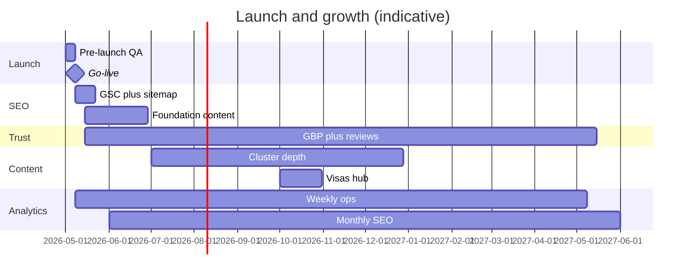

# Launch and growth system

**Thai Visa Company  -  operational strategy for launch, SEO, AI-search, reviews, content, and analytics**

Practical sequencing for sustainable authority and inquiry growth. Trust-first: no spam tactics, no random publishing, no aggressive funnels.

**Orchestrates:** [LAUNCH_CHECKLIST.md](./LAUNCH_CHECKLIST.md) · [PRODUCTION_READINESS.md](./PRODUCTION_READINESS.md) · [CONTENT_ROADMAP.md](./CONTENT_ROADMAP.md) · [EDITORIAL_WORKFLOW.md](./EDITORIAL_WORKFLOW.md) · [AI_SEARCH_OPTIMIZATION.md](./AI_SEARCH_OPTIMIZATION.md) · [CRM_WORKFLOW_SYSTEM.md](./CRM_WORKFLOW_SYSTEM.md) · [CONVERSION_AUDIT.md](./CONVERSION_AUDIT.md)

---

## 1. System overview

| Phase | Timeline (typical) | Primary outcome |
|-------|-------------------|-----------------|
| **Launch** | Week 0 | Production site, crawlable, measurable, contact-ready |
| **Initial SEO** | Weeks 1–4 | Indexed core URLs, Search Console baseline, first content ships |
| **Review acquisition** | Weeks 2–ongoing | GBP trust, authentic reviews, response discipline |
| **Content growth** | Months 2–12 | Topical clusters, AI-search depth, internal link graph |
| **Analytics review** | Weekly / monthly | Data-driven SEO + conversion improvements |
| **Long-term growth** | Year 1+ | Local SEO, partnerships, FAQ expansion, optional automation |

**North-star metrics**

- Indexed visa + resource pages with stable rankings for intent queries  
- Qualified inquiries (form + logged LINE/WhatsApp) with same-day first response  
- Growing **Completed** leads in Airtable, not raw traffic alone  

---

## 2. Growth philosophy

| Do | Don’t |
|----|--------|
| Answer specific visa questions with one URL per intent | Publish thin or duplicate content |
| Build clusters (visa landing + guides + FAQ) | Random blog posts off-topic |
| Earn trust (reviews, clear contact, honest copy) | Guarantee approvals or pressure closes |
| Measure → adjust CTAs and content | Growth hacks, link schemes, keyword stuffing |
| Keep ops simple (Airtable, templates, cadence) | Enterprise CRM or 20-stage funnels |

**AI-search:** Treat AI assistants as readers of the same clear copy and JSON-LD you ship for Google  -  see [AI_SEARCH_OPTIMIZATION.md](./AI_SEARCH_OPTIMIZATION.md).

---

# Launch phase

**Goal:** Ship a production-grade site that crawlers, analytics, and clients can trust on day one.

**When complete:** All launch gates below pass · domain + SSL live · team can receive and log inquiries.

### 2.1 Pre-launch checklist

Use [LAUNCH_CHECKLIST.md](./LAUNCH_CHECKLIST.md) and [PRODUCTION_READINESS.md](./PRODUCTION_READINESS.md) as the authoritative gate lists.

| Area | Must pass |
|------|-----------|
| **Build** | `npm run build` clean · no TS errors |
| **Routes** | Home, 5 visa pages, `/contact`, `/resources`, published articles only |
| **Env** | `NEXT_PUBLIC_SITE_URL`, Airtable, GA4, LINE/WhatsApp URLs set in production |
| **Legal** | Privacy + terms when required for your jurisdiction (routes in `lib/site-routes.ts`  -  set `published: true` when live) |
| **Content** | Copy review on homepage + visa pages · no STUB links in live `related` blocks |
| **Ops** | [CRM_WORKFLOW_SYSTEM.md](./CRM_WORKFLOW_SYSTEM.md) triage view ready · [INQUIRY_RESPONSE_TEMPLATES.md](./INQUIRY_RESPONSE_TEMPLATES.md) shared with team |

**Launch blockers (fix before DNS cutover)**

- Broken internal links to unpublished routes  
- Inquiry form fails in production (Airtable misconfig with `allowUnconfigured` off)  
- Placeholder `CONTACT_URLS` (LINE/WhatsApp)  
- Missing canonical origin (`NEXT_PUBLIC_SITE_URL`)  

### 2.2 Indexing preparation

| Task | Action |
|------|--------|
| **Sitemap** | `app/sitemap.ts`  -  only `published: true` in [lib/site-routes.ts](./lib/site-routes.ts) |
| **Robots** | `app/robots.ts`  -  allow crawl · point to sitemap · disallow `/api/` |
| **Canonical** | Every page uses production origin via `lib/seo/helpers.ts` |
| **Noindex** | Staging/preview must not index (env + `buildRobots`) |
| **STUB routes** | Planned articles: `published: false` until MDX ships |

**Post-deploy:** fetch `https://{domain}/sitemap.xml` and spot-check URLs.

### 2.3 Metadata verification

Per route (home, each visa, contact, resources index, each article):

- [ ] Unique `<title>`  -  intent-first, brand suffix  
- [ ] Meta description matches extractable summary (≤ ~160 chars usable)  
- [ ] Open Graph title/description/url  
- [ ] Canonical URL correct  
- [ ] No duplicate titles across visa/resource pages  

**Sources:** `lib/seo/`, `lib/visas/routing/`, `lib/content/routing/`, `lib/seo/ai-search.ts` (homepage).

### 2.4 Schema verification

| Page type | JSON-LD (verify in Rich Results / schema validator) |
|-----------|---------------------------------------------------|
| Site-wide | Organization / LocalBusiness  -  [components/seo/site-business-json-ld.tsx](./components/seo/site-business-json-ld.tsx) |
| Home | WebPage + WebSite  -  [components/seo/home-json-ld.tsx](./components/seo/home-json-ld.tsx) |
| Visa | WebPage + Service + FAQ  -  [components/seo/visa-page-json-ld.tsx](./components/seo/visa-page-json-ld.tsx) |
| Article | Article + FAQ + Breadcrumb  -  [components/seo/resource-article-json-ld.tsx](./components/seo/resource-article-json-ld.tsx) |
| Contact | WebPage + ContactPoint  -  [components/seo/contact-page-json-ld.tsx](./components/seo/contact-page-json-ld.tsx) |
| FAQ sections | Visible Q&A matches FAQPage `mainEntity` |

**Rule:** FAQ accordion text = schema answers (no mismatch).

### 2.5 Analytics verification

Follow [ANALYTICS_SETUP.md](./ANALYTICS_SETUP.md).

| Check | How |
|-------|-----|
| GA4 loads | `NEXT_PUBLIC_GA_ID` set · Realtime shows active user |
| Page views | Navigate home → visa → contact  -  `page_view` fires |
| LINE / WhatsApp | Click CTAs  -  `line_click` / `whatsapp_click` |
| Inquiry funnel | Submit test lead  -  `inquiry_submission` (use test row in Airtable) |
| Surface attribution | `data-analytics-*` on hero, final CTA, mobile bar |

**Production:** exclude internal traffic (GA4 filter) or use debug only in dev.

### 2.6 Contact flow verification

| Step | Expected |
|------|----------|
| LINE / WhatsApp | Opens real URLs from `CONTACT_URLS` |
| Mobile bar | Visible &lt; `lg` · hidden when nav open |
| Inquiry form | Validates · success state · Airtable row created |
| CRM | Lead appears with Status `New Inquiry`, correct visa label |
| Success CTAs | Messaging buttons on success card |
| Response ops | Assignee can reply using templates within SLA |

**Conversion reference:** [CONVERSION_INFRASTRUCTURE.md](./CONVERSION_INFRASTRUCTURE.md) · [CONVERSION_AUDIT.md](./CONVERSION_AUDIT.md).

### 2.7 Mobile QA

Use [RESPONSIVE_QA.md](./RESPONSIVE_QA.md) (if present) or minimum matrix:

| Device / width | Check |
|----------------|-------|
| Phone (~390px) | Hero readable · CTAs 44px · sticky bar not covering inputs |
| Tablet | Grid layouts · contact page two-column at `lg` |
| Mobile + keyboard | Inquiry form fields scroll above keyboard |

**Critical paths:** Home hero → LINE · Contact page form · Visa page hero → LINE.

### 2.8 Performance QA

Use [LIGHTHOUSE_OPTIMIZATION.md](./LIGHTHOUSE_OPTIMIZATION.md).

| Metric | Target (marketing site) |
|--------|-------------------------|
| LCP | &lt; 2.5s on 4G (hero text-first helps) |
| CLS | Minimal  -  mobile contact bar offset in CSS |
| INP | Low client JS (navbar, FAQ, form only) |

Run Lighthouse on `/`, `/visas/retirement`, `/contact` before launch.

### 2.9 Launch day sequence

```text
T-7  Pre-launch checklist + staging QA
T-3  Production env vars + Airtable test lead
T-1  DNS TTL lowered · final build on Vercel
T-0  DNS → production · verify SSL · submit sitemap (§3)
T+1  Search Console URL inspection (home + top 3 visas)
T+7  First analytics + indexing review (§6)
```

---

# Initial SEO phase

**Timeline:** Weeks 1–4 after launch.  
**Goal:** Core URLs indexed, baseline rankings data, foundation content live.

### 3.1 First indexing strategy

**Priority crawl order** (submit and monitor first):

1. `/`  -  homepage entity + internal links  
2. `/visas/retirement`, `/visas/dtv`  -  highest commercial intent  
3. `/visas/elite`, `/visas/business`, `/visas/education`  
4. `/contact`  -  conversion endpoint  
5. `/resources` + each **published** article  

**Do not** link prominently to URLs with `published: false` in `siteRoutes` until pages exist.

**Indexing hygiene**

- Request indexing for homepage + 2 visa pages via Search Console URL Inspection  
- Fix coverage errors within 48h  
- Ensure no accidental `noindex` on production  

### 3.2 Sitemap submission

1. Confirm `https://{domain}/sitemap.xml` lists only live routes  
2. [SEARCH_CONSOLE_SETUP.md](./SEARCH_CONSOLE_SETUP.md)  -  add property · DNS verify  
3. Submit sitemap URL in GSC  
4. Confirm “Success” under Sitemaps · note discovered vs indexed counts  

**When publishing new article:** rebuild/deploy → sitemap regenerates → optional manual “Validate fix” if URL omitted.

### 3.3 Search Console setup

| Report | Use |
|--------|-----|
| **Pages / Indexing** | New URLs indexed · fix 404/soft-404 |
| **Performance** | Queries, pages, CTR, position |
| **Core Web Vitals** | Field + lab issues |
| **Enhancements** | FAQ, breadcrumbs if eligible |

**Weekly (first month):** export top 20 queries · note which visa/page they map to · feed [CONTENT_ROADMAP.md](./CONTENT_ROADMAP.md) backlog.

### 3.4 Initial content publishing cadence

Align with **Foundation** phase in [CONTENT_ROADMAP.md](./CONTENT_ROADMAP.md):

| Month 1 | Ship |
|---------|------|
| Week 2 | `how-long-does-thai-visa-take` (process  -  unblocks visa related links) |
| Week 3–4 | `what-is-thailand-dtv-visa` OR second retirement depth piece |
| Ongoing | 2 articles/month max until process stable |

**Each publish:** full [EDITORIAL_WORKFLOW.md](./EDITORIAL_WORKFLOW.md)  -  registry, `published: true`, `siteRoutes.published: true`, internal links, build.

### 3.5 First authority-building priorities

| Priority | Action |
|----------|--------|
| **1  -  Visa landings** | Accurate requirements, FAQ, final CTA  -  already LIVE; quarterly refresh |
| **2  -  Process hub** | One timeline article linked from all visas |
| **3  -  DTV + retirement cores** | Highest search demand clusters |
| **4  -  Internal linking** | Every article → visa + sibling; use `lib/content/related.ts` |
| **5  -  GBP + reviews** | Parallel track (§4)  -  local trust signal |
| **6  -  Fix graph gaps** | Publish `/visas` hub when ready (P2 in roadmap) |

**Not yet:** mass guest posts, directory spam, AI-generated pages without review.

---

# Review acquisition phase

**Timeline:** Starts week 2 post-launch; continuous.  
**Goal:** Authentic Google reviews supporting trust and local SEO.

See [LOCAL_SEO_STRATEGY.md](./LOCAL_SEO_STRATEGY.md). Copy: [INQUIRY_RESPONSE_TEMPLATES.md](./INQUIRY_RESPONSE_TEMPLATES.md) §4.6.

### 4.1 First Google review strategy

| Asset | Setup |
|-------|--------|
| **Google Business Profile** | Correct categories (visa / immigration consultant) · Bangkok service area · LINE/WhatsApp in description |
| **Review link** | `NEXT_PUBLIC_GOOGLE_REVIEWS_URL`  -  used on site + templates |
| **NAP** | Name, address, phone consistent with website footer and schema |

**Positioning:** reviews reinforce *clear guidance and fast replies*  -  not “cheapest visa.”

### 4.2 Review timing workflow

| Moment | Ask for review? |
|--------|-----------------|
| After **Completed** in CRM + positive feedback | **Yes**  -  primary window |
| After first reply | No |
| After problem resolved well | Yes (optional) |
| Client stressed or ineligible | No |
| Already reviewed | Never ask again |

**CRM:** Note `review-requested` + date in Notes when template 4.6 sent.

### 4.3 Review request cadence

| Rule | Limit |
|------|-------|
| Max asks per client | **1** per completed engagement |
| Wait after completion | **3–7 days** (let outcome settle) |
| Team-wide | Track monthly asks vs reviews received  -  aim for quality, not volume |

### 4.4 Review response process

| Type | Response time | Tone |
|------|---------------|------|
| **Positive** | ≤3 business days | Thank by name · mention visa support (no PII) |
| **Neutral** | ≤2 business days | Acknowledge · invite offline resolution |
| **Negative** | ≤24 hours | Calm · factual · move conversation private (LINE/phone) |

**Never:** argue publicly, share client details, or offer incentives for reviews (policy violation).

**Website:** Keep [GoogleReviewSummary](./components/ui/google-review-summary.tsx) aligned with live rating/count in schema.

---

# Content growth phase

**Timeline:** Months 2–12.  
**Goal:** Semantic authority per visa cluster; AI-search-friendly corpus.

### 5.1 Publishing cadence

From [CONTENT_ROADMAP.md](./CONTENT_ROADMAP.md):

| Phase | Net new articles / month | Visa page reviews |
|-------|--------------------------|-------------------|
| **Foundation** (mo 1–2) | 2 | 1 cluster / month |
| **Growth** (mo 3–8) | 2–4 | Quarterly all visas |
| **Maintenance** | 1–2 updates + 0–1 new | When rules change |

**Cluster rule:** Finish Phase A (core + process + one eligibility) for a cluster before opening the next cluster’s Phase A.

### 5.2 Topical expansion strategy

Expand in layers per cluster (retirement, DTV, elite, business, education, process):

```text
Core how-to / what-is
  → Eligibility & requirements
  → Costs & financial proof
  → Renewal & extensions
  → Common mistakes
  → Comparisons (sparse, intentional)
```

**Cannibalization:** Visa H1 = service intent; resource slug = “how to” / “how long” / “vs” intent  -  see roadmap table.

### 5.3 AI-search optimization process

Run on **every** new or majorly updated page ([AI_SEARCH_OPTIMIZATION.md](./AI_SEARCH_OPTIMIZATION.md)):

| Step | Check |
|------|-------|
| 1 | Topic-first `h1` + one extractable summary (`data-page-summary` or `lead`) |
| 2 | FAQ: direct answer in first sentence · `h3` triggers · FAQPage JSON-LD |
| 3 | `PageAtAGlance` on homepage; consider on visa landings (future) |
| 4 | Article `abstract` = lead in JSON-LD |
| 5 | Internal links via `resolveRelatedArticles` + manual curation |
| 6 | Branded OG image when available |
| 7 | No STUB URLs in related lists (`filterPublishedRelatedLinks`) |

**Quarterly AI-search audit:** Re-read § strengths/weaknesses in AI_SEARCH_OPTIMIZATION.md · update `lib/seo/ai-search.ts` if positioning shifts.

### 5.4 Authority cluster expansion

| Cluster | P1 content (roadmap) | Visa anchor |
|---------|----------------------|-------------|
| Process | `how-long-does-thai-visa-take` | All visas |
| DTV | `what-is-thailand-dtv-visa` | `/visas/dtv` |
| Retirement | retirement how-to (LIVE) + renewal | `/visas/retirement` |
| Business / Education | Phase A after DTV+retirement depth | Respective visa pages |
| Elite | Phase A month 6–8 | `/visas/elite` |

**Hub:** Ship `/visas` with CollectionPage + ItemList when `published: true`  -  central discovery for users and crawlers.

### 5.5 Content update workflow

| Trigger | Action |
|---------|--------|
| Thai immigration rule change | Update visa `lib/visas/content/*` + affected articles |
| Search Console query gap | New brief or expand FAQ on existing URL |
| Article &gt;12 months old | Accuracy review · `updatedAt` · refresh stats/links |
| 404 / STUB link reported | Publish article OR remove link from `related` |

**Process:** [EDITORIAL_WORKFLOW.md](./EDITORIAL_WORKFLOW.md) stages 8–9 (publish + monitor).

---

# Analytics review phase

**Goal:** Turn data into SEO and conversion improvements without analysis paralysis.

### 6.1 Weekly review process (20–30 min)

| Source | Look at |
|--------|---------|
| **Airtable** | New inquiries · % contacted &lt;24h · P1 backlog |
| **GA4** | `line_click`, `whatsapp_click`, `inquiry_submission` by page |
| **GSC** (if indexed) | New queries · indexing errors |
| **Ops** | Any missed messaging leads (CRM gap) |

**Actions:** Assign stuck leads · one CTA or copy tweak if a page has views but zero clicks · log topic ideas for content backlog.

### 6.2 Monthly SEO review (60 min)

| Task | Output |
|------|--------|
| GSC Performance | Top pages, queries, CTR losers (position 5–15) |
| Index coverage | Fix excluded/blocked URLs |
| Content vs intent | Map queries → existing URL or new brief |
| Internal links | Add cross-links from winners to underperformers |
| Competitor spot-check | One SERP review per priority visa |

**Deliverable:** 3 prioritized actions for next month (content, technical, or on-page).

### 6.3 Conversion review (monthly, with weekly signals)

Use [CONVERSION_AUDIT.md](./CONVERSION_AUDIT.md) lenses:

| Metric | Question |
|--------|----------|
| CTA clicks / page views | Which surfaces underperform? |
| Inquiry by `leadSource` | Which pages feed CRM? |
| Inquiry by visa interest | Match content investment |
| Lost lead reasons | FAQ or copy fixes? |
| Time to first reply | Meeting SLA? ([CRM_WORKFLOW_SYSTEM.md](./CRM_WORKFLOW_SYSTEM.md)) |

### 6.4 Top-performing content analysis

| Tier | Definition | Action |
|------|------------|--------|
| **Winner** | High impressions + clicks + inquiries | Expand cluster · add FAQ · link from homepage |
| **Sleeper** | High impressions, low CTR | Improve title/description · first FAQ sentence |
| **Converter** | Moderate traffic, high inquiry rate | Replicate CTA placement on similar pages |
| **Dead** | No impressions after 90d | Consolidate intent, redirect, or improve internal links |

### 6.5 CTA optimization review

Quarterly (or after major UX change):

- Compare `hero_contact` vs `final_cta_contact` vs `mobile_bar_contact`  
- Test copy in [lib/cta.ts](./lib/cta.ts) / reassurance line  -  one change at a time  
- Verify visa page final CTA before FAQ still holds  
- No aggressive additions  -  maintain calm hierarchy ([CONVERSION_AUDIT.md](./CONVERSION_AUDIT.md))

---

# Long-term growth

**Timeline:** Year 1 and beyond.  
**Goal:** Durable authority, local presence, and efficient ops.

### 7.1 Local SEO scaling

From [LOCAL_SEO_STRATEGY.md](./LOCAL_SEO_STRATEGY.md):

| Lever | Scale when |
|-------|------------|
| **GBP posts** | Monthly  -  tips, timeline updates, no keyword stuffing |
| **Photos** | Real office/team/process  -  refresh quarterly |
| **Reviews** | Steady 2–4 quality reviews/month if volume allows |
| **NAP citations** | Selective directories (quality &gt; quantity) |
| **Maps / local pack** | Track “visa consultant Bangkok” visibility in GSC + manual checks |

### 7.2 Backlink opportunities (ethical)

| Type | Approach |
|------|----------|
| **Resource links** | Helpful guides worth citing (timelines, eligibility) |
| **Partners** | Relocation services, schools, employers  -  mutual “official partner” pages only if real |
| **PR / expertise** | Quotes on visa rule changes  -  link to relevant guide |
| **Directories** | vetted expat/legal lists  -  no paid link farms |

**Avoid:** PBNs, mass guest posts, irrelevant anchors.

### 7.3 Authority partnerships

| Partner type | Value |
|--------------|-------|
| Immigration lawyers | Referral clarity  -  who handles what |
| Relocation / property | Co-education content, not duplicate visa advice |
| Education agents | Education visa cluster support |
| Corporate HR | Business visa B2B inquiries |

**Document:** Referral terms in Notes/CRM  -  not on-site legal advice.

### 7.4 FAQ expansion strategy

| Source | FAQ addition |
|--------|----------------|
| LINE/WhatsApp repeat questions | Add to visa FAQ or new article |
| GSC “People also ask” | One FAQ per page if on-intent |
| Rule changes | Update existing FAQ answer first (avoid new URL) |

**Schema:** Keep visible FAQ = JSON-LD. Prefer expanding existing pages over thin new URLs.

### 7.5 Multilingual expansion opportunities

| Language | When | Approach |
|----------|------|----------|
| **Thai** | Local trust / GBP | Key contact + about sections  -  not full site day one |
| **Chinese** | Demand proven in analytics | Start with retirement/DTV high-intent pages |
| **Japanese** | Secondary | Selective guides |

**Technical:** i18n routing is a major project  -  defer until English corpus and conversion baseline are stable. No auto-translate without human review.

### 7.6 Future automation opportunities

| Automation | Trigger | Tool |
|------------|---------|------|
| New Airtable lead → Slack/email | Record created | Airtable automation / Make |
| Follow-Up Date reminder | Daily | Airtable |
| GSC indexing alert | New coverage issue | GSC email |
| GA4 weekly snapshot | Scheduled | Looker Studio or GA4 email |
| Review request reminder | Status → Completed + 5 days | CRM manual or light automation |

**Defer:** AI auto-replies to clients, chatbots replacing human first response, bulk content generation without editorial workflow.

---

## 8. Phase calendar (summary)



Adjust dates to your actual launch.

---

## 9. Roles (minimum viable team)

| Role | Launch | Growth |
|------|--------|--------|
| **Dev** | Build, schema, deploy, env | Sitemap, performance, i18n if needed |
| **SEO / content** | Metadata, GSC, first articles | Roadmap, linking, monthly review |
| **Ops / CRM** | Contact QA, Airtable, templates | Triage, reviews, SLAs |
| **Reviewer** | Visa accuracy sign-off | Article fact-check |

One person can wear multiple hats  -  cadence matters more than headcount.

---

## 10. Scalable authority growth verification

| Requirement | Supported by |
|-------------|--------------|
| **Sustainable growth** | Phased roadmap · cadence tables · maintenance mode |
| **Semantic authority** | Cluster strategy · internal linking rules · visa + guide pairing |
| **Inquiry volume** | Conversion reviews · CTA analytics · CRM SLAs |
| **Conversion quality** | Qualification in CRM · templates · no spam funnels |
| **Scalable operations** | Airtable + templates + weekly/monthly rituals |
| **SEO-first** | GSC workflow · sitemap registry · no random publishing |
| **AI-search** | Dedicated process §5.3 · `lib/seo/ai-search.ts` |
| **Practical launch** | Sequenced launch phase §2 · links to existing checklists |
| **Trust-first** | Review ethics · honest copy · no guarantees |
| **Production-grade** | Schema/metadata/analytics verification gates |
| **Avoid spam / hacks** | Philosophy §2 · ethical links §7.2 |

**Remaining dependencies (not blocked by this doc):** publish P1 articles · production env · GBP live · legal pages if required.

---

## 11. Document map

| Topic | Doc |
|-------|-----|
| Launch gates | [LAUNCH_CHECKLIST.md](./LAUNCH_CHECKLIST.md) |
| Readiness audit | [PRODUCTION_READINESS.md](./PRODUCTION_READINESS.md) |
| Content plan | [CONTENT_ROADMAP.md](./CONTENT_ROADMAP.md) |
| Publishing process | [EDITORIAL_WORKFLOW.md](./EDITORIAL_WORKFLOW.md) |
| AI-search | [AI_SEARCH_OPTIMIZATION.md](./AI_SEARCH_OPTIMIZATION.md) |
| Internal links | [lib/schema/INTERNAL_LINKING_STRATEGY.md](./lib/schema/INTERNAL_LINKING_STRATEGY.md) |
| GSC | [SEARCH_CONSOLE_SETUP.md](./SEARCH_CONSOLE_SETUP.md) |
| Analytics | [ANALYTICS_SETUP.md](./ANALYTICS_SETUP.md) |
| Conversion | [CONVERSION_AUDIT.md](./CONVERSION_AUDIT.md) |
| CRM | [CRM_WORKFLOW_SYSTEM.md](./CRM_WORKFLOW_SYSTEM.md) |
| Templates | [INQUIRY_RESPONSE_TEMPLATES.md](./INQUIRY_RESPONSE_TEMPLATES.md) |
| Local / reviews | [LOCAL_SEO_STRATEGY.md](./LOCAL_SEO_STRATEGY.md) |
| Env | [ENVIRONMENT_VARIABLES.md](./ENVIRONMENT_VARIABLES.md) |
| Routes / sitemap | [lib/site-routes.ts](./lib/site-routes.ts) |

---

*Last updated: May 2026  -  update phase dates and P1 slugs when launch day is set.*
