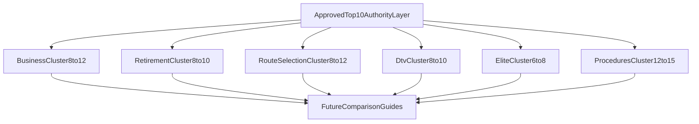

# Authority Guide Validation & Prioritization (Phase 0B)

## Purpose
This document validates and reprioritizes the Phase 0A Authority Guide roadmap using **only** approved inputs:

- [`docs/thailand-visa-search-intent-governance.md`](thailand-visa-search-intent-governance.md) (Phase 0A)

No new keyword discovery was performed in this phase.

## Validation Objective
Challenge whether the Phase 0A Top 10 is the highest-value commercial launch set for Thai Visa Company, prioritizing:

- high-intent visitors,
- hub strengthening (not hub competition),
- consultation conversion,
- topical authority,
- cluster expansion capacity,
- zero keyword cannibalization.

---

## Scoring Models Used In This Phase

### Commercial Value Score (0-100)
Weighted components:

| Component | Weight |
| --- | --- |
| Consultation potential | 30% |
| Commercial intent | 25% |
| Decision-stage proximity | 25% |
| Qualified lead likelihood | 20% |

Classification:

- **High:** 75-100
- **Medium:** 50-74
- **Low:** 0-49

### Authority Score (0-100)
Same framework as Phase 0A:

`(GoogleRank*20 + AIO*20 + ChatGPT*15 + Claude*15 + Perplexity*10 + Evergreen*20) / 5`

### Overall Priority Score (0-100)
Launch priority formula for implementation ranking:

`(CommercialValue*0.55) + (AuthorityScore*0.25) + (HubImpact*0.20)`

Where **Hub Impact** combines internal linking value, authority transfer, and conversion support (each 0-100, averaged).

---

## 1) Candidate Validation Matrix (All Phase 0A Authority Guides)

| # | Primary query | Recommendation | Reason |
| --- | --- | --- | --- |
| 1 | `business visa vs work permit thailand` | **Keep** | Genuine demand, core confusion, direct pre-consultation intent, strong hub support. |
| 2 | `non-immigrant b visa thailand work permit` | **Merge** | Near-duplicate intent family with #1; publish as one canonical authority page. |
| 3 | `retirement visa o vs o-a thailand` | **Keep** | High-stakes route decision with strong conversion and evergreen authority value. |
| 4 | `dtv visa rejection reasons` | **Keep** | Real anxiety-driven demand; high assistance intent and AI citation utility. |
| 5 | `dtv vs retirement visa` | **Keep** | Strong bridge comparison across two commercial hubs; high linking value. |
| 6 | `thailand elite visa worth it` | **Keep** | Direct decision-stage commercial intent for premium route. |
| 7 | `elite visa vs ltr thailand` | **Keep** | High-value affluent comparison; strong AI answer demand. |
| 8 | `elite visa vs retirement visa` | **Defer** | Valuable but overlaps decision space with #5 and #6; launch after core comparisons. |
| 9 | `best visa for living in thailand` | **Keep (promote)** | Underserved umbrella evaluation intent; should be in launch layer, not deferred. |
| 10 | `move to thailand visa options` | **Merge** | Same intent family as #9; one canonical route-selection authority page. |
| 11 | `language school visa thailand attendance` | **Defer** | Important but better as phase-2 education authority after hub + route comparisons. |
| 12 | `muay thai education visa requirements` | **Defer** | Valid niche demand, lower immediate commercial yield vs cross-route authorities. |
| 13 | `ed visa language school vs university` | **Defer** | Strong but narrower than attendance authority; phase-2 education layer. |
| 14 | `thailand 90 day report` | **Keep** | Universal post-approval intent; high AI citation and cross-hub utility. |
| 15 | `tm30 thailand` | **Defer** | Valuable, but lower direct consultation conversion than route-selection authorities. |
| 16 | `tm30 vs 90 day report thailand` | **Merge** | Fold into #14 as dedicated comparison section + supporting guide, not separate launch authority. |
| 17 | `re-entry permit thailand` | **Keep (promote)** | High-risk travel compliance intent with strong extension/consultation pathway. |
| 18 | `change visa type in thailand` | **Keep** | High conversion potential for route pivots; cross-links all hubs. |
| 19 | `thailand overstay fine ban` | **Defer** | High citation value but lower qualified lead quality; better phase-2 compliance authority. |

### Validation Notes By Guide

#### `business visa vs work permit thailand` — Keep
- Genuine demand: Yes (recurring confusion in search and community phrasing).
- Real user problem: Yes (legal work eligibility uncertainty).
- Hub support: Strong (`/visas/business`).
- Cannibalization risk: Low if head-term requirements remain hub-owned.
- Stronger replacement: None in business cluster.

#### `non-immigrant b visa thailand work permit` — Merge
- Same primary intent family as business-vs-work-permit.
- Separate page would create primary-owner duplication.
- Canonical owner: merged authority page titled around comparison intent.

#### `retirement visa o vs o-a thailand` — Keep
- Genuine demand: Yes (persistent route-branch confusion).
- Hub support: Strong (`/visas/retirement`).
- Cannibalization risk: Low with strict title/query-family boundaries.
- Must-win opportunity: Yes.

#### `dtv visa rejection reasons` — Keep
- Genuine demand: Yes (high post-denial query volume pattern).
- Consultation potential: High (assistance-heavy intent).
- Hub support: Strong (`/visas/dtv`).
- Cannibalization risk: Low (distinct from requirements head term).

#### `dtv vs retirement visa` — Keep
- Genuine demand: Yes (50+ remote-worker segment overlap).
- Hub support: Dual-hub bridge without replacing either hub.
- Cannibalization risk: Medium if page drifts into generic requirements; mitigate with comparison framing only.

#### `thailand elite visa worth it` — Keep
- Genuine demand: Yes (decision and pricing intent).
- Hub support: Strong (`/visas/elite`).
- Consultation potential: Very high (premium route qualification).

#### `elite visa vs ltr thailand` — Keep
- Genuine demand: Yes (affluent segment comparison).
- Competitive opportunity: High differentiation potential via structured decision matrix.
- Cannibalization risk: Low.

#### `elite visa vs retirement visa` — Defer
- Valid demand, but launch set already covers elite and retirement decision paths.
- Better as phase-2 comparison after O vs O-A and DTV vs Retirement are live.

#### `best visa for living in thailand` — Keep (promote into launch Top 10)
- Solves upstream route-selection problem before hub-specific qualification.
- High funnel value for all visa hubs.
- Should replace a lower-commercial launch slot (Muay Thai ED).

#### `move to thailand visa options` — Merge
- Near-duplicate of best-visa intent family.
- Canonical owner: one route-selection authority page.

#### `language school visa thailand attendance` — Defer
- Real compliance problem, but education commercial conversion is lower than visa-route decisions in year one.
- Launch after education hub has one route-specific authority.

#### `muay thai education visa requirements` — Defer
- Niche but real; not optimal for first authority layer given commercial profile.
- Better phase-2 education authority.

#### `ed visa language school vs university` — Defer
- Valuable comparison, but secondary to attendance compliance and extension risk topics.

#### `thailand 90 day report` — Keep
- Broad existing-holder demand across all routes.
- High AI citation and internal-link utility.
- Must-win compliance authority.

#### `tm30 thailand` — Defer
- Important, but lower immediate consultation yield than route and transition authorities.
- Publish after 90-day authority is live.

#### `tm30 vs 90 day report thailand` — Merge
- High confusion value, but not a separate launch authority.
- Merge into 90-day authority + one supporting guide.

#### `re-entry permit thailand` — Keep (promote into launch Top 10)
- Strong cross-hub impact and high extension/consultation adjacency.
- Better launch priority than Muay Thai ED and duplicate TM30 comparison authority.

#### `change visa type in thailand` — Keep
- High-risk transition intent with direct service relevance.
- Strong cross-hub linking and conversion support.

#### `thailand overstay fine ban` — Defer
- High informational demand, lower qualified lead quality.
- Better as phase-2 compliance authority.

---

## 2) Commercial Value Assessment (All Candidates)

| Primary query | Consultation potential | Commercial intent | Decision proximity | Qualified leads | Commercial class | Commercial score |
| --- | --- | --- | --- | --- | --- | --- |
| business visa vs work permit thailand | Very high | Very high | Decision | Very high | High | 94 |
| retirement visa o vs o-a thailand | Very high | Very high | Decision | Very high | High | 93 |
| thailand elite visa worth it | Very high | Very high | Decision | High | High | 91 |
| dtv visa rejection reasons | High | High | Decision | High | High | 86 |
| change visa type in thailand | High | High | Decision | High | High | 85 |
| best visa for living in thailand | High | High | Evaluation | High | High | 84 |
| dtv vs retirement visa | High | High | Evaluation | High | High | 83 |
| elite visa vs ltr thailand | High | High | Evaluation | Medium-high | High | 80 |
| re-entry permit thailand | Medium-high | Medium-high | Existing holder | Medium-high | Medium | 72 |
| thailand 90 day report | Medium | Medium | Existing holder | Medium | Medium | 63 |
| muay thai education visa requirements | Medium | Medium | Evaluation | Medium | Medium | 58 |
| language school visa thailand attendance | Medium | Medium | Existing holder | Medium-low | Medium | 56 |
| tm30 vs 90 day report thailand | Medium | Medium | Existing holder | Medium-low | Medium | 55 |
| tm30 thailand | Medium | Medium | Existing holder | Low-medium | Medium | 52 |
| elite visa vs retirement visa | Medium-high | Medium-high | Evaluation | Medium | Medium | 68 |
| thailand overstay fine ban | Low-medium | Medium | Urgent info | Low | Low | 41 |

---

## 3) AI & Search Authority Scoring (All Candidates)

| Primary query | Google | AIO | ChatGPT | Claude | Perplexity | Evergreen | Authority score |
| --- | --- | --- | --- | --- | --- | --- | --- |
| business visa vs work permit thailand | 5 | 5 | 5 | 5 | 5 | 5 | 100 |
| retirement visa o vs o-a thailand | 5 | 5 | 5 | 5 | 5 | 5 | 100 |
| tm30 vs 90 day report thailand | 4 | 5 | 5 | 5 | 5 | 5 | 96 |
| thailand 90 day report | 5 | 5 | 5 | 5 | 4 | 5 | 96 |
| dtv visa rejection reasons | 4 | 5 | 5 | 5 | 5 | 4 | 92 |
| elite visa vs ltr thailand | 4 | 5 | 5 | 5 | 5 | 4 | 92 |
| best visa for living in thailand | 5 | 4 | 5 | 5 | 4 | 4 | 88 |
| dtv vs retirement visa | 4 | 4 | 5 | 5 | 4 | 4 | 84 |
| change visa type in thailand | 4 | 4 | 4 | 4 | 4 | 4 | 80 |
| thailand elite visa worth it | 4 | 4 | 4 | 4 | 4 | 4 | 80 |
| re-entry permit thailand | 4 | 4 | 4 | 4 | 4 | 5 | 80 |
| muay thai education visa requirements | 3 | 4 | 4 | 4 | 3 | 4 | 72 |
| language school visa thailand attendance | 3 | 4 | 4 | 4 | 3 | 4 | 72 |
| elite visa vs retirement visa | 3 | 4 | 4 | 4 | 3 | 4 | 72 |
| tm30 thailand | 4 | 4 | 4 | 4 | 3 | 4 | 76 |
| thailand overstay fine ban | 4 | 4 | 4 | 4 | 4 | 3 | 76 |

---

## 4) Visa Hub Impact Assessment

| Authority Guide | Primary hub supported | Linking value | Authority transfer | Conversion support | Competes with hub? |
| --- | --- | --- | --- | --- | --- |
| business visa vs work permit | `/visas/business` | Very high | Very high | Very high | No |
| retirement visa o vs o-a | `/visas/retirement` | High | Very high | Very high | No |
| dtv rejection reasons | `/visas/dtv` | High | High | High | No |
| dtv vs retirement | `/visas/dtv` (primary), `/visas/retirement` (secondary) | Very high | High | High | No |
| elite worth it | `/visas/elite` | High | High | Very high | No |
| elite vs ltr | `/visas/elite` | High | High | High | No |
| best visa for living in thailand | All published hubs | Very high | Very high | High | No (if framed as route selection) |
| 90 day report | Immigration procedures cluster | Very high | Medium | Medium | No |
| re-entry permit | Cross-hub procedures | Very high | Medium-high | Medium-high | No |
| change visa type | Cross-hub procedures | Very high | High | High | No |
| muay thai ed requirements | `/visas/education` | Medium | Medium | Medium | No |
| tm30 vs 90 day (standalone) | Procedures cluster | High | Medium | Low-medium | No, but redundant with #90-day |

**Hub impact conclusion:** all retained launch guides strengthen hubs. No launch guide should target hub head terms (`requirements`, `cost`, `eligibility`) as primary query families.

---

## 5) Content Ecosystem Value

| Authority Guide | Supporting guides enabled | Internal links created | Long-term authority contribution |
| --- | --- | --- | --- |
| business visa vs work permit | 10-12 | Very high | Very high |
| retirement o vs o-a | 8-10 | High | Very high |
| best visa for living in thailand | 8-12 | Very high | Very high |
| dtv rejection reasons | 8-10 | High | High |
| dtv vs retirement | 6-8 | Very high | High |
| elite worth it | 6-8 | High | High |
| elite vs ltr | 5-7 | High | High |
| 90 day report | 8-10 | Very high | High |
| re-entry permit | 6-8 | Very high | High |
| change visa type | 8-10 | Very high | Very high |

Guides with highest ecosystem leverage for year-one launch: **business vs work permit**, **best visa for living**, **O vs O-A**, **90-day reporting**, **change visa type**.

---

## 6) Cannibalization Validation

| Proposed guide | Could weaken hub? | Risk mechanism | Resolution |
| --- | --- | --- | --- |
| business visa vs work permit | No | Comparison intent, not requirements head term | Keep |
| retirement o vs o-a | No | Route-branch decision intent | Keep |
| dtv rejection reasons | No | Post-denial intent distinct from requirements | Keep |
| best visa for living | Low | Could absorb hub head terms if poorly scoped | Keep as evaluation-only; link out to hubs for requirements |
| dtv vs retirement | Low | Could become generic requirements page | Keep strict comparison framing |
| elite worth it | Low | Could duplicate hub pricing section | Keep decision framing; hub remains canonical for cost tables |
| non-immigrant b + work permit (duplicate) | Yes | Two authorities for same intent family | Merge |
| move to thailand visa options + best visa | Yes | Duplicate route-selection owner | Merge |
| tm30 vs 90-day + 90-day standalone | Medium | Split authority across near-identical confusion pair | Merge comparison into 90-day authority |
| muay thai ed requirements | No | Niche branch intent | Defer (priority, not cannibalization) |

Cannibalization governance remains intact: **one intent family, one canonical owner**.

---

## 7) Competitive Opportunity Snapshot

| Topic | Saturation | Realistic best-resource potential | Must-win? |
| --- | --- | --- | --- |
| business visa vs work permit | Medium | High (structured comparison + employer pathway clarity) | **Yes** |
| retirement o vs o-a | Medium-high | High (route-specific evidence + insurance branch clarity) | **Yes** |
| dtv rejection reasons | Medium | High (denial-reason taxonomy + reapply workflow) | **Yes** |
| best visa for living in thailand | Medium-high | High (profile-based route chooser) | **Yes** |
| elite worth it | High | Medium-high (needs stronger decision framework than generic cost posts) | Yes |
| 90 day report | High | Medium-high (must beat form-only pages with role-based clarity) | Yes |
| elite vs ltr | Medium | High (tax/work-rights matrix is underserved) | Yes |
| re-entry permit | Medium | High (cross-visa travel-risk clarity) | Yes |
| muay thai ed requirements | Medium-low | Medium (niche but winnable) | No (phase 2) |
| tm30 standalone | High | Medium (hard to outrank form explainers without unique UX) | No (phase 2) |

---

## 8) Final Prioritized Launch Roadmap (Approved Top 10)

Phase 0A required challenge. After validation, **two replacements** and **three merges** improve commercial focus without breaking governance.

### Approved Year-One Authority Layer

| Rank | Primary query | Parent hub | Intent | Consultation | AI authority | SEO value | Linking value | Cluster potential | Overall priority |
| --- | --- | --- | --- | --- | --- | --- | --- | --- | --- |
| 1 | `business visa vs work permit thailand` | `/visas/business` | Decision/comparison | High | 100 | High | Very high | 10-12 | **95** |
| 2 | `retirement visa o vs o-a thailand` | `/visas/retirement` | Decision/comparison | High | 100 | High | High | 8-10 | **94** |
| 3 | `best visa for living in thailand` | All hubs (canonical route-selection) | Evaluation | High | 88 | High | Very high | 8-12 | **90** |
| 4 | `dtv visa rejection reasons` | `/visas/dtv` | Decision/troubleshooting | High | 92 | Medium-high | High | 8-10 | **89** |
| 5 | `thailand elite visa worth it` | `/visas/elite` | Decision/value | High | 80 | Medium-high | High | 6-8 | **87** |
| 6 | `dtv vs retirement visa` | `/visas/dtv` (primary) | Evaluation/comparison | High | 84 | Medium-high | Very high | 6-8 | **86** |
| 7 | `change visa type in thailand` | Procedures cluster | Transition decision | High | 80 | Medium-high | Very high | 8-10 | **85** |
| 8 | `elite visa vs ltr thailand` | `/visas/elite` | Evaluation/comparison | High | 92 | Medium-high | High | 5-7 | **84** |
| 9 | `re-entry permit thailand` | Procedures cluster | Existing-holder compliance | Medium-high | 80 | Medium-high | Very high | 6-8 | **79** |
| 10 | `thailand 90 day report` | Procedures cluster | Existing-holder compliance | Medium | 96 | High | Very high | 8-10 | **78** |

### Changes vs Phase 0A Top 10

| Phase 0A item | Phase 0B decision | Reason |
| --- | --- | --- |
| `muay thai education visa requirements` | **Replace** | Lower commercial yield and narrower funnel vs cross-route authorities. |
| `tm30 vs 90 day report thailand` | **Merge** | High AI value but redundant as standalone launch authority. |
| `best visa for living in thailand` | **Promote** | Upstream route-selection intent with highest cross-hub commercial leverage. |
| `re-entry permit thailand` | **Promote** | Stronger consultation adjacency and cross-hub utility than niche education authority. |
| `non-immigrant b visa thailand work permit` | **Merge** into #1 | Prevent duplicate primary-owner intent family. |
| `move to thailand visa options` | **Merge** into #3 | Prevent duplicate route-selection owner. |

---

## 9) Long-Term Content Capacity (Approved Top 10)

### Expansion estimate from approved Top 10

| Launch authority | Supporting guides | Future cluster articles | Additional comparisons unlocked |
| --- | --- | --- | --- |
| Business vs Work Permit | 10-12 | 4-6 | BOI business route, employer-change route |
| O vs O-A Retirement | 8-10 | 3-5 | Retirement vs Elite (phase 2) |
| Best Visa for Living | 8-12 | 4-6 | Move-to-Thailand scenario variants |
| DTV Rejection Reasons | 8-10 | 3-5 | Embassy variance matrix |
| Elite Worth It | 6-8 | 3-4 | Family package value scenarios |
| DTV vs Retirement | 6-8 | 2-4 | Tax/day-count decision support |
| Change Visa Type | 8-10 | 4-6 | Route conversion playbooks |
| Elite vs LTR | 5-7 | 2-4 | Tax and work-rights branches |
| Re-entry Permit | 6-8 | 2-3 | Travel-risk by visa type |
| 90-Day Reporting | 8-10 | 3-4 | TM30 role guides (supporting layer) |

**Projected total ecosystem capacity:** 58-72 supporting guides + 30-47 future cluster/comparison articles, without primary-intent cannibalization.

---

## 10) Final Validation Decision

**Decision: B — Minor roadmap refinement recommended (now applied in this document).**

### Reasoning
- Phase 0A Top 10 was directionally strong and governance-safe.
- Validation found no fundamental architecture flaw.
- Commercial optimization required:
  - promoting upstream route-selection authority (`best visa for living in thailand`),
  - promoting cross-hub compliance with consultation adjacency (`re-entry permit`),
  - deferring niche education authority (`muay thai ed requirements`),
  - merging duplicate intent families (business/work permit variants, route-selection variants, TM30/90-day confusion pair).
- After refinement, the launch set better balances:
  - route decision intent (business, retirement, DTV, elite),
  - upstream funnel intent (best visa),
  - post-approval transition intent (change visa type, re-entry, 90-day),
  - while preserving cannibalization controls.

### Are these the best possible 10 for the next year?
**Yes, after the refinements in Section 8.**  
Proceed to implementation planning for this approved authority layer.

---

## Implementation Guardrails (For Next Phase, No Content Yet)

1. Publish merged intent families as single canonical authority pages only.
2. Keep hub head terms exclusively on visa hubs.
3. Every authority page must include:
   - parent hub link above the fold,
   - explicit "who this is for" decision block,
   - consultation CTA mapped to route complexity.
4. Defer queue (phase-2 authorities): Muay Thai ED requirements, language school attendance, TM30 standalone, elite vs retirement, overstay fine/ban.
5. Quarterly reprioritization review using conversion data, not traffic volume alone.

This document is the approved implementation roadmap for the first generation of Thailand Visa Authority Guides.
