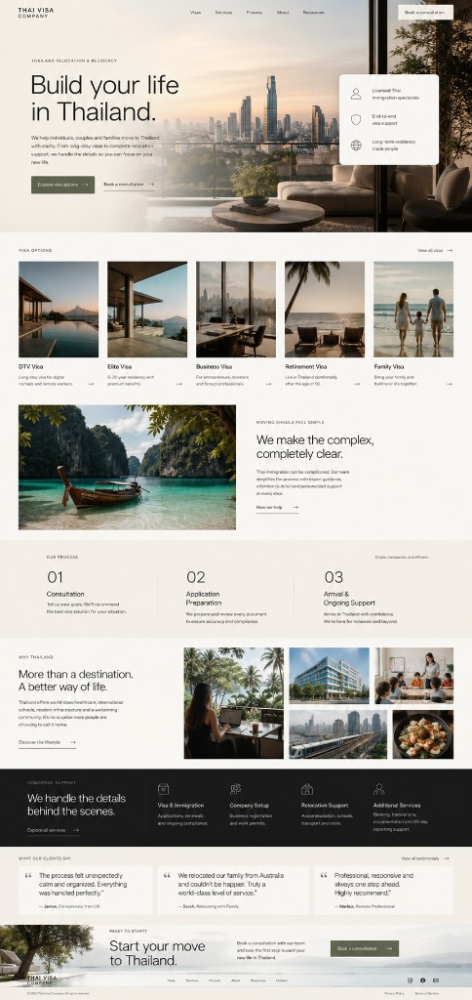

# Design reference — Thai Visa Company

Permanent visual calibration and design memory for humans and AI agents. Read this folder before any UI, typography, or visual work.

**No component changes belong in this layer** — documentation and long-term direction only.

---

## Primary visual calibration reference

**File:** [`premium-direction-reference-v1.png`](./premium-direction-reference-v1.png)

This image is the **primary visual calibration reference** for the product. It encodes the target *feeling* of the interface — not a page to build verbatim.

### Use it to guide

- **Typography feeling** — large, restrained sans-serif display; clear hierarchy; tight tracking on headlines; readable UI body
- **Spacing rhythm** — generous whitespace between bands; grid discipline; calm vertical pacing
- **Premium atmosphere** — trustworthy, polished, operational — not flashy or ornamental
- **Image treatment** — architectural photography, warm grade, sharp frames, minimal overlay
- **Architectural cleanliness** — aligned grids, structured surfaces, precise edges
- **Visual restraint** — borders and tone before decoration; no spectacle

### Do NOT use it to copy

- Exact layouts or wireframes
- Section structure or page flow
- Card placement or grid compositions
- Hero composition or trust-panel positioning
- Homepage section order or content architecture

Extract **principles and tone** only. Implement within the existing site structure.

---

## Layout system

Container widths, article grids, and page-type rules: [`layout-system.md`](./layout-system.md).

---

## Intended visual direction

The frontend should feel:

- Modern premium
- Calm
- Architectural
- Trustworthy
- Highly polished
- Restrained
- Contemporary

**Closer to:** Bilt · Ramp · Apple · Linear · premium real estate brands · calm enterprise product design

**Not:** serif editorial · fashion luxury · hotel/resort luxury · flashy startup SaaS

> This brand should feel modern, trustworthy, architectural, and operationally premium — not editorial, resort-like, or fashion-oriented.

---

## Visual principles

| Principle | Meaning |
|-----------|---------|
| **Whitespace as luxury** | Section breathing room is a trust signal; never fill space to “look complete” |
| **Typography-first hierarchy** | Inter Tight for display authority; Geist for UI; hierarchy from type scale, not decoration |
| **Borders before shadows** | Surfaces separate with border and tone; shadows only for layering (e.g. sticky chrome), never decorative depth |
| **Restrained color palette** | Warm ivory, charcoal, stone, muted olive accent — color lives in photography, not UI chrome |
| **Subtle motion only** | Short reveals; respect reduced motion; no scroll gimmicks or animated backgrounds |
| **Premium through clarity** | Competence and structure read as luxury — not gold, serifs, glass, or gradients |
| **Calm conversion UX** | One clear primary action; factual reassurance; no urgency theater |

---

## Design intelligence documents

| Document | Role |
|----------|------|
| [brand-system.md](./brand-system.md) | Brand philosophy, tokens, typography, color, spacing, surfaces (canonical target state) |
| [ui-principles.md](./ui-principles.md) | Operational rules for builders and agents |
| [design-audit.md](./design-audit.md) | Frontend vs target — drift and remediation phases |
| [visual-inconsistency-audit.md](./visual-inconsistency-audit.md) | Post-token normalization opportunities |
| [phase-2-token-audit.md](./phase-2-token-audit.md) | Token implementation notes |
| [homepage-refinement-strategy.md](./homepage-refinement-strategy.md) | Homepage premium audit vs reference v1 + Phases A/B/C roadmap |

### Reading order

1. **This README** + reference image (calibration)
2. **brand-system.md** (target system)
3. **ui-principles.md** (how to apply)
4. **homepage-refinement-strategy.md** (homepage visual refinement — when implementing UI polish)
5. **design-audit.md** / **visual-inconsistency-audit.md** (what code still diverges)

---

## For AI agents

When generating or refining UI:

1. Open `premium-direction-reference-v1.png` for **tone and restraint** — not layout.
2. Follow [brand-system.md](./brand-system.md) and [ui-principles.md](./ui-principles.md).
3. Do not introduce glassmorphism, heavy shadows, serif display type, neon accents, or editorial luxury patterns.
4. Do not redesign homepage sections or information architecture unless explicitly requested.

---

## Legacy root docs (historical)

Superseded for direction — use `docs/design/` first:

- [`DESIGN_SYSTEM.md`](../DESIGN_SYSTEM.md)
- [`RELOCATION_PLATFORM_DESIGN.md`](../RELOCATION_PLATFORM_DESIGN.md)
- [`PHOTOGRAPHY_DIRECTION.md`](../PHOTOGRAPHY_DIRECTION.md)
