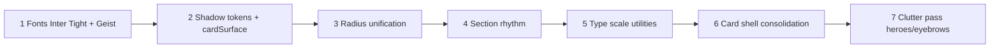

# Design audit

**Date:** 2026-05-21  
**Baseline:** Current frontend vs [brand-system.md](./brand-system.md) and [ui-principles.md](./ui-principles.md)  
**Scope:** Visual system drift only — not product architecture, section order, or unpublished content strategy.

---

## Summary

The codebase has strong foundations (ivory/charcoal tokens, `Section` spacing variables, shared `section-styles`). The largest gap is **typography direction**: Newsreader serif and `font-editorial` conflict with the target **Inter Tight + Geist** architectural sans system. Secondary gaps: **shadow and radius inconsistency**, fragmented type scales, and legacy documentation that sends mixed signals.

**Remediation:** Phase 2 — no component changes in the documentation phase.

---

## Severity legend

| Level | Meaning |
|-------|---------|
| **High** | Breaks brand direction; fix before visual polish pass |
| **Medium** | Inconsistency that erodes premium cohesion |
| **Low** | Local clutter or naming debt |

---

## Findings

### 1. Serif / editorial typography — **High**

**Target:** Inter Tight display + Geist UI; no serif; no editorial treatment.

**Evidence:**

| Location | Issue |
|----------|--------|
| [`app/layout.tsx`](../../app/layout.tsx) | Loads `Newsreader` from `next/font/google`; exposes `--font-newsreader` |
| [`styles/tokens.css`](../../styles/tokens.css) | `--font-editorial`, `--font-heading` map to serif stack |
| [`lib/section-styles.ts`](../../lib/section-styles.ts) | `pageTitleClass` uses `font-editorial`, `--tracking-editorial` |
| [`components/layout/section-heading.tsx`](../../components/layout/section-heading.tsx) | `titleVariants` use `font-editorial` |
| [`components/sections/resources-category-groups.tsx`](../../components/sections/resources-category-groups.tsx) | Category headings use `font-editorial` |
| [`styles/editorial.css`](../../styles/editorial.css) | Filename and patterns (`editorial-eyebrow`, hero frame) imply editorial stack |
| [`app/globals.css`](../../app/globals.css) | Re-exports `--font-editorial` |

**Phase 2 fix:**

- Add Inter Tight in `layout.tsx`; set `--font-display` / `--font-heading`
- Remove Newsreader and `--font-editorial`
- Replace `font-editorial` utilities with `font-display` across section-styles and headings
- Rename `--tracking-editorial` → `--tracking-display`; update comments

---

### 2. Conflicting design documentation — **High**

**Target:** Single canonical direction in `docs/design/`.

**Evidence:**

| Doc | Conflict |
|-----|----------|
| [`DESIGN_SYSTEM.md`](../../DESIGN_SYSTEM.md) | Geist-first, but recommends `rounded-2xl` / `rounded-3xl` — conflicts with tokenized 6px radius |
| [`RELOCATION_PLATFORM_DESIGN.md`](../../RELOCATION_PLATFORM_DESIGN.md) | Legacy hospitality/editorial framing; references superseded aesthetic |
| [`PREMIUM_DESIGN_REFINEMENT.md`](../../PREMIUM_DESIGN_REFINEMENT.md) | Earlier pass; may contradict shadow/radius targets |

**Phase 2 fix:**

- Supersession banners added (this phase) — agents should read `docs/design/` first
- Optionally archive or trim legacy root docs after Phase 2 code alignment

---

### 3. Shadow overuse / inconsistency — **Medium**

**Target:** Borders and spacing before shadows; nearly imperceptible shadows only for layering/interaction.

**Evidence:**

| Location | Issue |
|----------|--------|
| [`lib/section-styles.ts`](../../lib/section-styles.ts) | `cardSurfaceClass` — resting `shadow-[0_1px_2px...]` + stronger hover shadow |
| [`lib/mobile-contact-bar-styles.ts`](../../lib/mobile-contact-bar-styles.ts) | `shadow-[0_-6px_20px_-10px_rgba(0,0,0,0.12)]` — acceptable for layer, but not tokenized |
| Trust / visa cards | Mixed flat vs lifted card languages |

**Phase 2 fix:**

- Remove resting shadow from `cardSurfaceClass`; hover → border/background only
- Introduce `--shadow-layer` for sticky bar; document in `tokens.css`
- Audit card components for one shadow language

---

### 4. Radius inconsistency — **Medium**

**Target:** Unified `--radius` (6px) with rare `--radius-md` for media; avoid `rounded-xl` as default card language.

**Evidence:**

| Location | Class |
|----------|--------|
| [`styles/tokens.css`](../../styles/tokens.css) | `--radius: 0.375rem` (6px) |
| [`components/sections/process.tsx`](../../components/sections/process.tsx) | `rounded-xl` container and items |
| [`components/ui/faq-item.tsx`](../../components/ui/faq-item.tsx) | `rounded-xl` FAQ shell |
| [`components/layout/navbar.tsx`](../../components/layout/navbar.tsx) | `rounded-xl` mobile menu trigger |
| [`components/sections/visa-requirements.tsx`](../../components/sections/visa-requirements.tsx) | `lg:rounded-xl` bordered panels |
| [`components/sections/resources-category-groups.tsx`](../../components/sections/resources-category-groups.tsx) | `rounded-xl` dashed placeholders |
| [`components/layout/article-layout.tsx`](../../components/layout/article-layout.tsx) | `rounded-xl` empty states |

**Phase 2 fix:**

- Map cards/FAQ/process to `rounded-[var(--radius)]` unless media frame needs `--radius-md`
- Update `DESIGN_SYSTEM.md` radius guidance or leave superseded

---

### 5. Section rhythm inconsistency — **Medium**

**Target:** `Section` component spacing tokens everywhere on marketing pages.

**Evidence:**

| Location | Issue |
|----------|--------|
| [`components/layout/section.tsx`](../../components/layout/section.tsx) | Tokenized section padding via explicit vars (`--space-section-y`, `-sm`, `-lg`, `-hero`) |
| [`components/layout/article-layout.tsx`](../../components/layout/article-layout.tsx) | Hardcoded `py-12 sm:py-14 md:py-16` on bands |
| [`components/sections/page-at-a-glance.tsx`](../../components/sections/page-at-a-glance.tsx) | `py-9 sm:py-10` — tighter than section scale |
| [`components/layout/footer.tsx`](../../components/layout/footer.tsx) | `py-12 sm:py-14 lg:py-16` |

**Phase 2 fix:**

- Align article/footer/at-a-glance to `compact` / `default` Section spacing or document exceptions

---

### 6. Typography scale fragmentation — **Medium**

**Target:** Semantic scale from brand-system; minimize arbitrary pixels.

**Evidence:**

| Location | Examples |
|----------|----------|
| [`lib/section-styles.ts`](../../lib/section-styles.ts) | `text-[1.625rem]`, `text-[15px]`, `text-[13px]` |
| [`lib/article-styles.ts`](../../lib/article-styles.ts) | `text-[1.5rem]`, `text-[1.125rem]`, `text-[15px]` |
| [`lib/form-styles.ts`](../../lib/form-styles.ts) | `text-lg font-semibold` vs 15px body elsewhere |
| [`components/forms/inquiry-form.tsx`](../../components/forms/inquiry-form.tsx) | `text-[13px]` errors |
| [`components/sections/resources-category-groups.tsx`](../../components/sections/resources-category-groups.tsx) | `text-[14px]` placeholders |

**Phase 2 fix:**

- Centralize type utilities or CSS variables per scale row in brand-system
- Migrate arbitrary sizes incrementally (forms and articles first)

---

### 7. Card system split — **Medium**

**Target:** Border-first cards via `cardSurfaceClass`; consistent radius and padding.

**Evidence:**

| Pattern | Components |
|---------|------------|
| `cardSurfaceClass` | Visa, trust, resource cards |
| `rounded-xl` bordered shells | FAQ, process, visa requirements (lg) |
| Dashed `rounded-xl` placeholders | Resources categories, article layout |

**Phase 2 fix:**

- Extract `cardPlaceholderClass` and `cardShellClass` sharing radius/border tokens
- FAQ/process align with visa card border language

---

### 8. Visual clutter / gimmick risk — **Low–Medium**

**Target:** Restraint; no stacked decorative layers.

**Evidence:**

| Location | Risk |
|----------|------|
| [`lib/section-styles.ts`](../../lib/section-styles.ts) | `sectionBandClass` — olive tint band |
| Hero | `hero-media-frame` wash + overlay + trust list + mock panel |
| [`styles/editorial.css`](../../styles/editorial.css) | Editorial eyebrow olive dot |
| Trust sections | Multiple Lucide icons at small size |

**Phase 2 fix:**

- Cap olive bands per page (already documented — enforce in templates)
- Simplify hero overlays to one wash OR one gradient
- Replace editorial eyebrow marker with sans eyebrow per brand-system

---

### 9. Legacy radius guidance in DESIGN_SYSTEM — **Medium**

**Evidence:** [`DESIGN_SYSTEM.md`](../../DESIGN_SYSTEM.md) recommends `rounded-2xl` / `rounded-3xl` while tokens use 6px.

**Phase 2 fix:** Supersession banner; do not follow legacy radius section for new work.

---

## Non-findings (out of scope)

These are **not** visual-system audit items:

- Homepage section order (Reviews → Final CTA → FAQ)
- Missing `/visas` hub route
- Unpublished resource articles / “Coming soon” cards
- CRM, conversion copy, or SEO architecture

See [`FINAL_ARCHITECTURE_AUDIT.md`](../../FINAL_ARCHITECTURE_AUDIT.md) and [`CONVERSION_AUDIT.md`](../../CONVERSION_AUDIT.md).

---

## Phase 2 remediation priority

| Order | Workstream | Primary files |
|-------|------------|---------------|
| 1 | Font stack | `app/layout.tsx`, `styles/tokens.css`, `lib/section-styles.ts`, `section-heading.tsx` |
| 2 | Shadows | `lib/section-styles.ts`, `lib/mobile-contact-bar-styles.ts`, `styles/tokens.css` |
| 3 | Radius | process, faq-item, navbar, visa-requirements, resources-category-groups |
| 4 | Section rhythm | article-layout, page-at-a-glance, footer |
| 5 | Type scale | section-styles, article-styles, form-styles |
| 6 | Cards | faq, process, placeholders |
| 7 | Clutter | hero, editorial.css, sectionBand usage |

---

## Acceptance criteria (Phase 2)

- [x] No `Newsreader` or `font-editorial` in production bundle (2026-05-21)
- [x] Inter Tight loaded for `--font-display`
- [x] Cards use border-first surfaces; no decorative hover shadow on static cards
- [x] `rounded-xl` removed from default card/FAQ/process/nav language
- [ ] Marketing sections use `Section` spacing variants consistently (footer/article bands still hardcoded)
- [ ] Arbitrary `text-[Npx]` reduced to documented scale (section-styles + articles updated; forms/footer partial)
- [x] `docs/design/` remains canonical; legacy root design docs superseded

See [phase-2-token-audit.md](./phase-2-token-audit.md) for implementation notes.
