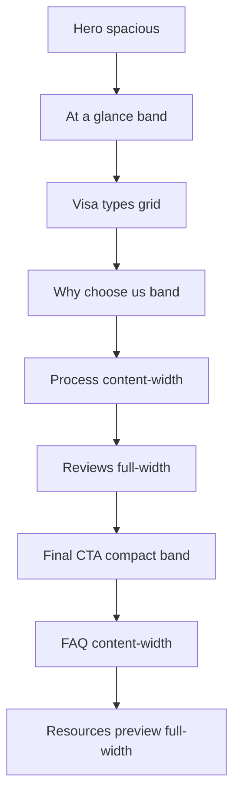

# Homepage premium refinement strategy

**Date:** 2026-05-21  
**Calibration:** [`premium-direction-reference-v1.png`](./premium-direction-reference-v1.png) — atmosphere only, **not** a layout blueprint  
**Scope:** Refinement audit + implementation roadmap. **No redesign.** Architecture, SEO, section order, and component boundaries stay intact.

**Constraints (fixed):**

- Preserve [`app/page.tsx`](../app/page.tsx) section order and IDs
- Preserve JSON-LD, `homepageAiCopy`, heading semantics
- Preserve `Section` / `Container` / `SectionHeading` / card components
- No new animation systems; keep existing `SectionReveal` / `StaggerGrid` unless tuning distance only

**Current homepage flow:**

---

## Calibration lens (from reference v1)

Extract **feeling**, not structure:

| Signal | Target |
|--------|--------|
| Typography | Large display authority, tight tracking, calm body, dramatic headline vs meta contrast |
| Space | Section bands breathe; grids feel locked-in, not floating |
| Photography | Architectural, warm grade, sharp frames, color in images not UI chrome |
| Surfaces | Border + tone separation; nearly no decorative shadow |
| Conversion | One primary path; trust factual, not loud |
| Anti-patterns | No glass, gradient bands, serif, amber/gold UI chrome, stock vacation vibe |

---

## Section-by-section audit

### 0. Global homepage observations

| Dimension | Current state | vs calibration | Gap severity |
|-----------|---------------|----------------|--------------|
| Visual hierarchy | Clear H1 → sections; cards compete with section titles | Reference: display dominates; cards are subordinate | Medium |
| Typography | Heroes/sections tokenized; cards still 15/14px Geist | Reference: bolder display scale, quieter cards | Medium |
| Images | Single hero only; cards are text-only | Reference: photography throughout — **do not add collage**; hero quality matters more | Medium (hero) · Low (cards) |
| Surfaces | Border-first cards; 2× `sectionBandClass` + at-a-glance band | Slight band fatigue; still calm | Low–Medium |
| Layout rhythm | Mixed `default` / `spacious` / `compact` / `content` widths | Good skeleton; cadence uneven between full vs content | Medium |
| Conversion | Hero + final CTA strong; FAQ after CTA | Order is intentional (conversion audit); reference places CTA at footer only — **keep current order** | Low |
| Mobile | Readable; dense hero trust stack; process list cramped | Hero long scroll before visas; CTAs OK at h-11 | Medium |

---

### 1. Hero (`HeroSection` → `PageHero` + `HeroMediaFrame`)

**Files:** [`hero.tsx`](../components/sections/hero.tsx), [`page-hero.tsx`](../components/layout/page-hero.tsx), [`editorial.css`](../styles/editorial.css), [`photography.ts`](../lib/media/photography.ts)

#### Visual hierarchy

| Aspect | Current | Opportunity |
|--------|---------|-------------|
| Headline rhythm | H1 + secondary tagline line — two-line stack is good for SEO | Secondary line could be slightly more muted (tertiary tier) so primary H1 reads as single architectural statement |
| CTA prominence | `ContactCtaGroup` below lead — correct | Reassurance line uses `text-sm` — align to `--text-small`; ensure primary button is visually first (LINE) |
| Section pacing | `spacing="spacious"` — appropriate | — |
| Content density | Trust divider + Google summary + 3 icon bullets — **dense** below CTAs | Reference: lighter trust — consider collapsing to summary **or** bullets, not both at full weight |
| Whitespace | Split grid `gap-10` → `gap-16` xl | Slightly increase lead-to-CTA token gap on desktop for calibration “breathing room” |

#### Typography

- Display scale tops at 34px (`--text-display-lg`) — reference feels **larger on desktop**. Phase C: optional single step to 36–38px at `lg` without breaking mobile.
- `pageTitleSecondaryClass` — good sans subline; ensure it does not rival H1 weight.

#### Image treatment

- Portrait 4:5 frame — architectural, bordered — **aligned** with restraint (not full-bleed reference hero).
- Wash + gradient overlay — acceptable; avoid adding third overlay layer.
- Unsplash residence — warm, not tourist cliché — **good**.
- Caption uppercase on image — subtle luxury; ensure contrast stays legible.
- **Sizing:** `max-w-md` on mobile centers image — premium; on lg column feels slightly narrow vs copy column — tune `lg` column balance only (not full-bleed).

#### Surfaces

- No floating trust card on image (reference has one) — **correct per guardrail**; do not add overlay card.
- Trust block uses border-top only — good.

#### Layout rhythm

- First impression is **copy-left / image-right** — keep.
- Motion: `fadeUpMount` on copy and image — keep subtle.

#### Conversion

- Strong: dual messaging CTAs + review proof.
- Risk: trust list feels like a **checklist ad** — shorten copy or reduce to 2 bullets for premium calm.

#### Mobile

- Stack: copy → image → long trust — **long hero**.
- Mitigation (refinement): tighten trust block spacing; consider `GoogleReviewSummary` only on mobile, bullets on desktop (or vice versa) — **content-preserving** display rules only.

**Section grade:** B+ → target A- via density + display scale + trust simplification.

---

### 2. At a glance (`PageAtAGlance`)

**Files:** [`page-at-a-glance.tsx`](../components/sections/page-at-a-glance.tsx)

#### Assessment

- SEO/AI extractable block — **keep** (architecture constraint).
- Visually: second band immediately after hero — `surface-band` + olive bullets + `foreground/90` body reads **louder** than muted section descriptions.
- Reference has no equivalent — feels like an **inserted utility strip**, not premium editorial flow.

#### Opportunities (refinement only)

- Tone list items to `text-muted-foreground` or `--text-secondary`.
- Reduce vertical padding to `compact` band token (or single `--space-section-y-sm` without duplicating sm breakpoint).
- Optional: remove olive dots → simple en-dash or no marker (align with process/visa bullet language).
- Eyebrow without `section-eyebrow-marker` here (less decorative noise).

**Section grade:** C+ → B via tonal quieting (no removal).

---

### 3. Visa types (`VisaTypesSection`)

**Files:** [`visa-types.tsx`](../components/sections/visa-types.tsx), [`visa-card.tsx`](../components/cards/visa-card.tsx)

#### Visual hierarchy

- `SectionHeading` — good display hierarchy.
- Five cards in 2-col → 6-col grid with offset row — **clever** but desktop layout is **dense** vs reference’s airy image-top row (do **not** switch to 5-column; refine spacing only).
- Card titles 15px medium — **below** section title authority — correct relationship but cards feel utilitarian.

#### Typography

- Benefit line with `CircleCheck` + `foreground/90` — third text tier inside card.
- “Learn more” pseudo-link + overlay link — fine for a11y; visually quiet — good.

#### Image treatment

- **No card images** — biggest visual gap vs reference mood. **Not a Phase A requirement** (would be content/design asset work). Phase C: optional thumbnail slot in `VisaCard` if brand photography exists — behind feature flag / prop.

#### Surfaces

- `cardSurfaceClass` — aligned.
- Hover border only — good.

#### Layout rhythm

- `gap-3.5` / `gap-5` / `lg:gap-6` — normalize to grid tokens (Batch B).
- `lg:col-start-2` offset — slightly asymmetric; premium if gaps are generous — verify optical centering in Phase C.

#### Conversion

- Cards link to visa pages — clear intent.
- No section-level CTA — acceptable; hero covers contact.

#### Mobile

- Single column stack — good.
- Card padding and benefit block add height — acceptable.

**Section grade:** B → A- via grid tokens + card typography utilities + optional imagery (C).

---

### 4. Why choose us (`WhyChooseUsSection`)

**Files:** [`why-choose-us.tsx`](../components/sections/why-choose-us.tsx), [`trust-card.tsx`](../components/cards/trust-card.tsx)

#### Visual hierarchy

- Band section (`sectionBandClass`) — second tinted band on page (after at-a-glance) — **band fatigue** risk.
- Four equal trust cards — reference uses fewer, larger ideas; four is OK for conversion but reads **grid-heavy**.

#### Typography

- Trust card titles 15px — consistent with visa cards — good sibling relationship.
- Icons `foreground/35` vs hero olive icons — **inconsistent trust color language** (see visual-inconsistency audit).

#### Surfaces

- Cards identical to visa — good system consistency.

#### Layout rhythm

- 2×2 grid `gap-3.5` — normalize tokens.

#### Conversion

- Strong rational trust — aligns with consultation intent.

#### Mobile

- 1-col stack — fine.

**Section grade:** B → A- via icon color unification + band alternation review (consider plain `sectionDividerClass` if at-a-glance stays band — only one “strong” band per scroll depth).

---

### 5. Process (`ProcessSection`)

**Files:** [`process.tsx`](../components/sections/process.tsx), [`process-step.tsx`](../components/cards/process-step.tsx)

#### Visual hierarchy

- `Container size="content"` — narrows section — **good** calm cadence vs full-width grids.
- Mobile: single `cardShellClass` with dividers — **dense** (`px-3.5 py-3.5`).
- Desktop: 2×2 bordered cells — closer to reference’s numbered steps, but reference uses **large light step numbers** — refinement target.

#### Typography

- Step badge: small muted box `11px` — reference: oversized numeral as **graphic** element. Phase B/C: introduce `processStepNumberClass` (display, light weight, large size) without changing copy structure.

#### Image treatment

- N/A — appropriate.

#### Surfaces

- Shell + inner cards — dual surface on sm+ — slightly busy; Phase B: simplify mobile to card padding tokens only.

#### Conversion

- Clear 4-step narrative — supports confidence.

#### Mobile

- **Weakest rhythm section** on homepage — cramped padding.

**Section grade:** B- → A- via mobile padding + display numerals (typography only).

---

### 6. Reviews (`ReviewsSection`)

**Files:** [`reviews.tsx`](../components/sections/reviews.tsx), [`review-card.tsx`](../components/cards/review-card.tsx), [`google-review-summary.tsx`](../components/ui/google-review-summary.tsx)

#### Visual hierarchy

- Header row: `SectionHeading` + `GoogleReviewSummary` `size="md"` — summary can **compete** with section title (large rating type).
- Phase A: use `size="sm"` in section header; reserve `md` for hero/footer only.

#### Typography

- Review quotes `foreground/85` — OK.
- Names 14px — migrate to card body token.

#### Image treatment

- N/A.

#### Surfaces

- `sectionDividerClass` only — calm transition — good.
- **Amber star fill** — reads “Google default”, not Bilt/Ramp. Phase C: muted charcoal/olive star treatment or single accent star — **micro-refinement**, high perceptual impact.

#### Conversion

- Link to Google reviews — trust.
- Placed before final CTA — supports conversion arc.

#### Mobile

- 1-col cards — good.
- Stacked header (title then summary) — ensure summary doesn’t dominate.

**Section grade:** B → A- via summary scale + star chroma restraint.

---

### 7. Final CTA (`FinalCTASection`)

**Files:** [`final-cta.tsx`](../components/sections/final-cta.tsx)

#### Visual hierarchy

- `spacing="compact"` + `sectionBandClass` + `content` container — **strong** closing band.
- Third band on page — with at-a-glance + why-us, consider whether this band needs full tint or divider-only (Phase B visual study).

#### Typography

- Footnote `text-[13px]` — tokenize to `--text-small`.

#### Conversion

- `showExploreCta={false}` on homepage — **correct** single intent (contact).
- Review summary + CTAs + footnote — slightly dense; mirror hero trust simplification patterns.

#### Mobile

- Narrow content width — premium focused column — good.

**Section grade:** A- → A via footnote tokens + optional band softening.

---

### 8. FAQ (`FaqSection`)

**Files:** [`faq.tsx`](../components/sections/faq.tsx), [`faq-item.tsx`](../components/ui/faq-item.tsx)

#### Visual hierarchy

- Content-width — good pause after CTA.
- Accordion in `cardShellClass` — consistent.

#### Typography

- FAQ question 15px — OK; answer 14/15px stepped — unify to body/small tokens.

#### Surfaces

- Flat accordion triggers — aligned with restraint.

#### Conversion

- Post-CTA FAQ — answers objections without stealing primary CTA — **keep order**.

#### Mobile

- `min-h-11` triggers — accessible; adequate premium feel.

**Section grade:** B+ → A- via type tokens only.

---

### 9. Resources preview (`ResourcesPreviewSection`)

**Files:** [`resources-preview.tsx`](../components/sections/resources-preview.tsx), [`resource-card.tsx`](../components/cards/resource-card.tsx)

#### Visual hierarchy

- Full-width after FAQ — correct “secondary” placement.
- Resource cards match visa card language — good.

#### Layout rhythm

- Footer link with `border-t` — mirrors final CTA pattern — consistent.

#### Conversion

- Low-pressure explore path — appropriate after FAQ.

**Section grade:** B+ → A- via card typography utilities (shared with Phase B).

---

## Cross-cutting refinement themes

| Theme | Homepage impact | Phase |
|-------|-----------------|-------|
| Card typography utilities | Visa, trust, resource, review, process | B |
| Grid gap tokens | All grids | B |
| Muted text tiers (3 only) | Hero trust, at-a-glance, cards, footnotes | A |
| Trust / review density | Hero + final CTA | A |
| Band alternation policy | At-a-glance, why-us, final CTA | B |
| Hero display scale (desktop) | Hero only | C |
| Process step numerals | Process | B/C |
| Star color restraint | Reviews | C |
| Hero trust icon color | Hero vs trust cards | A |
| Optional visa card imagery | Visa types | C (asset-dependent) |

---

## Phased implementation roadmap

### PHASE A — Quick high-impact refinements

**Goal:** Perceptible premium lift in &lt;1 day of focused UI work. No new components. No layout restructure.

| # | Task | Target files | Expected effect |
|---|------|--------------|-----------------|
| A1 | Simplify hero trust density (tune spacing; reduce visual weight of duplicate proof) | `page-hero.tsx`, `hero.tsx` | Calmer first screen; more reference-like restraint |
| A2 | Quiet **At a glance** band (muted text, softer markers) | `page-at-a-glance.tsx` | Smoother hero → content transition |
| A3 | Unify trust icon color to muted semantic (hero olive → `text-muted-foreground/50` or keep olive only in hero) | `section-styles.ts`, `trust-card.tsx` | Less chromatic noise |
| A4 | Reviews header: `GoogleReviewSummary` → `size="sm"` | `reviews.tsx` | Section title regains authority |
| A5 | Navbar/mobile CTA height alignment (`min-h-10` desktop) | `lib/cta.ts` | Premium consistency at conversion edge |
| A6 | Tokenize hero/footer microcopy (`text-[13px]` → `--text-small`) | `final-cta.tsx`, `page-hero.tsx` meta lines | System feel |
| A7 | Remove `skip-link` shadow if still present | `skip-link.tsx` | Surface philosophy |

**Acceptance:** Homepage scroll feels calmer at top; no new sections; Lighthouse/SEO unchanged; one primary CTA path obvious.

---

### PHASE B — System-level consistency improvements

**Goal:** One rhythm language across all homepage sections. Still no section reorder or new layouts.

| # | Task | Target files | Expected effect |
|---|------|--------------|-----------------|
| B1 | Add `--space-grid-gap-sm`, `--space-grid-gap`; export `cardGridClass` | `tokens.css`, `section-styles.ts` | Unified grid breathing |
| B2 | Apply `cardGridClass` to visa, why-us, reviews, resources | Section files | Even cadence |
| B3 | Add `cardTitleClass`, `cardBodyClass`, `metaTextClass`; migrate all homepage cards | `typography.ts`, `cards/*` | Typography-first hierarchy |
| B4 | Process mobile padding → card padding tokens | `process.tsx` | Mobile premium |
| B5 | Process step number → display numeral style (large, light) | `process-step.tsx`, `tokens.css` optional | Architectural step section |
| B6 | Band policy: max 2 strong bands — soften at-a-glance **or** why-us (divider vs tint) | `page-at-a-glance.tsx`, `why-choose-us.tsx` | Less band fatigue |
| B7 | Tokenize `PageHero` vertical spacing (`--space-hero-*`) | `tokens.css`, `page-hero.tsx` | Predictable hero rhythm |
| B8 | `sectionContentOffsetClass` already tokenized — verify all sections use it (no ad-hoc `mt-6`) | `final-cta.tsx`, `resources-preview.tsx` | Heading-to-content consistency |
| B9 | FAQ + accordion copy → body/small tokens | `faq-item.tsx` | Quiet utility |

**Acceptance:** All homepage grids use gap tokens; all cards use shared type classes; process readable on 375px; section bands feel intentional not repetitive.

---

### PHASE C — Premium polish and final calibration

**Goal:** Bilt/Ramp-level finish — micro-tuning against reference v1. Optional asset work.

| # | Task | Target files | Expected effect |
|---|------|--------------|-----------------|
| C1 | Hero display scale +1 step at `lg` only (e.g. 2.25rem → 2.375rem) | `tokens.css`, `pageTitleClass` | Reference-bold headline without mobile blowout |
| C2 | Hero image column balance (subtle max-width / aspect tune) | `page-hero.tsx`, `editorial.css` | Better split balance |
| C3 | Review star chroma → restrained (charcoal/olive, not amber) | `review-card.tsx` | Premium trust, less plugin-default |
| C4 | Visa grid optical centering review (`col-start-2`) | `visa-types.tsx` | Architectural grid |
| C5 | Optional `VisaCard` image prop + curated thumbs (if assets ready) | `visa-card.tsx`, `photography.ts` | Reference mood without 5-col clone |
| C6 | Photography pass: hero + optional card crops (warm grade consistency) | `photography.ts` | Tonal consistency |
| C7 | Reduce motion distance 10–15% if feels heavy (optional) | `motion.css` | Subtle polish |
| C8 | Final cross-page visual QA vs reference v1 (checklist) | `docs/design/` | Sign-off |

**Acceptance:** Side-by-side with reference — same *calm premium* tier; homepage structure unchanged; stakeholders confirm “operational luxury” not “travel agency.”

---

## Explicit non-goals (all phases)

- Reordering sections (Reviews / Final CTA / FAQ order stays per conversion strategy)
- Cloning reference: 5-column visa strip, dark service band, lifestyle collage, floating hero card
- New animation systems, parallax, video heroes
- Replacing `Section` / `Container` architecture
- H1/copy changes that break SEO extracts without content team review
- shadcn `Button` replacing `ctaButton*` on marketing surfaces

---

## Verification checklist (post-implementation)

- [ ] Single obvious primary action on hero and final CTA (LINE/WhatsApp)
- [ ] ≤2 strong tinted bands visible in first 3 viewport heights
- [ ] All homepage card grids share gap tokens
- [ ] No `text-[14px]` / `text-[15px]` literals on homepage cards
- [ ] Hero + reviews + navbar CTA heights coherent
- [ ] No decorative shadows on cards
- [ ] `premium-direction-reference-v1.png` mood match — structure intentionally different
- [ ] Mobile hero scroll length acceptable (&lt;2 screens to visa section ideal)
- [ ] JSON-LD and `homepageAiCopy` unchanged unless copy team approves

---

## Related documents

- [README.md](./README.md) — calibration guardrails
- [brand-system.md](./brand-system.md) — token target state
- [ui-principles.md](./ui-principles.md) — operational rules
- [visual-inconsistency-audit.md](./visual-inconsistency-audit.md) — cross-site normalization (feeds Phase B)
- [CONVERSION_AUDIT.md](../../CONVERSION_AUDIT.md) — CTA/section order rationale
