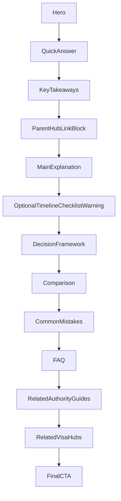

# Golden Authority Guide Template

**Golden Authority Guide Template Version:** 1.0  
**Status:** Approved  
**Architecture owner:** Thai Visa Company  
**Governance inputs:** Phase 0 (Search Intent Research), Phase 0A (Search Intent Governance), Phase 0B (Authority Guide Prioritization)  
**Related templates:** [`docs/golden-visa-page-template.md`](golden-visa-page-template.md) (Visa Hubs), [`docs/content/visa-hub-canonical-policy.md`](content/visa-hub-canonical-policy.md)

This document is the **source of truth** for building and maintaining every Thailand Visa Authority Guide.

Authority Guides are evergreen decision and comparison pages that strengthen Visa Hub pages. They do not replace hubs. They do not compete with hubs.

---

## Golden Rule

Authority Guides exist to support Visa Hub pages.

- **One search intent. One canonical owner.**
- Visa Hubs own head terms (`requirements`, `cost`, `eligibility`, route overview).
- Authority Guides own evaluation, comparison, transition, and high-stakes decision intents.
- Supporting Guides own procedural depth beneath Authority Guides.

A writer should be able to produce any Authority Guide from this document alone, without referencing previously published guides.

---

## Template Governance

| Field | Value |
| --- | --- |
| **Version** | 1.0 |
| **Status** | Approved |
| **Architecture owner** | Thai Visa Company |
| **URL pattern** | `/guides/{slug}` |
| **Primary engine** | Guides (evergreen authority) |

### What may change (per guide)

- Copy and examples
- Comparison rows and decision criteria
- FAQ items (within ownership rules)
- Related links
- Supporting guide references
- Images and media

### What may NOT change (without governance process)

- Section order (frozen architecture below)
- Section ownership rules
- Internal linking hierarchy
- Quality gate requirements
- Component misuse boundaries

### Amendment process

Any change to locked architecture requires **all three** steps:

1. **Documented rationale** — impact on SEO, AEO, conversion, trust, or maintenance.
2. **Governance review** — approval by architecture owner.
3. **Version increment** — e.g. 1.0 → 1.1, recorded in Amendment Log.

---

## 1. Fixed Page Architecture (Frozen)

Authority Guides use this section sequence. Do not reorder.

| # | Section | Required | Purpose |
| --- | --- | --- | --- |
| 1 | **Hero** | Required | Establish topic, primary query match, and reader context without answering the full question. |
| 2 | **Quick Answer** | Required | Direct, citation-ready answer to the primary search query in 2-4 sentences. |
| 3 | **Key Takeaways** | Required | Scannable decision highlights for humans and AI extractors. |
| 4 | **Parent Hub Link Block** | Required | Explicit upward link to canonical Visa Hub (or hub set for cross-route guides). |
| 5 | **Main Explanation** | Required | Detailed guidance that goes beyond the hub without duplicating hub head-term ownership. |
| 6 | **Decision Framework** | Required for comparison/selection guides; Optional otherwise | Structured route-to-outcome logic (who should choose what, and why). |
| 7 | **Comparison** | Required when primary intent is `vs`/comparison; Optional otherwise | Side-by-side decision support (table or matrix). |
| 8 | **Common Mistakes** | Required | High-cost errors that cause refusal, delay, or wrong route choice. |
| 9 | **FAQ** | Required (5-12 items) | Edge cases and long-tail questions not owned by hub head-term FAQ. |
| 10 | **Related Authority Guides** | Required (2-4 links) | Sibling decision/comparison intents with natural overlap. |
| 11 | **Related Visa Hubs** | Required (1-3 links) | Commercial and informational destinations; hub remains canonical for route facts. |
| 12 | **Final CTA** | Required | Consultation invitation mapped to decision complexity. |

### Optional sections (use only when intent demands)

| Section | When to include | When to omit |
| --- | --- | --- |
| **Timeline** | Process has strict sequencing (e.g. visa then work permit) | Pure conceptual comparison with no sequence dependency |
| **Checklist** | Document-preparation intent is secondary but material | Decision-only guides with no immediate filing step |
| **Warning box** | Legal/compliance risk is central to intent | Low-risk informational guides |
| **Practical tip** | One high-value operational insight improves outcomes | Tip would duplicate Main Explanation prose |

Optional sections are inserted **after Main Explanation** and **before Decision Framework**. They do not replace required sections.

### Architecture diagram



---

## 2. Content Ownership By Section

Each section owns one job. No section may absorb another section's primary responsibility.

### Hero
**Owns:** topic framing, audience qualification, intent signal.  
**Does not own:** full answer, comparison verdict, or hub-level requirements tables.

Required elements:
- H1 (on-page title) closely reflects the Primary Search Query — short, clean, human-readable; not keyword-stuffed
- H1 does not have to match HTML `<title>` (`meta.title`) exactly; see Three-Layer Content Model, Section 3
- 1-2 sentence scope statement ("who this guide is for")
- Last reviewed date (when policy-sensitive)

### Quick Answer
**Owns:** direct answer to the **Canonical Question** (see Three-Layer Content Model, Section 3); AI-friendly summary block.  
**Does not own:** edge cases, embassy variance detail, or procedural steps.

Rules:
- Answer the Canonical Question in the first sentence.
- Appears immediately beneath the H1 (layout header; `meta.answer`).
- Include the decision outcome when intent is comparison (`X is better when...`).
- Keep self-contained (quotable by AI systems without surrounding context).
- Max 80 words unless policy complexity requires one additional sentence.
- Do not introduce the topic; answer the query.

### Key Takeaways
**Owns:** 4-7 scannable bullets for fast comprehension.  
**Does not own:** narrative explanation or FAQ depth.

Rules:
- Each bullet = one decision-relevant fact.
- No duplicate bullets from Quick Answer verbatim.
- Use outcome language ("choose O-A if...") not generic advice.

### Parent Hub Link Block
**Owns:** canonical upward navigation and authority transfer.  
**Does not own:** hub content duplication.

Rules:
- Must appear before Main Explanation body copy.
- Must link to at least one parent Visa Hub.
- Copy pattern: "For full route requirements, see [Hub Name]."
- Cross-route guides may link to multiple hubs, with one primary hub declared in metadata.

### Main Explanation
**Owns:** detailed guidance, context, and reasoning behind the Quick Answer.  
**Does not own:** side-by-side comparison tables (Comparison section) or edge-case Q&A (FAQ).

Rules:
- Lead each H2 with a direct answer sentence.
- Explain *why* decisions differ, not only *what* the rules are.
- Reference hub for canonical thresholds, fees, and document lists.
- Avoid restating hub key-facts tables.

### Decision Framework
**Owns:** route-to-profile mapping and decision logic.  
**Does not own:** generic definitions already on the hub.

Required when primary intent includes: `vs`, `which`, `best`, `worth it`, `choose`, `change`.

Structure:
1. Decision inputs (age, income, work intent, location, risk tolerance)
2. If/then branches
3. Clear "choose route A when / choose route B when" outcomes
4. Link to hub for each recommended route

### Comparison
**Owns:** structured decision support for parallel options.  
**Does not own:** long-form narrative (Main Explanation) or procedural filing steps.

Required for comparison intents. Use Comparison Table or Decision Matrix component.

Rules:
- Compare on decision-relevant dimensions only (not every possible attribute).
- Declare trade-offs explicitly.
- Never imply a hub is "the visa" — compare routes, link to hubs.

### Common Mistakes
**Owns:** preventable errors with consequences.  
**Does not own:** full rejection recovery workflows (Supporting Guide territory).

Structure per mistake:
- Mistake (what people do wrong)
- Why it fails
- What to do instead
- Link to hub or supporting guide when procedural fix is needed

Minimum: 4 mistakes. Target: 5-7.

### FAQ
**Owns:** edge cases, exceptions, and long-tail questions.  
**Does not own:** head-term questions already canonical on the Visa Hub.

Rules:
- 5-12 items.
- Each answer: 2-4 sentences, self-contained.
- No duplicate questions on hub FAQ.
- Question phrasing should match natural search language.

### Related Authority Guides
**Owns:** sibling navigation across decision intents.  
**Does not own:** hub commercial conversion (that is Related Visa Hubs + CTA).

Rules:
- 2-4 links only.
- Link where user intent naturally crosses routes.
- Never link to a page that competes for the same primary query family.

### Related Visa Hubs
**Owns:** downward commercial and informational routing to canonical route pages.  
**Does not own:** authority guide depth.

Rules:
- Minimum 1 hub; maximum 3.
- Primary parent hub listed first.
- Use editorial link cards, not dense inline link paragraphs.

### Final CTA
**Owns:** consultation conversion.  
**Does not own:** educational content.

Rules:
- One primary CTA block at page end.
- Optional mid-page soft CTA only after Decision Framework (maximum one additional).
- CTA copy must reflect guide intent (e.g. "Unsure which retirement route fits?" not generic "Contact us").

---

## 3. AI-First Content Design

Authority Guides must be optimized for human readers **and** AI retrieval systems (Google AI Overviews, ChatGPT, Claude, Gemini, Perplexity).

### Answer-first structure
- Every H2 opens with a direct answer sentence.
- Quick Answer is the canonical extract block for the page.
- Key Takeaways provide bullet-level extract redundancy (intentional, not duplicate prose).

### Three-Layer Content Model

Every Authority Guide defines **three independent layers** before writing. Each layer has a distinct purpose. They may be identical when appropriate, but should **never** be forced to match.

#### Why Three Layers Exist

Each layer serves a different audience and purpose:

- **Primary Search Query** — defines search intent and ownership for search engines and internal governance.
- **H1** — presents that search intent as a short, clear, human-readable page title.
- **Canonical Question** — captures the exact question users are trying to answer; answered immediately by the Quick Answer (`meta.answer`); suitable for Google AI Overviews, ChatGPT, Claude, Gemini, Perplexity, and other AI retrieval systems.

The three layers are intentionally independent. Each exists because it serves a different function.

#### Layer 1 — Primary Search Query

**Purpose:** The dominant search phrase users type into search engines. This is primarily an SEO entity.

**Requirements:**

- Based on real search behaviour.
- Used for metadata, keyword targeting, search intent ownership, and internal governance.
- Declared in `primaryQuery` and editorial brief.

The Primary Search Query does **not** have to be used verbatim as the H1.

#### Layer 2 — H1

**Purpose:** The primary page title displayed to users on the page.

**Requirements:**

- Short, clean, human-readable.
- Closely reflects the Primary Search Query.
- Recognizable at a glance.
- Evergreen.
- Do not artificially lengthen for SEO.
- Do not force question form.

The H1 does **not** have to match the HTML `<title>` (`meta.title`) exactly. The HTML `<title>` may extend or optimize the wording for search engines while the H1 remains concise for readers.

**H1 vs HTML `<title>` example:**

| Layer | Wording |
| --- | --- |
| H1 | Business Visa vs Work Permit in Thailand |
| HTML `<title>` | Business Visa vs Work Permit in Thailand \| Key Differences Explained |

#### Layer 3 — Canonical Question

**Purpose:** The exact question the article answers.

**Requirements:**

- Represents the user's real problem.
- Drives the opening answer (Quick Answer / `meta.answer`).
- Supports Google AI Overviews, ChatGPT, Claude, Gemini, Perplexity, and other AI retrieval systems.
- Documented in the editorial brief.

The Canonical Question does **not** have to appear as the H1.

**Immediately beneath the H1**, the article must provide a concise, direct answer to the Canonical Question. In implementation, this answer is delivered via the **Quick Answer** block (`meta.answer` in the layout header, Section 2 position #2 in the frozen architecture). No section reordering is required.

The opening answer must:

- answer the Canonical Question immediately,
- stand on its own without requiring the reader to continue,
- be complete enough to serve as an authoritative reference,
- be suitable for AI retrieval and Google AI Overviews,
- be written in clear, natural language,
- avoid unnecessary introductions or background information.

The opening answer must **never** simply introduce the topic.

The remainder of the article expands on that answer through:

- evidence,
- explanations,
- comparisons,
- examples,
- practical guidance,
- FAQs,
- internal links,
- decision support.

This model applies to **every Authority Guide profile**: comparison, decision, troubleshooting, compliance, and transition.

#### Three-layer examples

| Primary Search Query | H1 | Canonical Question |
| --- | --- | --- |
| `business visa vs work permit thailand` | Business Visa vs Work Permit in Thailand | Do I need both a Business Visa and a Work Permit to work legally in Thailand? |
| `thailand elite visa worth it` | Thailand Elite Visa Worth It | Is the Thailand Elite Visa worth the cost for my situation? |
| `re-entry permit thailand` | Re-Entry Permit Thailand | Do I need a Re-Entry Permit before leaving Thailand? |
| `retirement visa o vs o-a thailand` | Retirement Visa O vs O-A Thailand | What is the difference between an O visa and an O-A retirement visa in Thailand? |
| `dtv visa rejection reasons` | DTV Visa Rejection Reasons | Why was my DTV visa application rejected? |

#### Relationship (mandatory)

```
Primary Search Query  →  defines search intent and ownership
H1                    →  presents intent as short, human-readable page title
Canonical Question    →  states exact user question
Quick Answer          →  answers Canonical Question directly (meta.answer)
Body                  →  expands through evidence, comparisons, FAQs, links
```

#### Pattern (mandatory)

1. **Primary Search Query** — declared in brief and `primaryQuery`.
2. **H1** — short, clean on-page title reflecting search intent.
3. **Canonical Question** — declared in editorial brief; drives Quick Answer.
4. **Immediate answer** — Quick Answer (`meta.answer`) directly beneath the H1.
5. **Structured expansion** — remaining frozen sections (Key Takeaways through Final CTA).

All three layers are reviewed independently during publication.

### Natural language questions
- H2/H3 headings should mirror real user questions where possible.
- FAQ questions use conversational phrasing, not internal taxonomy labels.
- Avoid bureaucratic headings ("Eligibility Parameters") when user language is plain ("Do I qualify?").

### Entity clarity
- Name entities explicitly on first use: visa types, forms (TM.7, WP3), agencies (Immigration Bureau, Ministry of Labour).
- Do not use ambiguous pronouns across sections ("this visa", "the route") without re-stating the entity.

### Context completeness
- AI systems quote isolated sections. Each major section must include enough context to stand alone:
  - who it applies to,
  - what decision it supports,
  - what the recommended action is.

### Citation readiness
- Include stable, quotable statements with clear subject-verb-object structure.
- Prefer definitive guidance with explicit scope limits ("for most applicants", "at most embassies").
- Attribute policy volatility where relevant ("as of [review date], confirm with your processing post").

### Structured explanations
- Use tables, matrices, checklists, and step lists instead of long unstructured paragraphs.
- One concept per paragraph in Main Explanation.
- Maximum 4 sentences per paragraph in body sections.

### Extractable summaries
Required extract surfaces on every Authority Guide:
1. Quick Answer (paragraph)
2. Key Takeaways (bullets)
3. Comparison table or decision matrix (when applicable)
4. FAQ block (Q&A pairs)

---

## 4. Internal Linking Governance

### Mandatory hierarchy

```
Visa Hub (canonical route)
    ↑
Authority Guide (decision/comparison intent)
    ↑
Supporting Guide (procedural depth)
```

### Authority Guide linking rules

| Direction | Rule | Minimum |
| --- | --- | --- |
| **Up** | Link to parent Visa Hub | 1 (in Parent Hub Link Block + Related Visa Hubs) |
| **Sideways** | Link to related Authority Guides | 2 |
| **Down** | Link to Supporting Guides when published | 0 at launch; add as cluster matures |
| **Commercial** | Hub links must remain visible | 1 hub in first half of page |

### Cross-route guides
Guides like `best visa for living in thailand` or `dtv vs retirement visa` may link to multiple hubs but must declare:
- **primary hub** (metadata owner),
- **secondary hubs** (Related Visa Hubs section only).

### Prohibited linking patterns
- Do not link from Authority Guide to another Authority Guide as if it were the canonical requirements page.
- Do not link Supporting Guides in place of hub links.
- Do not use anchor text that targets hub head terms for the authority page itself (e.g. authority page anchor "Thailand DTV requirements" when hub owns that intent).

### Link placement priority
1. Parent Hub Link Block (required, early)
2. In-context hub links within Main Explanation (when referencing thresholds/documents)
3. Related Authority Guides (pre-CTA)
4. Related Visa Hubs (pre-CTA)
5. Final CTA (hub-aware consultation path)

---

## 5. Component Library

Use existing editorial components from the guides engine. Component names map to implementation in `components/editorial/` and MDX usage per `docs/content-strategy.md`.

| Component | Purpose | Use when | Misuse to avoid |
| --- | --- | --- | --- |
| **ArticleQuickAnswer** | Citation-ready direct answer | Every guide (required) | Do not paste full comparison tables inside Quick Answer |
| **Summary card / Key Takeaways list** | Scannable highlights | Every guide (required) | Do not duplicate Quick Answer verbatim |
| **ArticleComparison** | Side-by-side route comparison | Comparison intents | Do not use for non-parallel concepts |
| **Decision matrix (table)** | Profile-to-route mapping | Selection and `best visa` guides | Do not include hub-level document checklists |
| **ArticleTable** | Structured attribute comparison | Fees, timelines, eligibility bands | Do not recreate hub key-facts tables |
| **Timeline** | Sequential process visualization | Multi-step transitions (visa → permit) | Do not use for conceptual-only guides |
| **Process steps** | Ordered actions | Procedural sub-intents within authority scope | Do not replace Supporting Guide depth |
| **ArticleChecklist** | Preparation lists | Document readiness is decision-critical | Do not publish full filing checklists (hub/supporting own those) |
| **Warning box** | Compliance and risk emphasis | High-risk mistakes, legal boundaries | Do not overuse; max 2 per guide |
| **Practical tip** | Single high-value operational insight | One insight that changes outcomes | Do not use for generic advice |
| **FAQ accordion** | Edge-case Q&A | Every guide (required) | Do not duplicate hub FAQ |
| **Consultation CTA** | Conversion block | End of guide; optional mid-page after Decision Framework | Do not place CTA before Quick Answer |

### Component selection by guide type

| Guide type | Required components |
| --- | --- |
| Comparison (`vs`) | Quick Answer, Comparison, Decision Framework, FAQ |
| Decision (`worth it`, `best`) | Quick Answer, Decision Framework, Comparison or Matrix, FAQ |
| Troubleshooting (`rejection reasons`) | Quick Answer, Common Mistakes, Checklist, FAQ |
| Compliance (`90-day report`, `re-entry permit`) | Quick Answer, Process steps or Timeline, Warning box, FAQ |
| Transition (`change visa type`) | Quick Answer, Decision Framework, Timeline, FAQ |

---

## 6. CTA Governance

Authority Guides are **informational first**. Consultation is the natural next step when complexity exceeds self-serve decision confidence.

### Conversion philosophy
- Help the reader decide; invite consultation when decision risk is high.
- Never disguise sales copy as education.
- CTA tone: specialist guidance, not urgency marketing.

### CTA placement
| Position | Allowed | Notes |
| --- | --- | --- |
| Before Quick Answer | No | Answer first, always |
| After Decision Framework | Optional (soft) | One mid-page CTA maximum |
| Final section | Required | Primary conversion block |

### CTA frequency
- **Maximum:** 2 CTAs per page (1 soft + 1 final, or 1 final only).
- **Minimum:** 1 CTA per page.

### CTA style
- Intent-specific headline tied to guide topic.
- One sentence describing what consultation clarifies.
- Single primary button (e.g. "Book a consultation").
- Secondary text link to parent hub allowed.

### CTA mapping by intent complexity

| Complexity | CTA emphasis |
| --- | --- |
| High (business vs work permit, change visa type, O vs O-A) | "Review your route before filing" |
| Medium (DTV rejection, elite worth it) | "Get a case-specific checklist" |
| Compliance (90-day, re-entry) | "Confirm your compliance plan before travel" |

---

## 7. SEO & AEO Governance

### Search intent alignment
- One Primary Search Query per Authority Guide (declared in `primaryQuery`).
- H1 closely reflects the Primary Search Query; HTML `<title>` (`meta.title`) may extend it for search engines (see Three-Layer Content Model, Section 3).
- Meta description must state the decision outcome or scope in one sentence.

### Primary entity ownership
- Authority Guide owns its declared query family only.
- Hub owns route head terms.
- Supporting Guide owns procedural long-tail beneath authority.

### Heading hierarchy
- One H1 (hero title).
- H2 = major user questions or decision blocks.
- H3 = supporting detail within an H2.
- No skipped levels.

### FAQ usage
- 5-12 FAQ items per Authority Guide.
- FAQ must not duplicate hub FAQ questions.
- FAQ answers must be extractable standalone (2-4 sentences).

### Schema recommendations
- `Article` with `author`, `datePublished`, `dateModified`, `reviewedBy` where applicable.
- `FAQPage` when FAQ section is present.
- `BreadcrumbList`: Home → Guides → Topic → Article.
- Link to parent hub in `relatedLink` / structured related content where supported.

Do not add `Service` schema to Authority Guides (reserved for Visa Hubs).

### Internal links
- Minimum 3 internal links per guide (excluding nav).
- At least 1 upward hub link and 2 lateral authority/supporting links.

### Canonical ownership
- Authority Guide URL is canonical for its query family.
- Never publish a blog post targeting the same primary query family.
- Blog may cover freshness/policy updates that link to the authority guide.

### AI retrieval optimization
- Quick Answer + Key Takeaways + Comparison/Matrix + FAQ = minimum extract bundle.
- Include explicit scope qualifiers to reduce hallucination risk in AI summaries.
- Update `updatedAt` when policy materially changes (not for typo fixes).

### Prohibited tactics
- Keyword stuffing.
- Duplicate pages for query variants (merge into one canonical authority).
- Publishing hub-level requirements tables on authority pages.

---

## 8. Evergreen Governance

Authority Guides are long-lived assets. Govern lifecycle to prevent sprawl.

### When to update
- Material policy or embassy rule change affecting decisions.
- Hub structure change that alters canonical thresholds or pathways.
- New rejection patterns or compliance rules with decision impact.
- Quarterly review for top-priority guides (approved launch layer).

### When to expand
- New FAQ items for emerging edge cases (within FAQ ownership, not hub duplication).
- Additional comparison rows when new route variants affect decisions.
- New Common Mistakes entries when filing patterns reveal fresh failure modes.

### When to split
- A section consistently attracts a distinct query family with 20%+ of impressions (sustained two review cycles).
- Split candidate must pass Phase 0B-style validation: unique owner, no hub cannibalization, commercial justification.
- Parent authority remains; split becomes Supporting Guide or new Authority Guide only after governance review.

### When to merge
- Two pages split the same primary query family with no incremental citation/traffic gain (two consecutive review cycles).
- Near-duplicate intents (e.g. `non-immigrant b work permit` + `business visa vs work permit`) merge into one canonical authority.
- Absorbed page redirects to canonical owner.

### When to deprecate
- Policy removes the decision branch entirely (rare).
- Intent ownership moves to hub after policy simplification.
- Deprecation requires redirect to canonical owner and governance log entry.

### Anti-sprawl rules
1. No new Authority Guide without Phase 0B-style validation.
2. No Supporting Guide unless parent Authority Guide exists or is in the approved launch layer.
3. Maximum 12 FAQ items per Authority Guide; overflow becomes Supporting Guide candidates.
4. Comparison dimensions capped at what a reader needs to decide (typically 6-10 rows).

---

## 9. Quality Gate (Pre-Publication)

Every Authority Guide must pass **all** checks before publication. Failure on any check blocks publish.

### Intent and ownership
- [ ] Declares exactly one primary search intent / query family.
- [ ] Primary owner is Authority Guide (not hub, not supporting).
- [ ] Does not target hub head terms as primary intent.
- [ ] Passes cannibalization check against existing hub and authority pages.

### Hub relationship
- [ ] Supports at least one Visa Hub.
- [ ] Parent Hub Link Block present before Main Explanation.
- [ ] Provides clear value beyond the hub (decision, comparison, or transition depth).
- [ ] Does not duplicate hub key-facts tables or hub FAQ.

### Architecture compliance
- [ ] Follows frozen section order (Section 1).
- [ ] Required sections present for guide type.
- [ ] Section ownership rules respected (Section 2).
- [ ] Uses approved components only (Section 5).

### Linking
- [ ] Minimum 1 upward hub link (early placement).
- [ ] 2-4 related Authority Guide links.
- [ ] Related Visa Hubs section present.
- [ ] No competing anchor text for hub-owned intents.

### SEO
- [ ] Primary Search Query declared in `primaryQuery`; H1 and HTML `<title>` reflect search intent (H1 and `<title>` may differ).
- [ ] Meta description states decision outcome or scope.
- [ ] Heading hierarchy valid (H1 → H2 → H3).
- [ ] Canonical URL stable and declared.

### AEO
- [ ] Quick Answer is self-contained and under 80 words (unless exception documented).
- [ ] Key Takeaways present (4-7 bullets).
- [ ] FAQ present (5-12 items, non-duplicative with hub).
- [ ] At least one structured extract surface (comparison, matrix, or checklist) when intent requires it.

### Three-layer validation
- [ ] Primary Search Query matches dominant search behaviour.
- [ ] H1 is short, human-readable, and clearly represents the search intent.
- [ ] Canonical Question captures the user's real question (declared in editorial brief).
- [ ] Quick Answer immediately answers the Canonical Question.
- [ ] The remainder of the article expands upon the answer rather than delaying it.

### Consultation quality
- [ ] Final CTA present and intent-specific.
- [ ] Maximum 2 CTAs per page.
- [ ] No disguised sales copy in educational sections.

### Editorial
- [ ] Plain English, answer-first prose.
- [ ] No em dashes in user-facing copy (per `rules/content/punctuation.mdc`).
- [ ] `updatedAt` / review attribution set when policy-sensitive.
- [ ] `npm run validate:articles` passes (when implemented for guides).

---

## 10. Authority Guide Metadata Contract

Each Authority Guide must declare metadata at publish time (implementation phase will enforce; template defines fields now).

| Field | Required | Purpose |
| --- | --- | --- |
| `primaryQuery` | Yes | Primary Search Query — dominant search phrase; intent ownership |
| `canonicalQuestion` | Yes (editorial brief) | Canonical Question — exact user question the article answers; drives `meta.answer` |
| `primaryIntent` | Yes | `comparison`, `decision`, `troubleshooting`, `compliance`, `transition` |
| `parentHub` | Yes | Primary hub path (e.g. `/visas/business`) |
| `secondaryHubs` | No | For cross-route guides |
| `topicId` | Yes | Cluster alignment (`dtv`, `retirement`, `business`, etc.) |
| `relatedAuthoritySlugs` | Yes | 2-4 sibling guides |
| `supportingGuideSlugs` | No | Populated as cluster matures |
| `reviewedAt` | Yes | Policy-sensitive guides |
| `answer` | Yes | Feeds Quick Answer block; must answer the Canonical Question |
| `title` / `seo.title` | Yes | HTML `<title>`; may extend H1 for search engines (see Three-Layer Content Model, Section 3) |

**Three-layer mapping:** `primaryQuery` = Primary Search Query · on-page H1 = Layer 2 · `canonicalQuestion` (brief) = Canonical Question · `meta.answer` = Quick Answer to Canonical Question.

---

## 11. Launch Layer Alignment (Approved Phase 0B)

The first ten Authority Guides must use this template without structural variation:

1. `business visa vs work permit thailand` → `/visas/business`
2. `retirement visa o vs o-a thailand` → `/visas/retirement`
3. `best visa for living in thailand` → all hubs (primary: guides topic hub)
4. `dtv visa rejection reasons` → `/visas/dtv`
5. `thailand elite visa worth it` → `/visas/elite`
6. `dtv vs retirement visa` → `/visas/dtv` (secondary: `/visas/retirement`)
7. `change visa type in thailand` → immigration procedures cluster
8. `thailand elite visa vs retirement visa` → `/visas/elite` (+ `/visas/retirement`)
9. `re-entry permit thailand` → immigration procedures cluster
10. `thailand 90 day report` → immigration procedures cluster

Merged intent families from Phase 0B must publish as **one** canonical authority page each, not multiple pages.

---

## Appendix A: Section Blueprint (Copy-Paste Outline)

Use this outline for every new Authority Guide draft.

```markdown
# [H1: short on-page title reflecting Primary Search Query]

## Hero
[Scope + audience + last reviewed]

## Quick Answer
[2-4 sentences. Direct answer first.]

## Key Takeaways
- [Bullet 1]
- [Bullet 2]
- [Bullet 3]
- [Bullet 4]

## Parent Hub
[Link card to canonical hub with one-sentence bridge]

## [H2: Main user question #1]
[Answer-first paragraph]

## [H2: Main user question #2]
[Answer-first paragraph]

## Decision Framework
[Inputs → branches → outcomes → hub links]

## Comparison (if applicable)
[Comparison table or matrix]

## Common Mistakes
### [Mistake 1]
### [Mistake 2]
...

## FAQ
### [Question 1]
### [Question 2]
...

## Related Authority Guides
[2-4 editorial cards]

## Related Visa Hubs
[1-3 editorial cards]

## Final CTA
[Intent-specific consultation invitation]
```

---

## Appendix B: Amendment Log

| Version | Date | Change | Rationale | Approved by |
| --- | --- | --- | --- | --- |
| 1.0 | 2026-06-25 | Initial Golden Authority Guide Template | Phase 1 architecture lock after Phase 0/0A/0B completion | Thai Visa Company |
| 1.0 | 2026-06-25 | Canonical Question Rule added (Section 3; quality gate) | Governance refinement; strengthens answer-first; no section order change | Thai Visa Company |
| 1.0 | 2026-06-25 | Three-Layer Content Model formalized (Section 3; quality gate; metadata) | Governance refinement; separates Primary Search Query, H1, and Canonical Question; no version increment | Thai Visa Company |

---

## Template Lock

### Golden Authority Guide Template

**Version:** 1.0  
**Status:** Approved

**Architecture is frozen.**

Future changes require:
- documented rationale,
- governance review,
- version increment.

This template governs every future Authority Guide in the Thailand Visa Authority Content System.
