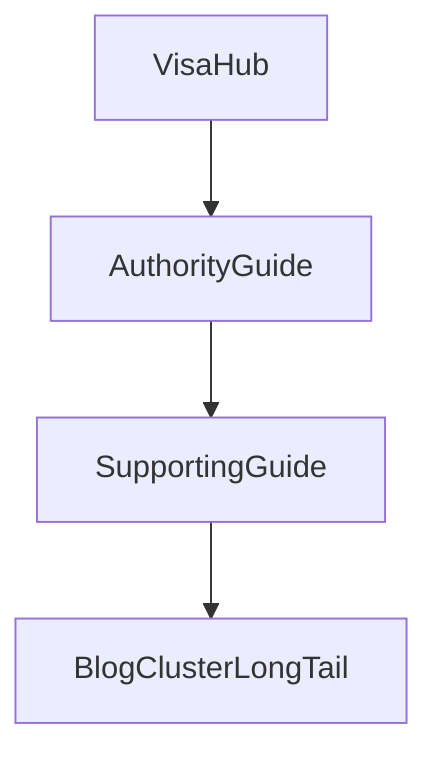

# Golden Authority System Audit (Phase 2B)

**Audit date:** 2026-06-25  
**Scope:** Authority Content System architecture, governance, ownership, and scalability  
**Out of scope:** Content quality review of the reference article  

**Reference implementation:** [`content/articles/guides/business-visa-vs-work-permit-thailand/`](../content/articles/guides/business-visa-vs-work-permit-thailand/)  
**Template:** [`docs/golden-authority-guide-template.md`](golden-authority-guide-template.md) v1.0  

**Governance inputs audited:**

- [`docs/thailand-visa-search-intent-governance.md`](thailand-visa-search-intent-governance.md) (Phase 0A; effective research baseline)
- [`docs/authority-guide-prioritization.md`](authority-guide-prioritization.md) (Phase 0B)
- [`docs/content/visa-hub-canonical-policy.md`](content/visa-hub-canonical-policy.md)
- [`docs/content-strategy.md`](content-strategy.md)

**Governance debt noted:** The original Phase 0 search-intent research document (`thailand-visa-search-intent-research.md`) was never committed. Phase 0A governance is treated as the effective baseline. This is documentation debt, not an architectural failure.

### Do not implement (audit scope)

This phase is **documentation only**. Do not:

- Create or modify Authority Guide articles
- Change layouts, components, routes, or rendering logic
- Increment the Golden Authority Guide Template version
- Rewrite legacy content as part of this audit

---


## Executive Summary

The Authority Content System is **architecturally sound** for scaling launch Authority Guides. The hub → authority → supporting → cluster hierarchy is coherent, the Golden Authority Guide Template v1.0 maps cleanly to existing layout and MDX components, and the reference implementation validates the model without requiring code changes.

Scaling to 50–100 articles will succeed **if governance discipline holds**. The primary risks are not structural: they are **legacy content drift**, **documentation-only intent enforcement**, and **manual linking bottlenecks**. None of these block the remaining nine launch guides.

**Preliminary verdict:** B (see Section 10 for evidence-based final verdict).

---

## 1. Architecture Stress Test

### Assumption

The next 100 Authority Guides use the frozen 12-section architecture defined in Golden Authority Guide Template v1.0, implemented via `/guides/{slug}` with existing layout and MDX components.

### 12-section model at scale

| # | Section | Scale risk | Assessment |
| --- | --- | --- | --- |
| 1 | Hero | Low | Layout-owned (`title`, `eyebrow`, `lead`, `heroImage`). Scales without writer variance. |
| 2 | Quick Answer | Medium | `meta.answer` in header works; risk of duplication if writers also add `<ArticleQuickAnswer>` in MDX. |
| 3 | Key Takeaways | Medium | `<KeyFacts>` + `## Key takeaways` intro in reference creates mild redundancy. Pattern is repeatable but should be standardized. |
| 4 | Parent Hub Link Block | Low | Required early hub deferral prevents cannibalization. Becomes more valuable at scale, not less. |
| 5 | Main Explanation | Low | Core value layer. Scales well with H2-per-question structure. |
| 6 | Decision Framework | Low–medium | Optional for non-decision types per template. Required on comparison guides; can feel forced on pure compliance if not profile-governed. |
| 7 | Comparison | Low | Correctly optional. Omitting on non-`vs` intents avoids bloat. |
| 8 | Common Mistakes | Medium | Always required. Valuable on decision/troubleshooting types; may thin on low-risk explanation content unless reframed as "common misunderstandings." |
| 9 | FAQ | Medium | Meta-owned, layout-rendered. FAQ/hub deduplication becomes a maintenance task at 50+ articles. |
| 10 | Related Authority Guides | High (early) | Weak until sibling authorities exist. Resolves naturally as launch layer fills. |
| 11 | Related Visa Hubs | Low | Meta + in-content hub links. Scales cleanly. |
| 12 | Final CTA | Low | Meta-owned. Consistent conversion surface. |

### Repetitive sections (predictable at 100 articles)

1. **Hub surfacing stack:** Parent Hub callout + in-content hub links + `ArticleLinkCard` + layout topic hub strip + `meta.related` hub entry. Redundant by design (authority transfer), but writers should follow a minimum viable hub-link pattern to avoid five near-identical blocks.
2. **Quick Answer + Key Takeaways:** Both extract the same decision outcome in different formats. Intentional for AEO, but requires discipline to avoid verbatim duplication.
3. **Common Mistakes on every guide:** Appropriate for immigration content where errors are costly; less natural for pure definitional explanation unless scoped to misconceptions.

### Duplication risks

| Risk | Source | Mitigation (governance, not code) |
| --- | --- | --- |
| Quick Answer twice | `meta.answer` + `<ArticleQuickAnswer>` | Single-source rule: use `meta.answer` only unless exception documented |
| Key Takeaways twice | `<KeyFacts>` bullets repeat Quick Answer | Bullets must add decision criteria, not restate the answer sentence |
| Hub FAQ overlap | Hub owns head-term FAQs; guide FAQ owns edge cases | Pre-publish FAQ dedup check against hub FAQ |
| Requirements tables on guides | Writers recreate hub key-facts | Template prohibits; link to hub anchors only |
| Comparison + Decision Framework overlap | Both map profiles to outcomes | Comparison = attributes; Decision Framework = if/then branches |

### Unnecessary required sections (by article type)

The frozen sequence is appropriate **if** article-type profiles clarify which sections are required vs omitted in MDX (template already marks Decision Framework and Comparison as conditional). **Common Mistakes** as universally required is the weakest universal rule; reframing as "high-cost errors or misconceptions" preserves value across types.

No section reordering is recommended.

### Missing reusable patterns

| Pattern | Status | Impact at scale |
| --- | --- | --- |
| Article-type profiles | Documented in template component table; not a locked subsection | High: prevents wrong components on wrong intents |
| `primaryQuery` / `primaryIntent` in meta | Template contract only; not in TypeScript types | Medium: intent drift without pre-publish checklist |
| Supporting Guide template | Not yet defined | High at 50+: procedural depth needs its own frozen architecture |
| Intent ownership registry maintenance | Phase 0A registry is static markdown | Medium at 25+: new guides need registry updates |
| Hub backlink workflow | Manual `relatedArticleSlugs` / `relatedResources` on hubs | Medium: new authorities invisible from hubs until curated |
| Legacy guide classification | Unmarked pre-template content | High: writers may copy retirement guide pattern |

### Documentation-only governance that should become enforceable (eventually)

These are **not blockers** for launch scaling but should be formalized before 50 articles:

1. `primaryQuery` and `primaryIntent` on every guide meta (TypeScript enforcement deferred).
2. Pre-publish intent ownership check against Phase 0A registry.
3. Hub FAQ deduplication check.
4. Quarterly ownership audit (template maintenance cadence already specifies this).

### Architecture stress test conclusion

The 12-section architecture **remains appropriate** for long-term scale when combined with article-type profiles. No template section reordering. No template v1.1 required solely from this section.

**One v1.1 candidate (benefits 5+ guides):** Add a locked **Article-Type Profiles** subsection to the template formalizing required/optional sections per `comparison`, `decision`, `troubleshooting`, `compliance`, and `transition` intents. This is structural documentation, not a layout change.

---

## 2. Article Type Validation

### Layer placement rules (from governance)

| Layer | Owns |
| --- | --- |
| Visa Hub | Head terms: requirements, cost, eligibility, route overview |
| Authority Guide | Evaluation, comparison, transition, high-stakes decision, troubleshooting at scale |
| Supporting Guide | Procedural depth, document packs, embassy-specific steps |
| Blog / cluster | Freshness, embassy variance, filing notes, nationality-specific long-tail |



### Type-by-type friction matrix

| Type | Fits Authority? | Canonical owner | Friction level | Launch action |
| --- | --- | --- | --- | --- |
| Comparison | Yes | Authority Guide | Low | Implement (reference validates) |
| Decision | Yes | Authority Guide | Low | Implement |
| Troubleshooting | Yes | Authority Guide | Low–medium | Implement; defer tactical steps to Supporting |
| Compliance | Yes | Authority Guide | Low–medium | Implement; use embedded comparison subsections only |
| Procedure | No | Supporting Guide | High if misrouted | Do not implement as Authority |
| Requirements | No | Visa Hub | High if misrouted | Reject; hub owns head terms |
| Explanation | Partial | Hub or Supporting | Medium | Low priority; hub-owned unless edge-case depth |

### Type-by-type stress test

#### Comparison (`business visa vs work permit`)

| Question | Answer |
| --- | --- |
| Fits Authority layer? | **Yes** (reference implementation) |
| Belongs elsewhere? | No |
| Optional components | Checklist (low value here) |
| Weak required sections | None for this type |
| Reference validation | **Pass** |

#### Decision (`elite visa worth it`, `best visa for living in thailand`)

| Question | Answer |
| --- | --- |
| Fits Authority layer? | **Yes** |
| Belongs elsewhere? | No; not hub (evaluation intent) |
| Optional components | Comparison table or decision matrix (one required); Timeline if multi-step |
| Weak required sections | Comparison section if matrix used instead (mutually exclusive per profile) |
| Launch fit | **Strong** |

#### Troubleshooting (`dtv visa rejection reasons`)

| Question | Answer |
| --- | --- |
| Fits Authority layer? | **Yes** |
| Belongs elsewhere? | Post-denial tactical steps → Supporting Guide beneath authority |
| Optional components | Checklist (high value); Comparison (omit); Timeline (reapply sequence) |
| Weak required sections | Decision Framework (optional per template; use only if route branching exists) |
| Launch fit | **Strong** |

#### Compliance (`thailand 90 day report`, `re-entry permit`)

| Question | Answer |
| --- | --- |
| Fits Authority layer? | **Yes** |
| Belongs elsewhere? | TM30 standalone deferred to supporting layer (Phase 0B merge rule) |
| Optional components | Comparison (only for TM30 vs 90-day subsection, not standalone authority); ProcessSteps (high value); Warning box |
| Weak required sections | Decision Framework (usually omit); Comparison as standalone section (omit) |
| Launch fit | **Strong** with profile discipline |

#### Procedure (`retirement visa extension`, `wp3 employer documents`)

| Question | Answer |
| --- | --- |
| Fits Authority layer? | **No** (Supporting Guide) |
| Belongs elsewhere? | Supporting Guide under parent authority or hub |
| Risk if forced into Authority | Competes with hub checklists; creates requirements cannibalization |
| Launch fit | **Do not implement as Authority Guides** |

#### Requirements (`thailand retirement visa requirements`, `dtv visa requirements`)

| Question | Answer |
| --- | --- |
| Fits Authority layer? | **No** (Visa Hub) |
| Belongs elsewhere? | `/visas/{slug}` hub owns head-term requirements, cost, and eligibility |
| Risk if forced into Authority | Cannibalizes hub SEO; duplicates key-facts and checklists; violates Phase 0A ownership |
| Legacy example | [`how-to-get-thailand-retirement-visa`](../content/articles/guides/how-to-get-thailand-retirement-visa/) — pre-template debt; **do not scale this pattern** |
| Launch fit | **Reject at quality gate**; long-tail filing variance belongs in future Authority Guides or Supporting layer under the frozen system |

#### Explanation (conceptual `what is X` without decision/comparison)

| Question | Answer |
| --- | --- |
| Fits Authority layer? | **Partial** |
| Belongs elsewhere? | Hub-owned if head-term definition; Supporting if edge-case depth |
| Weak required sections | Comparison (omit); Decision Framework (usually omit); Common Mistakes (reframe) |
| Launch fit | **Low priority**; most explanation intents are hub-owned |

### Recommended article-type profiles (governance addendum, not v1.1 unless locked in template)

| Profile | Required MDX sections | Optional components | Omit |
| --- | --- | --- | --- |
| `comparison` | Hub block, Main explanation, Decision framework, Comparison, Common mistakes | ProcessSteps, Warning | — |
| `decision` | Hub block, Main explanation, Decision framework, Comparison OR matrix, Common mistakes | ConsultationCta mid-page | Full comparison when matrix suffices |
| `troubleshooting` | Hub block, Main explanation, Common mistakes | Checklist, ProcessSteps, Warning | Comparison |
| `compliance` | Hub block, Main explanation, Common mistakes | ProcessSteps, Warning, embedded comparison subsection | Standalone Comparison section |
| `transition` | Hub block, Main explanation, Decision framework, Common mistakes | Timeline, ProcessSteps | Comparison unless comparing routes |

These profiles benefit **all nine remaining launch guides** and future supporting layer. Recommend adding as a locked subsection in template v1.1 **only if** the team wants profiles to be amendment-governed; otherwise publish as a governance addendum without version bump.

---

## 3. Cannibalization Review

### Ownership model validation

| Rule | Status | Evidence |
| --- | --- | --- |
| One search intent → one owner | **Aligned** | Phase 0A registry + Phase 0B merge decisions |
| Visa Hubs retain canonical ownership | **Aligned** | Hub policy + reference hub deferral pattern |
| Authority Guides support hubs | **Aligned** | Reference links up; does not host requirements tables |
| Supporting Guides subordinate | **Aligned in governance** | Not yet implemented at scale |
| Cluster articles subordinate | **Aligned** | Blog cluster = freshness and long-tail; links to hub |

### Reference implementation ownership

| Query family | Owner | Competing page? |
| --- | --- | --- |
| `business visa vs work permit thailand` | Authority Guide (reference) | No dedicated competitor page |
| `thailand business visa` / `non-immigrant b requirements` | `/visas/business` hub | Reference defers explicitly |
| `work permit thailand` (procedural head term) | Future Supporting Guide | Reference mentions but does not own; monitor `seo.keywords` |

**Minor watch item:** Reference meta keywords include `thailand work permit requirements`. Acceptable as secondary discovery if the page does not become a procedural requirements resource. Supporting guide should own deep work-permit document intent when published.

### Hub overlap watch

Business hub FAQ includes: *"Is a Thailand business visa the same as a work permit?"*  
Reference guide FAQ uses edge-case angles (director permits, employer filing, timing). **No verbatim duplication today.** Requires ongoing dedup at scale.

### Legacy content (classified separately)

| Asset | Issue | Classification |
| --- | --- | --- |
| [`how-to-get-thailand-retirement-visa`](../content/articles/guides/how-to-get-thailand-retirement-visa/) | Requirements-style guide; predates Golden Template; overlaps retirement hub head-term intent | **Legacy cannibalization debt** |
| Pre-template blog cluster content | Removed per Authority Content System freeze | **Aligned** |

Legacy debt does **not** invalidate the new architecture. It must not be used as a pattern for new Authority Guides. Recommend: mark legacy guide for eventual merge into supporting role or redirect strategy (governance action, not launch blocker).

### Future overlap risks (at scale)

| Risk | Trigger | Prevention |
| --- | --- | --- |
| Duplicate `vs` authorities | Phase 0B merge rules ignored | Enforce merge before publish (e.g. O vs O-A only one page) |
| Requirements guides proliferate | Writers copy retirement guide | Requirements = hub-owned; reject at quality gate |
| Compliance authorities duplicate | TM30 + 90-day as separate authorities | Phase 0B merge: comparison as subsection only |
| Blog posts target authority intents | Blog used for evergreen comparisons | Guides own evergreen; blog owns freshness/long-tail per content strategy |
| Hub SEO keyword sprawl | Hubs target authority comparison terms | Hubs own head terms only; comparison terms stay on authorities |

### Cannibalization conclusion

The **new architecture is cannibalization-safe**. Legacy retirement guide is pre-existing debt. Scaling launch authorities does not introduce new ownership conflicts if Phase 0A/0B rules and quality gate are followed.

---

## 4. Internal Linking Ecosystem

### Intended hierarchy

```
Visa Hub (/visas/{slug})
    ↑ parent hub link, pillarSlug, related visa cards
Authority Guide (/guides/{slug})
    ↑ sibling related authorities
Supporting Guide (/guides/{slug} or future convention)
    ↑ cluster long-tail
Blog cluster (/blog/{slug})
```

### Current implementation

| Link direction | Mechanism | Reference behavior |
| --- | --- | --- |
| Up (guide → hub) | Early `ArticleCallout`, in-content links, `meta.related`, `pillarSlug` → pillar visa in cross-links | Strong |
| Sideways (guide → guide) | `meta.related`, `relatedSlugs`, auto-scoring in `lib/content/related.ts` | Weak until more siblings published |
| Down (guide → supporting) | In-content links when supporting exists | Not yet used |
| Up (hub → guide) | Manual `relatedResources` / `relatedArticleSlugs` on hub content | **Business hub `relatedResources` empty** — backlink gap |
| Archive discoverability | `/guides/topic/{topic}`, `/guides/category/{category}`, `/blog/cluster/{id}` | Topic hub strip on guide pages |

### Bottlenecks at scale

| Bottleneck | Emerges at | Severity |
| --- | --- | --- |
| Sparse sibling related links | 10 articles | Low (expected) |
| Manual hub backlinks | 10–25 articles | Medium |
| Auto-related scoring noise | 50+ articles | Medium |
| Dual archive surfaces (guides topic vs blog cluster) | 25+ articles | Low if roles stay distinct |
| `MAX_RELATED = 3` on guide cross-links | 50+ articles | Low; editorial curation still primary |
| No supporting guide index beneath authority | 50+ articles | Medium; readers lack procedural drill-down |

### Linking model verdict

The linking **architecture is logical** and will remain coherent at 100+ articles. The **operational bottleneck** is manual curation (hub backlinks, related authority selection), not missing routes or components. Automation may eventually assist scoring but is not required for launch.

**Preventive governance:** When publishing each launch authority, add hub backlink in `relatedResources` or `relatedArticleSlugs` on the parent visa hub content file.

---

## 5. Component Reuse

| Component | Implementation | Verdict | Rationale |
| --- | --- | --- | --- |
| **Hero** | Layout: `title`, `eyebrow`, `lead`, `heroImage`, `metadata` | **Universal** | Consistent entry; scales without MDX variance |
| **Quick Answer** | `meta.answer` in layout header (`data-article-answer`) | **Universal, single source** | AEO extract; do not duplicate with `<ArticleQuickAnswer>` |
| **Key Facts / Key Takeaways** | `<KeyFacts>` in MDX | **Universal** | AEO bullet extract; standardize one block + short intro |
| **Parent Hub Link Block** | `ArticleCallout` or `ArticleLinkCard` early in MDX | **Universal** | Cannibalization control |
| **Decision Framework** | H2 section + prose/lists | **Profile-restricted** | Required: comparison, decision, transition. Omit: compliance, troubleshooting |
| **Comparison** | `<ArticleComparison>` | **Profile-restricted** | Required: comparison. Optional: decision. Omit: troubleshooting, compliance |
| **Timeline / Process Steps** | `<ProcessSteps>`, `<ArticleTimeline>` | **Optional** | High value: compliance, transition, comparison with sequence |
| **Checklist** | `<ArticleChecklist>` | **Optional** | Troubleshooting, document-prep sub-intents; not hub-level checklists |
| **Warning** | `<ArticleCallout variant="warning">` | **Optional** | Compliance and high-risk mistakes; max 2 per guide |
| **FAQ** | `meta.faq` → layout `ArticleInlineFaq` | **Universal** | Schema + AEO; keep out of MDX body |
| **CTA** | `meta.cta` + optional `<ConsultationCta>` | **Universal** | Final CTA required; mid-page soft CTA optional after decision framework |

No component requires code changes. Restrictions are **writer governance** enforced through article-type profiles and quality gate.

---

## 6. Governance Consistency

### Cross-document alignment

| Topic | 0A Governance | 0B Prioritization | Golden Template | Hub Policy | Content Strategy | Consistent? |
| --- | --- | --- | --- | --- | --- | --- |
| One intent, one owner | Yes | Yes | Yes | Yes | Yes | **Yes** |
| Hub owns head terms | Yes | Yes | Yes | Yes | Yes | **Yes** |
| Authority owns comparison/decision | Yes | Yes | Yes | Implied | Guides = evergreen | **Yes** |
| Blog vs guides split | Implied | N/A | Guides only | Both in cluster | Guides evergreen, blog freshness | **Yes** (terminology drift in Phase 2A brief only) |
| Supporting guide layer | Yes | Yes | Yes | Yes | Clusters | **Yes** (template not yet written for supporting) |
| FAQ ownership split | Yes | N/A | Yes | Yes | Yes | **Yes** |
| TM30 vs 90-day | Merge to 90-day authority | Merge | Optional comparison subsection | N/A | N/A | **Yes** |
| `primaryQuery` / `primaryIntent` | Registry in 0A | Per guide | Metadata contract | N/A | N/A | **Partial** — not in reference meta |
| Phase 0 research artifact | N/A | Uses 0A only | References Phase 0 | N/A | N/A | **Gap** — research doc missing |

### Contradictions found

**None material** between active governance documents. Ambiguities:

1. **Legacy retirement guide** contradicts hub-canonical policy in practice but is not governed by new template (classified as debt).
2. **`primaryQuery` / `primaryIntent`** defined in template but not implemented in reference meta (documentation ahead of practice).
3. **Phase 0 research doc missing** — 0A absorbed the role; acceptable if recorded as debt.

### Governance refinements (broadly beneficial)

1. Publish **Article-Type Profiles** addendum (comparison, decision, troubleshooting, compliance, transition).
2. Add **pre-publish intent checklist** (primary query, owner layer, hub FAQ dedup, hub backlink planned).
3. Classify **legacy guides** explicitly; prohibit as implementation patterns.
4. Record **Phase 0 research debt**; optional backfill doc not required before launch.
5. Standardize **Quick Answer single-source** rule (`meta.answer` only).

No code changes required for any refinement.

---

## 7. Future Expansion

### Readiness by scale

| Scale | Readiness | Complexity emerges | Governance sufficient? |
| --- | --- | --- | --- |
| **10 launch articles** | **Ready** | Sparse sibling links; manual hub backlinks | Yes, with checklist |
| **25 articles** | **Ready with discipline** | Intent registry maintenance; FAQ dedup effort | Yes, if quarterly audit starts |
| **50 articles** | **Ready if supporting layer begins** | Procedural content pressure; auto-related noise; legacy guide confusion | Borderline; supporting template needed |
| **100+ articles** | **Achievable without redesign** | Merge/split triggers; ownership drift; archive depth | Needs formal audit cadence + optional metadata enforcement |

### Where automation may eventually help (not now)

- Intent registry lookup at publish time (`primaryQuery` uniqueness check).
- Hub FAQ vs guide FAQ similarity warning.
- Auto-suggest hub backlinks when `pillarSlug` matches.
- Related authority scoring weighted toward same `primaryIntent` siblings.

Automation is **optimization**, not a prerequisite for launch.

### Expansion conclusion

Complexity is **operational and editorial**, not architectural. The system does not require redesign to reach 100+ articles. It requires **supporting guide architecture** (separate template, future phase) and **governance cadence** before 50.

---

## 8. Architecture Lock Review

### Recommendation: **Remain Golden Authority Guide Template v1.0**

**Rationale:**

- Reference implementation validates section order, component mapping, and layout integration without friction.
- Article-type conditional sections (Decision Framework, Comparison) already exist in v1.0.
- Identified issues are **editorial** (Quick Answer duplication, Key Takeaways intro) or **governance** (profiles, intent metadata), not structural failures.
- Section reordering is explicitly out of scope and not warranted.

### v1.1 trigger assessment

| Proposed change | Benefits 5+ guides? | v1.1 justified? |
| --- | --- | --- |
| Article-Type Profiles as locked template subsection | Yes (all 9 launch + future) | **Borderline** — can be governance addendum without version bump |
| Single-source Quick Answer rule | Yes | **No** — editorial guidance |
| Supporting Guide Template (new doc) | Yes at 50+ | **Separate artifact**, not authority template v1.1 |
| TypeScript `primaryQuery` enforcement | Yes at 25+ | **Code change** — out of audit scope |
| Remove Common Mistakes as universal required | No | **No** |

**Conclusion:** Stay on **v1.0**. Optionally publish Article-Type Profiles as a **governance addendum** linked from the template. Reserve v1.1 for a future locked structural change (e.g. formal supporting-guide layer in the same document family).

---

## 9. System Invariants

These rules must remain true as the Authority Content System grows. They are permanent operating principles.

### Ownership invariants

1. **One search intent family has one canonical owner.**
2. **Visa Hubs own head-term intents:** requirements, cost, eligibility, route overview, hub-level FAQs.
3. **Authority Guides own evaluation intents:** comparison, decision, troubleshooting at authority scale, compliance overview, route transition.
4. **Supporting Guides own procedural depth:** extensions, document packs, embassy steps, reapply workflows.
5. **Blog/cluster owns freshness and long-tail:** embassy variance, nationality specifics, filing notes, rule-change commentary.
6. **Requirements content is hub-owned.** Never publish a new Authority Guide whose primary intent is a requirements head term.

### Structural invariants

7. **Authority Guides exist to support Visa Hubs, not replace them.**
8. **Frozen section order in Golden Authority Guide Template v1.0 is not reordered without version increment.**
9. **Supporting Guides never compete with Authority Guides for the same primary query family.**
10. **Merged intent families publish as one canonical page** (per Phase 0B merge rules).

### Linking invariants

11. **Internal linking flows: Hub → Authority → Supporting → Cluster.**
12. **Every Authority Guide links upward to its parent hub before substantive body content.**
13. **Visa Hubs remain the commercial destination** for route qualification and conversion.
14. **Cross-links between authorities occur only where user intent naturally crosses routes.**

### Content invariants

15. **Hub tables and checklists are not duplicated on Authority Guides** — link to hub anchors.
16. **Hub FAQs and Authority FAQs must not duplicate** the same question and answer.
17. **Quick Answer is citation-ready and self-contained** (via `meta.answer`).
18. **Answer-first writing:** every H2 opens with a direct answer sentence.

### Governance invariants

19. **New Authority Guides pass the template quality gate before publication.**
20. **Template changes require documented rationale, governance review, and version increment.**
21. **Phase 0A intent registry is updated when new primary intents are approved.**
22. **Legacy pre-template content is not used as an implementation pattern for new guides.**

### Engine invariants

23. **Evergreen authority lives in `/guides/*`.**
24. **Freshness and long-tail live in `/blog/*`.**
25. **Service conversion lives in `/visas/*`.**

---

## 10. Final Readiness

### Evidence summary

| Criterion | Finding |
| --- | --- |
| Architecture scales cleanly | **Yes** — 12-section model maps to existing layout/MDX without code changes |
| Governance prevents drift | **Mostly** — documentation-only intent fields and legacy guide are gaps, not blockers |
| Hubs retain canonical ownership | **Yes** — policy + reference pattern aligned |
| Authorities remain distinct | **Yes** — comparison intent clearly separated from hub |
| Internal linking coherent | **Yes** — manual curation bottleneck only |
| Expansion without redesign | **Yes** to 25; **yes with supporting layer** to 50–100 |

### What does NOT block launch

- Missing Phase 0 research document (governance debt, 0A is baseline).
- Legacy retirement requirements guide (pre-existing; do not replicate).
- Empty business hub `relatedResources` (operational task per publish).
- Sparse sibling authority links until launch layer grows.

### What would block launch (not present)

- Template section order incompatible with layout.
- Broken build/registry pipeline.
- Systemic cannibalization in reference architecture.
- No ownership model.

None of these blockers exist.

---

## Final Verdict

### **B — Minor governance refinements recommended before scaling**

The Thailand Visa Authority Content System is **architecturally ready** for the remaining launch Authority Guides. The Golden Authority Guide Template v1.0 does not require a version increment. Governance refinements will reduce drift as the catalog moves from 2 to 10 to 50+ guides.

This is **not A** because documentation-only intent enforcement, legacy guide debt, and missing article-type profile formalization create predictable drift without corrective governance.

This is **not C** because no structural, code, layout, or template redesign is required to implement the remaining nine launch guides.

---

## Top Five Prioritized Governance Actions

1. **Publish Article-Type Profiles addendum** — Lock required/optional sections for comparison, decision, troubleshooting, compliance, and transition intents (benefits all launch guides).
2. **Adopt pre-publish intent checklist** — `primaryQuery`, owner layer, hub FAQ dedup, hub backlink planned, no requirements head-term targeting.
3. **Classify legacy guides** — Mark `how-to-get-thailand-retirement-visa` as pre-template debt; prohibit as pattern for new authorities.
4. **Hub backlink workflow** — When each authority publishes, add backlink on parent hub via `relatedResources` or `relatedArticleSlugs`.
5. **Quick Answer single-source rule** — Use `meta.answer` in layout; do not add `<ArticleQuickAnswer>` unless exception documented.

---

## Go / No-Go Recommendation

### **GO** — Proceed with implementing the remaining launch Authority Guides.

Conditions:

- Follow Golden Authority Guide Template v1.0 without section reordering.
- Apply article-type profiles from governance action #1.
- Run pre-publish intent checklist (action #2) on each guide.
- Add parent hub backlink at publish time (action #4).
- Do not use legacy retirement guide or requirements-style patterns for new authorities.

No code changes. No template v1.1. No content rewrites required before launch.

---

## Appendix: Pre-Publish Checklist (Authority Guides)

- [ ] `primaryQuery` declared (meta or editorial brief) and unique in Phase 0A registry
- [ ] `primaryIntent` profile selected: comparison | decision | troubleshooting | compliance | transition
- [ ] Owner layer confirmed: Authority Guide (not hub, not supporting)
- [ ] `meta.answer` written; no duplicate `<ArticleQuickAnswer>`
- [ ] Parent hub link block appears before main explanation
- [ ] No hub key-facts tables or full checklists duplicated
- [ ] FAQ items do not duplicate hub FAQ verbatim
- [ ] Article-type optional sections respected (comparison, decision framework, process steps)
- [ ] `pillarSlug` and `topicId` set
- [ ] `meta.related` includes hub + 2–4 sibling/alternate routes
- [ ] Parent hub backlink planned or added
- [ ] `npm run validate:articles` passes
- [ ] Quality gate (template Section 9) passed

---

*This audit is the final architectural checkpoint before implementing the remaining launch Authority Guides. No implementation was performed as part of this phase.*
