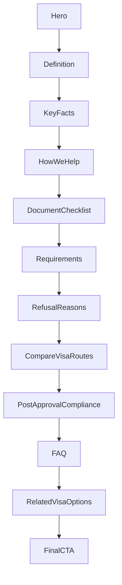

# Golden Visa Page Template

**Golden Template Version:** 1.0  
**Status:** Approved  
**Clone ready:** Yes  
**Architecture owner:** Thai Visa Company  
**Reference implementation:** `/visas/dtv` (illustrative only — not normative for visa-specific facts)  
**Audit source:** [`docs/golden-template-audit.md`](./golden-template-audit.md)  
**Canonical policy:** [`docs/content/visa-hub-canonical-policy.md`](./content/visa-hub-canonical-policy.md)

This document is the **source of truth** for building and maintaining all Thailand visa hub pages:

- Retirement Visa
- Business Visa
- Education Visa
- Marriage Visa
- Elite Visa
- LTR Visa
- Dependent Visa
- Future visa routes

---

> ### Worked examples vs template rules
>
> Throughout this document, **DTV worked examples** and the `/visas/dtv` reference implementation illustrate one approved layout in production. They are **not** requirements for other visa pages.
>
> The Golden Template governs **structure** (section order, components, design system, content shapes). It does **not** govern visa-specific facts.
>
> **Never copy these DTV facts into other visa pages unless they apply to that route:**
>
> - 500,000 THB savings threshold  
> - 180-day stay periods or +180-day extensions  
> - Remote work or digital nomad eligibility  
> - Soft-power or activity pathways (Muay Thai, cooking courses, etc.)  
> - Five-year multiple-entry validity  
> - DTV-specific pathway names, FAQ items, or comparison outcomes  
>
> Replace all visa-specific values, pathways, and copy when building Retirement, Business, Elite, or any other hub. Use labeled examples as format references only.

---

## Golden Template Governance

| Field | Value |
|-------|--------|
| **Golden Template Version** | 1.0 |
| **Status** | Approved |
| **Architecture owner** | Thai Visa Company |
| **Reference implementation** | `/visas/dtv` |

### What may change (per visa page)

- Copy
- Eligibility criteria
- Pathways
- Checklist items
- FAQ content
- Comparison data
- Images
- Related visa links

### What may NOT change (without governance process)

- Section order
- Design system
- Component inventory
- Page architecture

### Amendment process

Any change to locked architecture requires **all three** steps:

1. **Documented rationale** — impact on SEO, conversion, user understanding, trust, or maintenance (written in Amendment log or linked design note).
2. **Architecture review** — approval by template owner (Thai Visa Company).
3. **Template version increment** — e.g. 1.0 → 1.1, recorded in [Appendix B](#appendix-b-amendment-log).

### Amendment examples

| Proposed change | Version bump? | Notes |
|-----------------|---------------|-------|
| Retirement page copy and key facts | No | Content-only; structure unchanged |
| New pitfall card on Business page | No | Content within existing `pitfalls` section |
| Reorder `requirements` before `checklist` | **Yes** | Section order is locked |
| Add mandatory `lastUpdated` strip to all hubs | **Yes** | New visible section in architecture |
| Change key facts band from dark to ivory | **Yes** | Design system change |
| Add new renderer section `feesAndTimelines` | **Yes** | Component inventory + architecture change |
| Swap hero image on Elite page | No | Image asset only |

### Guidance for reviewers

- Prefer content changes inside existing sections over new sections.
- Long-tail depth belongs in cluster articles, not new hub sections (see [`docs/content/visa-hub-canonical-policy.md`](./content/visa-hub-canonical-policy.md)).
- If a proposal duplicates an existing section (e.g. fees table + key facts cards), reject it and use the existing surface.
- Emergency fixes to components or styles that affect all visa pages still require a version bump if they alter the documented design system.

---

## Golden Rule

### Architecture is fixed

Future visa pages **may change:**

- Copy
- Eligibility criteria
- Pathways
- Checklist items
- FAQ content
- Comparison data
- Images
- Related visa links

Future visa pages **may NOT change:**

- Section order
- Design system
- Component inventory
- Page architecture

without the [governance process](#golden-template-governance) above (rationale, review, version increment).

**Purpose:** Prevent design drift across visa pages. Every hub should feel like the same premium product, with visa-specific content swapped in.

**Technical gate:** Section visibility and order are controlled by the `layout` array on each `VisaPageContent` object. The golden layout is a fixed constant — copy it verbatim.

```typescript
// Golden layout — do not reorder without amending this document
const GOLDEN_VISA_PAGE_LAYOUT = [
  "hero",
  "definition",
  "keyFacts",
  "process",
  "checklist",
  "requirements",
  "pitfalls",
  "comparison",
  "compliance",
  "faq",
  "relatedVisas",
  "finalCta",
] as const
```

**Do not use** `DEFAULT_VISA_PAGE_LAYOUT` from `lib/visas/layout.ts` for new or migrated pages. That legacy Blueprint v3 order (20+ sections) is deprecated for hub pages.

---

## 1. Page Philosophy

### Purpose

Visa hub pages are the **canonical money URLs** for each visa type. They exist to:

1. Answer head-intent questions in plain English (what, who qualifies, documents, risks, after approval).
2. Demonstrate operational expertise through structure and filing insight — not volume of text.
3. Convert qualified visitors to consultation bookings via LINE, WhatsApp, or contact form.
4. Anchor SEO/AEO and internal linking; long-tail depth lives in blog and guide cluster articles.

### Target audience

Foreign nationals evaluating a **high-stakes relocation or long-stay decision** in Thailand. They are anxious, time-constrained, and comparing options. They need clarity, not a government portal.

### Tone of voice

- Plain English, direct, calm
- Operational (“here is what happens next”) not academic
- Embassy deferral where rules vary (“your embassy’s checklist is authoritative”)
- No filler, jargon, disguised sales copy, or legal disclaimer blocks
- No em dashes in user-facing copy (per content governance)

### Content style

- **Answer-first:** Hero one-liner → definition paragraphs → key facts grid
- **Service-first sequencing:** After facts, show **how we help** before deep qualification and document lists
- **High signal:** Every section earns its scroll; no duplicate surfaces
- **Scannable:** Metric cards, pathway cards, icon checklists, comparison tables, FAQ accordions

### Trust signals

| Signal | Where |
|--------|--------|
| Licensed specialists, clear requirements, fast replies | Hero trust bullets |
| Specific numbers with qualifying notes | Key facts cards |
| Personalized checklist, document review | Process steps |
| Rejection patterns with remedies | Pitfalls cards |
| Post-approval obligations (reporting, arrival card, renewals where applicable) | Compliance reminders |
| Reviewer attribution | `lastReviewed` in content (schema; no visible EEAT section) |

### Conversion strategy

This is a **premium service business**, not a government information portal.

**Approved narrative flow:**

1. What is this visa?
2. What are the key facts?
3. How do we help you?
4. What documents are typically needed?
5. Do you qualify?
6. What goes wrong?
7. How does this compare to other routes?
8. What happens after approval?
9. Edge-case questions
10. Other visa options
11. Book a consultation

Visitors understand the visa and your expertise **before** diving into qualification details and documentation. This supports trust, consultation bookings, perceived expertise, and conversion while preserving strong SEO and AEO.



**Conversion touchpoints on every golden page:**

| Location | Mechanism |
|----------|-----------|
| Hero | LINE / WhatsApp (`SignatureMessagingCtaGroup`, desktop 1024px+) |
| Requirements | Optional “Request a consultation” clarification link |
| Final CTA | `PremiumCtaSection` — “Book a consultation” |
| Mobile | Sticky contact bar (site-wide; hero CTAs hidden below 1024px) |

### Why this page works

- **Cognitive load:** Progressive disclosure — identity → facts → service → mechanics → risks → decision → close
- **Differentiation:** Agency `process` (not government steps) appears early
- **Authority without bloat:** Dark key facts band + pitfalls replace EEAT prose sections
- **Maintainability:** 12 sections, existing components, data-driven layout

---

## 2. Required Section Order

Fixed order. **Mandatory** unless this document is formally amended.

| # | User-facing name | Section ID | Required | DTV example |
|---|------------------|------------|----------|-------------|
| 1 | Hero | `hero` | Mandatory | Thailand DTV Visa |
| 2 | Definition | `definition` | Mandatory | What is the Thailand DTV Visa? |
| 3 | Key Facts | `keyFacts` | Mandatory | DTV visa key facts |
| 4 | How We Help | `process` | Mandatory | How we help with your DTV application |
| 5 | Document Checklist | `checklist` | Mandatory | DTV visa document checklist |
| 6 | Requirements | `requirements` | Mandatory | Do you qualify for a DTV visa? |
| 7 | Refusal Reasons | `pitfalls` | Mandatory | Why DTV applications are refused |
| 8 | Compare Visa Routes | `comparison` | Mandatory | DTV vs other Thailand visa routes |
| 9 | Post-Approval / Compliance | `compliance` | Mandatory | What happens after your DTV is approved? |
| 10 | FAQ | `faq` | Mandatory | DTV visa FAQ |
| 11 | Related Visa Options | `relatedVisas` | Mandatory | Related Thailand visa options |
| 12 | Final CTA | `finalCta` | Mandatory | Ready to Start Your Thailand DTV Application? |


### Per-section purpose and content guidelines

#### 1. Hero (`hero`)

**Purpose:** Visa identity, one-line value proposition, contact path, trust bullets, outcome imagery.

**Content guidelines:**

- `hero.eyebrow` — visa category label (uppercase meta style)
- `hero.title` — **only H1 on the page** (e.g. “Thailand Retirement Visa”)
- `hero.overview` — one sentence; mirrors search intent
- Hero image via `resolveVisaHeroMedia(slug)` → `visaGalleryPhotography[slug]`
- Trust bullets: default three labels or override via `hero.trustBullets`

**DTV worked example:**

```typescript
hero: {
  eyebrow: "Destination Thailand Visa (DTV)",
  title: "Thailand DTV Visa",
  overview: "Five-year multiple-entry visa for remote workers and approved long-stay activities in Thailand.",
}
```

Image: `/images/visas/dtv-remote-work.jpg`

---

#### 2. Definition (`definition`)

**Purpose:** Answer-first definitional content for humans and AEO. Ivory band.

**Content guidelines:**

- 2–4 short paragraphs separated by blank lines in `body`
- `title` as H2 question form (“What is the…?”)
- Align `answer` field (page-level) with first paragraph for speakable/AEO
- No bullet lists; prose only

**DTV worked example:** Eyebrow “Destination Thailand Visa”, three paragraphs covering what DTV is, why Thailand offers it, and how it differs from tourist visas.

---

#### 3. Key Facts (`keyFacts`)

**Purpose:** Scannable authority band — validity, stay, funds, work rules, family, timing.

**Content guidelines:**

- **`highlight: true` mandatory** — dark band (`#23211E`)
- 6–9 `items` with `label`, `value`, `detail`
- Include government fee and typical processing time as cards (replaces separate fees section)
- `description` one sentence under heading

**DTV worked example:** Nine cards including visa type, 5 years, 180 days per visit, +180 extension, multiple entry, remote work only, family, 500,000 THB, ~2–4 weeks processing. *All values are DTV-specific — replace entirely for other visas.*

---

#### 4. How We Help (`process`)

**Purpose:** **Agency service process** — how Thai Visa Company helps. Not embassy/government steps.

**Content guidelines:**

- 4–6 numbered steps with `title` + `description`
- Eyebrow: “How we help”
- Focus on deliverables: eligibility review, personalized checklist, document review, filing guidance, post-approval support
- Placed **before** checklist and requirements intentionally (conversion-first)

**DTV worked example:** Six steps from eligibility review through ongoing support.

---

#### 5. Document Checklist (`checklist`)

**Purpose:** Pathway-grouped document lists with Core Documents summary. Ivory band.

**Content guidelines:**

- `summary` — “Core Documents” universal items (5–6 max; avoid repeating every pathway item)
- `groups` — one card per pathway with `pathwayId` matching `requirements.pathways[].id`
- `categories` inside groups for scan structure (Passport, Financial Evidence, etc.)
- Each item: `text`, optional `note`, `icon` from checklist icon set
- Description must defer to embassy checklist authority

**DTV worked example:** Core Documents (passport, 500k THB, activity evidence, application form, photos) + three pathway cards: Remote Worker, Soft-Power/Activity, Dependent.

---

#### 6. Requirements (`requirements`)

**Purpose:** Qualification routing — which pathway fits the visitor.

**Content guidelines:**

**Multi-pathway visas (DTV, Business):**

- `pathways` array with `id`, `title`, `description`, optional `badge`
- `clarification` block optional — consultation CTA mid-page
- Pathway `id` must match checklist `pathwayId`

**Single-route visas (Retirement, Elite):**

- Use `requirements`, `eligibility`, and `documents` bullet blocks (legacy shape supported by component)
- No pathway grid required

**DTV worked example:** Three pathways (remote work, approved activity, family) + clarification “Not sure which DTV category fits you?” with consultation link.

---

#### 7. Refusal Reasons (`pitfalls`)

**Purpose:** Rejection patterns with actionable remedies — operational information gain.

**Content guidelines:**

- `rejections` — 4–5 cards with `title`, `description`, `remedy`, `icon`
- Optional `summary` with title + 1–2 paragraphs
- Risk label (red X) + remedy label (green check) — component handles styling
- `mistakes` subsection optional; not required on golden template

**DTV worked example:** Five cards — financial evidence, activity proof, inconsistent story, embassy-specific items, enrolment documentation.

---

#### 8. Compare Visa Routes (`comparison`)

**Purpose:** Side-by-side route comparison for decision support and internal linking.

**Content guidelines:**

- `columns` — up to 4; include `id`, `label`, optional `href` for published visa hubs
- `rows` — 6–8 comparison dimensions (stay, entry, work, funds, family, complexity, best for)
- Renderer passes `highlightColumnId={visa.slug}`
- Current visa column visually highlighted

**DTV worked example:** DTV vs Tourist vs Non-Immigrant B (links to `/visas/business`) vs LTR.

---

#### 9. Post-Approval / Compliance (`compliance`)

**Purpose:** What happens after visa approval — validity, stay, extension, re-entry, obligations.

**Content guidelines:**

- `cards` — 4 metric cards (`label`, `value`, `detail`) covering post-approval mechanics for **this visa** (validity, stay per entry, extension, re-entry)
- `reminders` optional — title + up to 3 short bullets for ongoing obligations relevant to the route (reporting, arrival card, renewals, rule changes)
- Ivory band (`band` on section)

**DTV worked example:** Four cards (5-year validity, 180 days per entry, one extension, re-entry allowed) + “Things to remember” (90-day reporting, TDAC, rule changes). *Replace all values for other visas.*

---

#### 10. FAQ (`faq`)

**Purpose:** Edge-case questions **not** fully answered above.

**Content guidelines:**

- 8–15 items max; each needs unique `value` slug
- `description` should defer to on-page sections
- Own: embassy edge cases, tax, visa conversion, timing nuance, overstay
- Do **not** restate key facts, pathway details, or comparison table rows
- FAQ JSON-LD must match visible items exactly

**DTV worked example:** 13 items; target 8–10 on new pages after deduplication. Description: “Edge cases not covered above…”

---

#### 11. Related Visa Options (`relatedVisas`)

**Purpose:** Cross-link 3 alternative routes with visual continuity.

**Content guidelines:**

- Max **3** cards via `relatedVisas.items` and/or `relatedVisaSlugs`
- Manual items override auto-ranked links for copy control
- Hero images auto-enriched via `enrichRelatedLinkWithVisaHero` from destination page heroes
- CTA label: “View visa guide”

**DTV worked example:** Retirement, Business, Elite — manual titles and descriptions with hero images from `/images/visas/`.

---

#### 12. Final CTA (`finalCta`)

**Purpose:** Terminal consultation conversion.

**Content guidelines:**

- `headline` or `title` — direct question or imperative
- `description` — one sentence value prop
- `buttonLabel` — default “Book a consultation”
- Always **last** section on the page

**DTV worked example:** “Ready to Start Your Thailand DTV Application?” + specialist guidance description.

---

## 3. Section Rules

### Global section shell

All sections (except hero wrapper and final CTA band) use `VisaEditorialSection`:

| Property | Value |
|----------|--------|
| Container width | `wide` → `--width-site` (1280px / 80rem) |
| Section padding | 80px mobile / 112px tablet / 140px desktop (`--visa-section-y*`) |
| Heading → content gap | 48px (`--visa-heading-to-content`) |
| Eyebrow → title gap | 24px (`--visa-label-to-heading`) |
| Title → description gap | 24px (`--visa-heading-to-intro`) |
| Bottom border | 1px subtle (`color-mix` on `--border`) |

### Heading style (H2 sections)

- Component: `VisaEditorialHeading`
- Eyebrow: Geist Sans, 13px, weight 500, 0.14em tracking, uppercase, `--text-tertiary`
- Title: Inter Tight, clamp 1.75–2.25rem, weight 600, max ~28–32ch, `--foreground`
- Description: intro size 1.125rem, max ~65ch, `--text-secondary`

### H1 rule

- **One H1 only** — `hero.title` in `VisaHeroSection`
- All following section titles are **H2** via `VisaEditorialHeading`
- Pathway titles, pitfall titles, checklist group titles are **H3**

### Background color by section

| Section | Background |
|---------|------------|
| Hero | Default page `--background` (`#FCFAF8`) |
| Definition | Ivory band `--surface-band` (`#F6F1EE`) |
| Key Facts | Dark highlight `#23211E` when `highlight: true` |
| Process | White / default |
| Checklist | Ivory band |
| Requirements | White / default |
| Pitfalls | White / default |
| Comparison | White / default |
| Compliance | Ivory band |
| FAQ | White / default |
| Related Visas | White / default |
| Final CTA | Premium CTA band (site shared component) |

### Card styles

| Card type | Class / token | Notes |
|-----------|---------------|-------|
| Metric (key facts, compliance) | `.visa-metric-card` | White on dark band uses translucent variant |
| Pathway (requirements) | `.visa-pathway-card` | Badge optional |
| Checklist pathway | `.visa-checklist-card--pathway` | Numbered step prefix |
| Core Documents | `.visa-checklist-summary` | Dark icon tiles on white card |
| Pitfall | `.visa-pitfall-card` | Risk #d95c5c, remedy check #15803d |
| Related visa | `.visa-guide-card--with-media` | 16:9 image, 24px image-to-content gap |
| Comparison | `.visa-comparison-table` | Highlighted active column |

Shared tokens:

- `--visa-card-radius: 0.75rem`
- `--visa-content-card-bg: #ffffff`
- `--visa-content-card-border: rgba(35, 33, 30, 0.08)`
- Resting shadow minimal; hover subtle elevation on interactive cards only

### Grid rules

| Section | Desktop grid | Mobile |
|---------|--------------|--------|
| Key facts | 3–4 column metric grid | 1–2 columns |
| Process | Vertical timeline | Stacked steps |
| Checklist pathways | 1 column stacked cards | Same |
| Core Documents | 3 columns (1024px+) | 1 column, generous row gap |
| Requirements pathways | 3 columns or stacked | 1 column |
| Pitfalls | Bento-style 2-col with odd last span | 1 column |
| Comparison | Horizontal scroll table | Scroll |
| Related visas | 3 columns | 1 → 2 → 3 col |

### Mobile behavior

- Hero: copy above image; messaging CTAs hidden &lt; 1024px
- All grids collapse to single column or horizontal scroll where appropriate
- Touch targets and readable body (16–17px at tablet+)
- No parallax, no dramatic motion

---

## 4. Design System Extraction

Mandatory standards for all golden visa pages. Full brand context: [`docs/design/brand-system.md`](./design/brand-system.md), [`docs/design/ui-principles.md`](./design/ui-principles.md).

### Colors

| Token | Hex / value | Usage |
|-------|-------------|--------|
| `--palette-bg-primary` / `--background` | `#FCFAF8` | Page background |
| `--palette-bg-secondary` / `--surface-band` | `#F6F1EE` | Ivory section bands |
| `--palette-text` / `--foreground` | `#23211E` | Headings, primary text |
| `--visa-content-card-bg` | `#FFFFFF` | Cards on bands |
| Key facts band | `#23211E` | Highlight section background |
| Pitfall risk icon | `#d95c5c` | Risk marker |
| Pitfall remedy icon | `#15803d` | Remedy checkmark |
| CTA primary | `#1f1b18` on `#fcfaf8` text | Buttons |

### Border radius

- Cards, inputs: `0.75rem` (`--visa-card-radius`)
- Buttons: `0` (`--radius-button`) — architectural, not pill

### Shadows

- Resting cards: border-first, minimal or no shadow
- Hover: light elevation (`0 12px 32px -20px` rgba) on guide/pitfall cards only
- No decorative shadows on images
- No glassmorphism

### Icon usage

- **Hero trust:** Lucide, 1.5 stroke
- **Checklist:** Document icons in dark square tiles (Core Documents) or muted bordered tiles (pathway lists)
- **Pitfalls:** Topic icons on cards; X and Check for risk/remedy
- **Compliance reminders:** Green check icons
- Do not add ornamental icon clusters

### Spacing scale (visa page)

| Token | Value |
|-------|--------|
| `--visa-section-y` | 5rem (80px) |
| `--visa-section-y-md` | 7rem (112px) |
| `--visa-section-y-lg` | 8.75rem (140px) |
| `--visa-heading-to-content` | 3rem (48px) |
| Card padding | ~1.375–1.5rem |
| Grid gaps | 1–1.25rem |

### Section padding

Use `VisaEditorialSection` defaults — do not ad-hoc `py-*` on visa sections.

### Card patterns

One strong visual idea per section. White cards on ivory or dark bands. No competing gradients or overlays on photography.

### Button styles

- **Hero:** `SignatureMessagingCtaGroup` (LINE, WhatsApp)
- **Requirements clarification:** text link CTA to contact
- **Final CTA:** `PremiumCtaSection` charcoal button, full-width band
- **Related cards:** whole-card link overlay; visible “View visa guide” text

### Table styles

- Comparison table only on golden template
- Highlighted column for current visa (`highlightColumnId`)
- Link published visa columns to hub URLs
- No embassy variance tables on hub pages

### CTA styles

- Primary label: “Book a consultation”
- Analytics: `analyticsCtaIds.finalCtaContact`, surface `visa_page`
- No neon, no gradient buttons

---

## 5. Content Rules

### What belongs on golden visa pages

| Content type | Section |
|--------------|---------|
| One-line + paragraph definition | Hero + definition + `answer` |
| Numeric facts, fees, timing | Key facts |
| Agency service steps | Process |
| Document lists by pathway | Checklist |
| Qualification routing | Requirements |
| Rejection patterns + fixes | Pitfalls |
| Route comparison | Comparison |
| Post-approval obligations | Compliance |
| Edge-case Q&A | FAQ |
| 3 related hubs | Related visas |
| Consultation close | Final CTA |
| Reviewer metadata | `lastReviewed` (schema only) |
| Publish/update dates | `publishedAt`, `updatedAt` (schema) |

### What must NOT appear

**Forbidden sections** (do not add to `layout`):

| Section ID | Name |
|------------|------|
| `eeat` | EEAT / Editorial Standards |
| `legalBoundaries` | Legal Boundaries |
| `embassyVarianceTable` | Embassy Variance tables |
| `decisionGuides` | Decision Guides |
| `officialSources` | Official Sources bibliography |
| `feesAndTimelines` | Fees & Timelines (use key facts) |
| `governmentProcess` | Government Process (use agency `process`; cluster for government steps) |
| `practiceInsights` | Practice Insights |
| `entityGlossary` | Entity Glossary |
| `overview` | Overview (legacy duplicate) |
| `bestFor` | Best For / Not Ideal |
| `relatedResources` | Related Resources article grids |
| `lastUpdated` | Visible last-updated strip (optional; not part of golden template) |

**Forbidden content patterns:**

- Duplicate qualification sections (only one `requirements` surface)
- Duplicate checklist surfaces (only one `checklist` section)
- Sections that repeat information already covered elsewhere (e.g. FAQ restating key facts)
- Legal disclaimer prose blocks
- Long official source bibliographies on the hub
- Embassy-by-embassy comparison tables on the hub
- Empty placeholder blocks (`overview` with empty strings)
- Dead content fields for forbidden sections in new page files — omit entirely

### Copy role separation

| Field | Role |
|-------|------|
| `hero.overview` | One sentence hook |
| `definition.body` | Full definitional answer (2–4 paragraphs) |
| `answer` | Citable 40–60 word extract for AEO; align with definition |
| `keyFacts.items` | Scannable metrics only |
| `faq.items` | Edge cases only |

### Deduplication rules

1. **Core Documents:** Universal documents only. Pathway-specific items live in pathway checklist cards.
2. **FAQ:** Do not duplicate comparison table, pathway cards, or key facts.
3. **Fees/timing:** Key facts cards only — no `feesAndTimelines` section.
4. **Government vs agency process:** `process` = Thai Visa Company; government filing steps → cluster articles.

### Concision target

High-signal, conversion-oriented. If a section does not help understanding, trust, SEO, or conversion — remove it, do not add it.

Long-tail depth → `/blog/*` and `/guides/*` linking back to the hub per [`docs/content/visa-hub-canonical-policy.md`](./content/visa-hub-canonical-policy.md).

---

## 6. SEO Structure

### H1 rules

- Exactly **one H1** per page: `hero.title`
- ID: `{slug}-hero-heading` via `getVisaSectionIds(slug)`

### H2 rules

- One H2 per golden section via `VisaEditorialHeading`
- Stable IDs: `{slug}-{section}-heading` (see `lib/visas/section-ids.ts`)
- No skipped heading levels

### FAQ structure

- Accordion UI via `VisaFaqSection` → `Faq` component
- `FAQPage` JSON-LD via `FaqJsonLd` — must match visible `faq.items`
- Hub FAQ: head-intent + edge cases, max ~15 items, non-duplicative with articles
- Each item: `value` (unique slug), `question`, `answer`

### Internal linking strategy

| Mechanism | Purpose |
|-----------|---------|
| `comparison.columns[].href` | Link to other visa hubs |
| `relatedVisas.items` / `relatedVisaSlugs` | 3 related hub cards with hero images |
| `requirements.clarification` | Contact / consultation |
| FAQ answers | Anchor links to on-page sections where helpful |
| Cluster articles | Off-page; link **to** hub, not grid on hub |

Priority: manual curation → explicit slugs → algorithmic (`lib/content/related.ts`).

### Schema requirements

Rendered via `VisaPageJsonLd` + `VisaFaqSection`:

| Type | When |
|------|------|
| `WebPage` | Always |
| `Service` | Always |
| `BreadcrumbList` | Always |
| `FAQPage` | When `faq.items` present |
| `ItemList` | When `checklist.groups` populated |
| `HowTo` | Only if `governmentProcess` populated — **omit on golden pages** |

**Metadata fields:**

- `author` — organization
- `reviewedBy` — from `lastReviewed`
- `datePublished` / `dateModified` — `publishedAt`, `updatedAt`
- `speakable` — `#${slug}-definition-heading`, `#${slug}-key-facts-heading`

### Meta title pattern

```
Thailand {Visa Name} ({Official Name if different}) — Requirements & How to Apply
```

**DTV example:** `Thailand DTV Visa (Destination Thailand Visa) — Requirements & How to Apply`

### Meta description pattern

Who qualifies + key threshold/rule + support hook. ~150–160 characters.

**DTV example:** “Clear Thailand DTV visa guide: who qualifies, 500,000 THB savings rule, remote work, extensions, documents, and expert help with your application.”

### Keywords

`seo.keywords` array — 5–7 head terms; no stuffing.

---

## 7. Reusable Component Inventory

### Page shell

| Component | File | Purpose |
|-----------|------|---------|
| `VisaPageTemplate` | `components/templates/visa-page.tsx` | Main layout, JSON-LD, breadcrumb, section loop |
| `renderVisaPageSections` | `lib/visas/sections/render.tsx` | Maps `layout` IDs → section components |

### Section components

| # | Component | File | Content type / props | Reusability rules |
|---|-----------|------|----------------------|-------------------|
| 1 | `VisaHeroSection` | `components/sections/visa-hero.tsx` | `VisaPageHeroContent` + `visaSlug` | Always; image from `resolveVisaHeroMedia` |
| 2 | `VisaDefinitionSection` | `components/sections/visa-definition-section.tsx` | `ContentVisaDefinitionSection` | Required; `band`; null if empty `body` |
| 3 | `VisaKeyFactsSection` | `components/sections/visa-key-facts.tsx` | `ContentVisaKeyFactsSection` | Required; `highlight: true` on golden pages |
| 4 | `VisaProcessSection` | `components/sections/visa-process.tsx` | `process` steps | Agency steps only; 4–6 steps |
| 5 | `VisaDocumentChecklistSection` | `components/sections/visa-document-checklist.tsx` | `ContentVisaDocumentChecklistSection` | `band`; `summary` + `groups` |
| 6 | `VisaRequirementsSection` | `components/sections/visa-requirements.tsx` | pathways or bullet blocks | Pathway IDs ↔ checklist |
| 7 | `VisaPitfallsSection` | `components/sections/visa-authority-blocks.tsx` | `ContentVisaPitfallsSection` | `rejections` required |
| 8 | `VisaComparisonSection` | `components/sections/visa-comparison.tsx` | `ContentVisaComparisonSection` | `highlightColumnId={slug}` |
| 9 | `VisaComplianceSection` | `components/sections/visa-compliance.tsx` | `ContentVisaComplianceSection` | `band`; 4 cards typical |
| 10 | `VisaFaqSection` | `components/sections/visa-faq.tsx` | `ContentFaqSection` | JSON-LD config required |
| 11 | `VisaRelatedVisasSection` | `components/sections/visa-related-visas.tsx` | `ContentRelatedLink[]` | Max 3; images auto-enriched |
| 12 | `VisaFinalCtaSection` | `components/sections/visa-final-cta.tsx` | `ContentVisaFinalCta` | Always last |

### Primitives (do not bypass)

| Primitive | File |
|-----------|------|
| `VisaEditorialSection` | `components/visa-editorial/visa-editorial-section.tsx` |
| `VisaEditorialHeading` / `VisaEditorialContent` | `components/visa-editorial/visa-editorial-heading.tsx` |
| `VisaFactGrid` / metric cards | `components/visa-editorial/visa-fact-grid.tsx` |
| `VisaEditorialProcessTimeline` | `components/visa-editorial/visa-editorial-process-timeline.tsx` |
| `VisaChecklistDocumentRow` | `components/visa-editorial/visa-checklist-document-row.tsx` |
| `VisaPitfallCard` | `components/visa-editorial/visa-pitfall-card.tsx` |
| `VisaGuideCard` | `components/cards/visa-guide-card.tsx` |
| `PremiumCtaSection` | `components/sections/premium-cta-section.tsx` |

### Styles

| Stylesheet | Scope |
|------------|--------|
| `styles/visa-editorial-system.css` | Sections, cards, grids, comparison |
| `styles/visa-hero-premium.css` | Hero layout and typography |
| `styles/tokens.css` | Global design tokens |

### Content file location

```
lib/visas/content/{slug}.ts   → VisaPageContent export
lib/visas/content/index.ts     → registry
app/visas/[slug]/page.tsx      → route (or dedicated page.tsx per slug)
```

---

## 8. Future Visa Page Generation Rules

### Step-by-step: create a new golden visa page

1. **Create content file** `lib/visas/content/{slug}.ts` exporting `VisaPageContent`.
2. **Set `layout`** to the golden constant (12 section IDs, exact order). Do not use `DEFAULT_VISA_PAGE_LAYOUT`.
3. **Register** in `lib/visas/content/index.ts` and `lib/visas/registry.ts` if new slug.
4. **Populate all 12 sections** with real copy — no placeholders, no forbidden sections.
5. **Hero image:** add entry to `lib/media/photography.ts` → `visaGalleryPhotography` if new slug; or set `hero.heroImage` explicitly.
6. **Pathways:** if multi-route, align `requirements.pathways[].id` with `checklist.groups[].pathwayId`.
7. **Comparison:** set `highlightColumnId` via renderer to `visa.slug`; pick 3 competitor columns (mix of hubs and text-only columns).
8. **Related visas:** set `relatedVisaSlugs` and optional manual `relatedVisas.items` (max 3).
9. **Schema fields:** `published`, `publishedAt`, `updatedAt`, `lastReviewed`, `answer`, `topicId`.
10. **SEO block:** `seo.title`, `seo.description`, `seo.keywords`.
11. **Validate:** page renders all 12 sections; no forbidden data blocks; FAQ JSON-LD matches UI.

### Per-visa migration notes

#### Retirement Visa

- Replace DTV pathways with age 50+ / financial proof routing
- Use requirements bullet blocks (`requirements`, `eligibility`, `documents`) if single-route is clearer
- Key facts: age threshold, financial proof, insurance, renewal cycle
- Process: adapt six agency steps to retirement workflow
- Checklist: one or two groups (applicant, dependent) — not three DTV pathways
- Pitfalls: financial seasoning, insurance gaps, wrong embassy checklist
- Comparison: Retirement vs DTV vs Elite vs Tourist
- Related: DTV, Elite, Business (example)
- **Do not** carry over legacy `overview` + `relatedResources` layout from current retirement page

#### Business Visa

- Pathways: employment, investment, company setup (as applicable)
- Checklist groups per pathway
- Comparison: Business vs DTV vs Retirement
- Pitfalls: employer documentation, work permit confusion, role mismatch

#### Education Visa

- Simpler pathway structure (often single route + school enrolment)
- Comparison vs Tourist vs DTV
- Compliance: reporting, school attendance obligations

#### Marriage Visa

- Dependent/spouse-focused checklist and requirements
- Comparison vs Retirement vs Business

#### Elite Visa

- Premium positioning; key facts emphasize membership tiers and fees
- Comparison vs Retirement vs DTV
- Pitfalls: package selection, payment timing

#### LTR Visa

- Wealth/talent/pension categories as pathways
- Higher complexity comparison table
- May use text-only columns for routes without hub pages

#### Dependent Visa

- Linked to primary visa holder context in requirements
- Shorter comparison; related visas point to parent routes
- If no standalone hub justified, do not force full golden template — product decision required before build

### Section addition policy

**No arbitrary section additions.** If a new section type is proposed:

1. Document justification (SEO, conversion, user understanding, trust).
2. Amend this Golden Template with version note.
3. Implement component + renderer + types once for all visas.

### Quality gate before publish

- [ ] `layout` matches golden order exactly
- [ ] All 12 sections render with content
- [ ] No forbidden sections in `layout` or content file
- [ ] No duplicate FAQ / key facts / pathway content
- [ ] `lastReviewed` and dates populated
- [ ] Hero image resolves
- [ ] Related visas show hero images (max 3)
- [ ] Comparison highlights correct column
- [ ] Mobile visual check
- [ ] `npm run validate` / build passes

---

## Appendix A: Technical reference

### Layout resolution

```typescript
// lib/visas/layout.ts
export function resolveVisaPageLayout(
  layout?: ReadonlyArray<VisaSectionId>,
): ReadonlyArray<VisaSectionId> {
  return layout ?? DEFAULT_VISA_PAGE_LAYOUT // ← legacy; golden pages MUST pass layout
}
```

### Section IDs

Generated by `getVisaSectionIds(slug)` in `lib/visas/section-ids.ts`. Pattern: `{slug}-{section}` and `{slug}-{section}-heading`.

**Example (retirement):** `retirement-hero`, `retirement-definition`, `retirement-key-facts`, `retirement-process`, `retirement-checklist`, `retirement-requirements`, `retirement-pitfalls`, `retirement-comparison`, `retirement-compliance`, `retirement-faq`, `retirement-related-visas`, `retirement-contact`

**Example (DTV):** `dtv-hero`, `dtv-definition`, … `dtv-contact`

### Related content policy

Hub owns head terms. Cluster owns embassy/nationality/extension depth. See [`docs/content/visa-hub-canonical-policy.md`](./content/visa-hub-canonical-policy.md).

### Supporting documentation

| Doc | Role |
|-----|------|
| [`docs/golden-template-audit.md`](./golden-template-audit.md) | Phase 0 audit and rationale |
| [`lib/VISA_PAGE_ARCHITECTURE.md`](../lib/VISA_PAGE_ARCHITECTURE.md) | Routing and schema overview |
| [`docs/design/brand-system.md`](./design/brand-system.md) | Brand tokens and typography |
| [`docs/design/ui-principles.md`](./design/ui-principles.md) | UI restraint rules |
| [`docs/content-strategy.md`](./content-strategy.md) | Copy governance |

---

## Appendix B: Amendment log

| Version | Date | Change | Author |
|---------|------|--------|--------|
| — | 2026-06 | Phase 0 — Golden template audit ([`golden-template-audit.md`](./golden-template-audit.md)) | — |
| — | 2026-06 | Phase 1 — Initial golden template; section order matches live DTV (`process` before `checklist` and `requirements`) | — |
| — | 2026-06 | Phase 1A — Validation audit (DTV leakage, forbidden sections, architecture lock, clone readiness) | — |
| **1.0** | 2026-06 | Phase 1B — Finalization: governance section, worked-examples callout, generic guidance fixes, Appendix C/D, clone-ready status | — |

**Golden Template Version:** 1.0  
**Status:** Approved  
**Clone ready:** Yes

---

## Appendix C: Required empty content structures

`VisaPageContent` in [`lib/visas/types.ts`](../lib/visas/types.ts) requires certain fields even when the golden `layout` does **not** render them. Use minimal empty stubs. Do **not** populate forbidden section data.

### `overview` (required type field; forbidden as a page section)

The legacy `overview` section is **not** in `GOLDEN_VISA_PAGE_LAYOUT`. The field remains required for TypeScript. Use an empty stub:

```typescript
overview: {
  title: "",
  intro: [],
  audience: { title: "", content: "" },
  eligibility: { title: "", content: "" },
  practicalOverview: { content: "" },
},
```

### `relatedResources` (required type field; forbidden as a page section)

The related resources grid is **not** in the golden layout. Cluster articles link to the hub off-page. Use an empty section:

```typescript
relatedResources: { items: [] },
```

### Fields not to include on new golden pages

Do **not** add content for forbidden sections even if the type allows them optionally:

- `eeat`, `legalBoundaries`, `embassyVarianceTable`, `decisionGuides`
- `officialSources`, `feesAndTimelines`, `governmentProcess`
- `practiceInsights`, `entityGlossary`, `bestFor`, `gettingStarted`

Omit these keys entirely on new pages. Do not copy dead blocks from legacy content files.

### `layout` (required for golden pages)

Always set explicitly — never rely on `DEFAULT_VISA_PAGE_LAYOUT`:

```typescript
import type { VisaSectionId } from "@/lib/visas/layout"

const GOLDEN_VISA_PAGE_LAYOUT: ReadonlyArray<VisaSectionId> = [
  "hero",
  "definition",
  "keyFacts",
  "process",
  "checklist",
  "requirements",
  "pitfalls",
  "comparison",
  "compliance",
  "faq",
  "relatedVisas",
  "finalCta",
]
```

---

## Appendix D: Retirement Visa starter structure

Field-by-field checklist for `lib/visas/content/retirement.ts`. **Structure only — no copy.** Replace every placeholder with retirement-specific content.

### Page shell

| Field | Shape / notes |
|-------|----------------|
| `slug` | `"retirement"` |
| `path` | `"/visas/retirement"` |
| `layout` | `GOLDEN_VISA_PAGE_LAYOUT` (12 sections, exact order) |
| `published` | `true` when ready |
| `publishedAt` | ISO date string |
| `updatedAt` | ISO date string |
| `topicId` | `"retirement"` (or matching cluster id) |
| `answer` | 40–60 word citable summary; align with `definition.body` |
| `lastReviewed` | `reviewerName`, `reviewerTitle`, `reviewerCredentials`, `reviewDate` |
| `overview` | Empty stub (Appendix C) |
| `relatedResources` | `{ items: [] }` |
| `seo` | `{ title, description, keywords }` |

### 1. Hero (`hero`)

| Field | Shape |
|-------|--------|
| `hero.eyebrow` | string — category label |
| `hero.title` | string — page H1 |
| `hero.overview` | string — one-sentence lead |
| Hero image | via `visaGalleryPhotography.retirement` or `hero.heroImage` |

### 2. Definition (`definition`)

| Field | Shape |
|-------|--------|
| `definition.eyebrow` | string (optional) |
| `definition.title` | string — H2 question form |
| `definition.body` | string — 2–4 paragraphs, `\n\n` separated |

### 3. Key Facts (`keyFacts`)

| Field | Shape |
|-------|--------|
| `keyFacts.highlight` | `true` (mandatory dark band) |
| `keyFacts.eyebrow` | string |
| `keyFacts.title` | string |
| `keyFacts.description` | string |
| `keyFacts.items` | array of 6–9 `{ label, value, detail? }` — age, funds, insurance, validity, timing, etc. |

### 4. How We Help (`process`)

| Field | Shape |
|-------|--------|
| `process.eyebrow` | `"How we help"` |
| `process.title` | string |
| `process.description` | string |
| `process.steps` | array of 4–6 `{ step, title, description }` — agency steps only |

### 5. Document Checklist (`checklist`)

| Field | Shape |
|-------|--------|
| `checklist.eyebrow` | string |
| `checklist.title` | string |
| `checklist.description` | string — defer to embassy checklist |
| `checklist.summary` | `{ title: "Core Documents", items: ContentVisaChecklistItem[] }` — universal docs only |
| `checklist.groups` | 1–2 groups for retirement (applicant; optional dependent) — use `categories[]` with `items[]`; `pathwayId` only if matching requirements pathway |

### 6. Requirements (`requirements`)

**Single-route pattern (recommended for retirement):**

| Field | Shape |
|-------|--------|
| `requirements.eyebrow` | string |
| `requirements.title` | string |
| `requirements.description` | string |
| `requirements.requirements` | `{ intro?: string, items: string[] }` |
| `requirements.eligibility` | `{ intro?: string, items: string[] }` |
| `requirements.documents` | `{ intro?: string, items: string[] }` |
| `requirements.clarification` | optional `{ title, description, linkLabel }` — consultation CTA |

Do **not** use `pathways` unless retirement is split into multiple qualification routes.

### 7. Refusal Reasons (`pitfalls`)

| Field | Shape |
|-------|--------|
| `pitfalls.eyebrow` | string |
| `pitfalls.title` | string |
| `pitfalls.description` | string |
| `pitfalls.summary` | optional `{ title, paragraphs[] }` |
| `pitfalls.rejections` | 4–5 `{ title, description, remedy, icon? }` |

### 8. Compare Visa Routes (`comparison`)

| Field | Shape |
|-------|--------|
| `comparison.eyebrow` | string |
| `comparison.title` | string |
| `comparison.description` | string |
| `comparison.columns` | up to 4 `{ id, label, href? }` — include `id: "retirement"`; link published hubs |
| `comparison.rows` | 6–8 `{ label, cells[] }` — one cell per column |

Renderer sets `highlightColumnId="retirement"`.

### 9. Post-Approval / Compliance (`compliance`)

| Field | Shape |
|-------|--------|
| `compliance.eyebrow` | string |
| `compliance.title` | string |
| `compliance.description` | string |
| `compliance.cards` | 4 `{ label, value, detail? }` |
| `compliance.reminders` | optional `{ title, items: string[] }` (max 3) |

### 10. FAQ (`faq`)

| Field | Shape |
|-------|--------|
| `faq.eyebrow` | string |
| `faq.title` | string |
| `faq.description` | string — defer to on-page sections |
| `faq.items` | 8–15 `{ value, question, answer }` — edge cases only; unique `value` slugs |

### 11. Related Visa Options (`relatedVisas`)

| Field | Shape |
|-------|--------|
| `relatedVisaSlugs` | up to 3 `VisaSlug` values |
| `relatedVisas` | optional `{ eyebrow?, title?, description?, items: ContentRelatedLink[] }` — max 3 cards; images auto-enriched from hub heroes |

### 12. Final CTA (`finalCta`)

| Field | Shape |
|-------|--------|
| `finalCta.headline` or `finalCta.title` | string |
| `finalCta.description` | string |
| `finalCta.buttonLabel` | optional — default “Book a consultation” |

### Registration

After content file is complete:

1. Export from `lib/visas/content/retirement.ts`
2. Register in `lib/visas/content/index.ts`
3. Confirm route resolves via `resolveVisaPageContext("retirement")`
4. Run quality gate checklist (§8)

---

*End of Golden Visa Page Template — Version 1.0*
