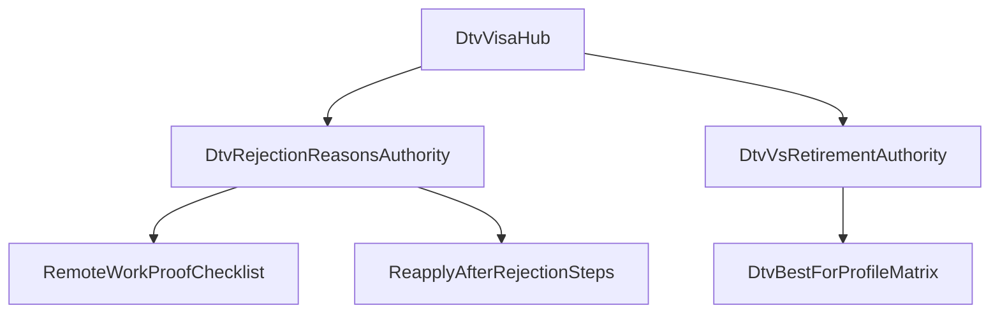
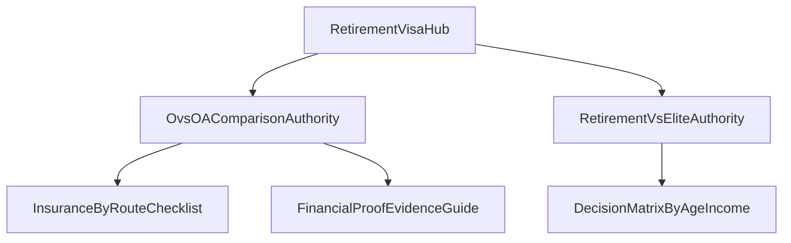
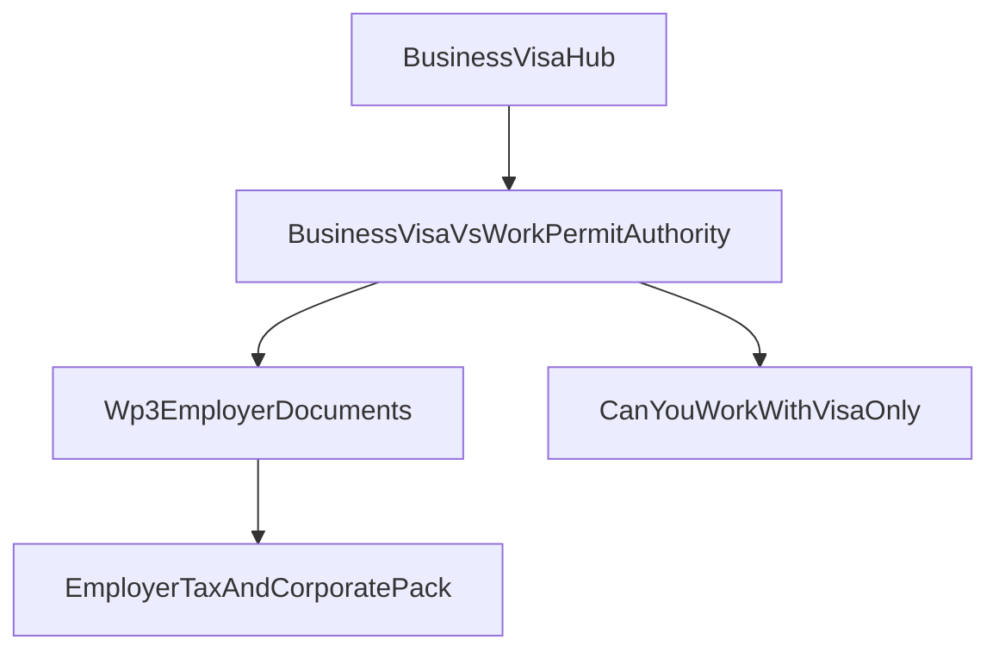
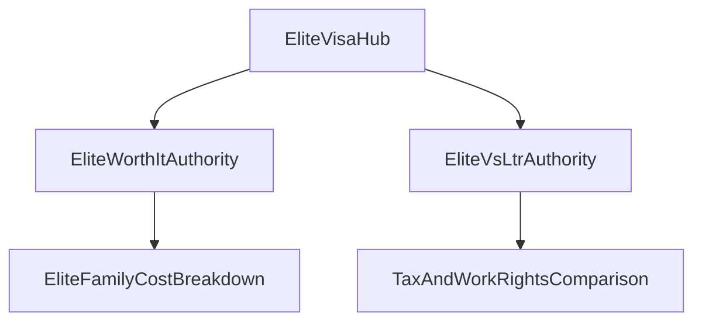
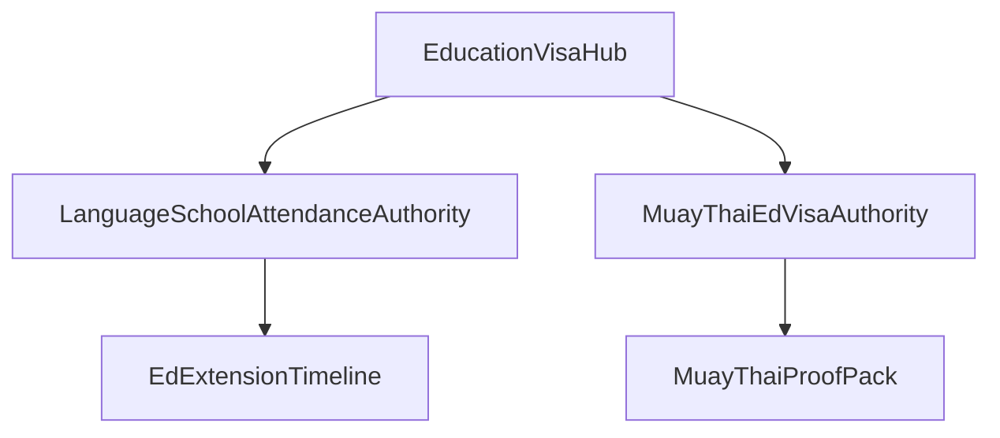
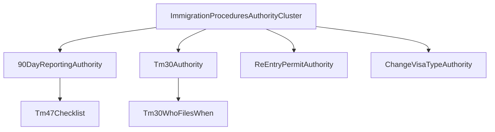

# Thailand Visa Search Intent Governance & Authority Roadmap (Phase 0A)

## Purpose
This document defines the permanent governance layer for Thailand visa content so every search intent has one canonical owner, one clear role, and one place in the topical architecture.

It extends Phase 0 discovery and converts research into an operating system for future content decisions.

## Scope And Inputs
- **In-scope intent domains:** General Thailand Visa, DTV, Retirement, Business/Work Permit, Elite/Privilege, Education, Immigration Procedures.
- **Evidence used:** Google-facing search patterns, official Thai government/consular pages, high-authority competitor patterns, AI-surfaced questions, and community Q&A phrasing (Quora; Reddit signals were limited in this collection cycle).
- **Internal ownership constraints:** Existing hubs and cluster rules in `docs/content-strategy.md`, `rules/content/content-clusters.mdc`, `rules/content/internal-linking.mdc`, and current published visa hubs in `lib/visas/content/index.ts`.

## Canonical Ownership Model

## Owner Types
- **Visa Hub:** head-term, high-commercial route intent (service + qualification + conversion).
- **Authority Guide:** high-value evaluation/comparison/complex decision intent that should rank and be cited independently while supporting a hub.
- **Supporting Guide:** procedural/edge-case/document/task intent that should strengthen a hub or authority guide without competing for the same head term.
- **Future Cluster Article:** long-tail expansion intent; valuable but lower-priority or dependent on parent authority maturity.

## One-Owner Rule
- One query family can have only one primary owner.
- If an intent overlaps a published hub, the hub remains canonical; competing authority pages are disallowed.
- New pages must prove net authority gain without weakening current hub ranking/citation potential.

## AI Authority Scoring Framework
Use this for each proposed Authority Guide.

- **Google ranking potential (0-5, weight 20%)**
- **Google AI Overview potential (0-5, weight 20%)**
- **ChatGPT citation potential (0-5, weight 15%)**
- **Claude citation potential (0-5, weight 15%)**
- **Perplexity citation potential (0-5, weight 10%)**
- **Evergreen value (0-5, weight 20%)**

**Overall Authority Opportunity Score (0-100)**  
`(GoogleRank*20 + AIO*20 + ChatGPT*15 + Claude*15 + Perplexity*10 + Evergreen*20) / 5`

Scoring principle: favor query classes that combine conversion relevance, policy durability, and structured answerability (definitions, comparisons, checklists, FAQs), not raw volume alone.

## Canonical Search Intent Ownership Registry (Phase 0A Core Set)
Representative discovered intents are assigned below. This registry is the current canonical baseline.

### General Thailand Visa
- `thailand visa requirements` -> **Visa Hub** (`/visas/*` route discovery path)  
  Reason: high-intent umbrella route selection; commercial and informational.
- `best visa for living in thailand` -> **Authority Guide** (`Thailand Visa Type Comparison`)  
  Reason: explicit evaluation intent across routes.
- `move to thailand visa options` -> **Authority Guide** (`How To Choose A Thailand Long-Stay Visa`)  
  Reason: route-selection journey intent before choosing a specific hub.
- `live in thailand legally long term` -> **Supporting Guide** (under comparison authority)  
  Reason: scenario framing, supports route comparison without replacing hub intents.

### DTV
- `dtv visa thailand requirements` -> **Visa Hub** (`/visas/dtv`)  
  Reason: canonical head-term requirement intent.
- `dtv visa thailand rejection reasons` -> **Authority Guide**  
  Reason: high-stakes decision/probability intent with strong AI citation potential.
- `dtv visa rejected what to do` -> **Supporting Guide** (under DTV rejection authority)  
  Reason: tactical post-decision workflow.
- `dtv visa remote work proof` -> **Supporting Guide**  
  Reason: document-proof sub-intent.
- `dtv visa freelancer documents` -> **Supporting Guide**  
  Reason: audience-specific document checklist.
- `dtv visa soft power documents` -> **Future Cluster Article**  
  Reason: route variant long-tail; lower initial priority.
- `dtv vs retirement visa` -> **Authority Guide**  
  Reason: high-value route comparison with dual-hub relevance.
- `dtv visa apply from thailand or abroad` -> **Supporting Guide**  
  Reason: process constraint intent.

### Retirement
- `thailand retirement visa requirements` -> **Visa Hub** (`/visas/retirement`)  
  Reason: canonical head-term.
- `retirement visa thailand o vs o-a` -> **Authority Guide**  
  Reason: core evaluation branch with high conversion implications.
- `retirement visa thailand extension` -> **Supporting Guide**  
  Reason: procedural lifecycle after route selection.
- `retirement visa insurance requirement thailand` -> **Supporting Guide**  
  Reason: route-condition sub-intent.
- `retirement visa thailand age requirement` -> **Supporting Guide**  
  Reason: eligibility check micro-intent.
- `retirement visa 800000 bank or 65000 income` -> **Supporting Guide**  
  Reason: financial proof detail, supports hub.
- `retirement visa vs elite visa` -> **Authority Guide**  
  Reason: decision-stage comparison for older affluent profiles.

### Business / Work
- `thailand business visa requirements` -> **Visa Hub** (`/visas/business`)  
  Reason: canonical head-term.
- `non-immigrant b visa thailand work permit` -> **Authority Guide**  
  Reason: structural confusion query with high commercial fit.
- `business visa vs work permit thailand` -> **Authority Guide**  
  Reason: direct comparison intent; recurring SERP/AI pattern.
- `wp3 thailand employer documents` -> **Supporting Guide**  
  Reason: process/document subset.
- `thai employer documents for non-b visa` -> **Supporting Guide**  
  Reason: pre-application packet detail.
- `can i work in thailand with non-b visa only` -> **Supporting Guide**  
  Reason: compliance clarification intent.
- `boi company non-b visa process` -> **Future Cluster Article**  
  Reason: advanced branch intent for later maturity.

### Elite / Privilege
- `thailand elite visa cost` -> **Visa Hub** (`/visas/elite`)  
  Reason: dominant commercial head term.
- `thailand elite visa worth it` -> **Authority Guide**  
  Reason: decision-stage value assessment, high conversion leverage.
- `thailand elite family cost` -> **Supporting Guide**  
  Reason: cost branch under worth-it authority.
- `elite visa vs ltr thailand` -> **Authority Guide**  
  Reason: affluent comparison intent, high AI/citation utility.
- `elite visa vs retirement visa` -> **Authority Guide**  
  Reason: adjacent route decision for age-diverse prospects.
- `thailand privilege points benefits` -> **Future Cluster Article**  
  Reason: product-detail tail intent.

### Education
- `thailand education visa requirements` -> **Visa Hub** (`/visas/education`)  
  Reason: canonical head term.
- `language school visa thailand attendance` -> **Authority Guide**  
  Reason: high-risk compliance/evaluation question.
- `muay thai education visa requirements` -> **Authority Guide**  
  Reason: distinct intent branch with unique documentation and scrutiny.
- `education visa extension thailand` -> **Supporting Guide**  
  Reason: procedural lifecycle.
- `education visa thailand rejected` -> **Supporting Guide**  
  Reason: troubleshooting branch, lower than primary authority topics.
- `ed visa language school vs university` -> **Authority Guide**  
  Reason: route-comparison selection intent.

### Immigration Procedures
- `thailand 90 day report` -> **Authority Guide**  
  Reason: durable procedural head intent with broad visa-holder relevance.
- `tm30 thailand` -> **Authority Guide**  
  Reason: standalone compliance system intent.
- `tm30 vs 90 day report` -> **Authority Guide**  
  Reason: high-confusion comparison intent.
- `re-entry permit thailand` -> **Authority Guide**  
  Reason: broad cross-hub compliance + travel risk intent.
- `visa extension thailand tm7` -> **Supporting Guide**  
  Reason: form-specific detail under procedures authorities.
- `change visa type in thailand` -> **Authority Guide**  
  Reason: high-value transition decision and risk-heavy intent.
- `thailand overstay fine ban` -> **Authority Guide**  
  Reason: urgent compliance intent with high citation demand.

## Cannibalization Governance Rules
- **Rule 1:** If query contains direct visa-type head term + requirements/cost/eligibility (`dtv requirements`, `retirement visa requirements`), owner must be the corresponding Visa Hub.
- **Rule 2:** Comparison intents (`vs`, `difference`, `which is better`) are eligible for Authority Guides, never for duplicate hubs.
- **Rule 3:** Form/process micro-intents (`TM7`, `WP3 checklist`, `extension documents`) default to Supporting Guides unless they represent broad cross-hub confusion at scale.
- **Rule 4:** Post-approval lifecycle intents (90-day, TM30, re-entry, overstay) belong in Immigration Procedures authority layer, not duplicated in each visa hub.
- **Rule 5:** Any proposed page that duplicates an existing hub or authority’s primary query family is rejected and re-scoped to supporting intent.

## Internal Linking Governance
- **Authority Guide must always link to parent hub** in first screenful or first substantive section.
- **Supporting Guide must link upward** to both parent Authority Guide and parent hub.
- **Hubs link down** to their top 2-4 authority pages plus high-frequency supporting pages.
- **Cross-links between authority guides** only when user intent naturally crosses routes (for example `DTV vs Retirement`, `Elite vs LTR`).
- **No sibling competition links** that imply alternate canonical owner for the same query family.

## Content Ecosystem Graphs

## Content Lifecycle Governance
- **Standalone forever (Authority):** `Business Visa vs Work Permit`, `O vs O-A`, `90-Day Reporting`, `TM30`, `Re-entry Permit`.
- **Expandable then stabilize:** `DTV Rejection Reasons`, `Elite Worth It`, `Muay Thai ED Visa Requirements`.
- **Likely absorbable later:** narrowly tactical supporting pages (for example `TM47 checklist`) may be merged into stronger authority pages if SERP/citation data shows consolidation benefits.
- **Retirement trigger for merge:** if two supporting pages within one intent family split impressions/citations with no incremental traffic gain for two consecutive review cycles.

## First Authority Layer (Top 10 Authority Guides)

1. **`business visa vs work permit thailand`**  
   Parent hub: `/visas/business`  
   Commercial: Very high | AI authority: Very high | Linking value: Very high  
   Why first 10: resolves the most common high-intent confusion before conversion.  
   Enables: WP3 guide, employer document pack, extension workflow.

2. **`retirement visa o vs o-a thailand`**  
   Parent hub: `/visas/retirement`  
   Commercial: Very high | AI authority: Very high | Linking value: High  
   Why first 10: core retirement decision branch with policy-sensitive requirements.  
   Enables: insurance breakdown, route-switching, extension scenarios.

3. **`dtv visa rejection reasons`**  
   Parent hub: `/visas/dtv`  
   Commercial: High | AI authority: Very high | Linking value: High  
   Why first 10: high anxiety, high assistance demand, high citation probability.  
   Enables: reapply strategy, evidence checklists, embassy-variance explainers.

4. **`dtv vs retirement visa`**  
   Parent hubs: `/visas/dtv` + `/visas/retirement` (primary owner in DTV authority layer)  
   Commercial: High | AI authority: High | Linking value: Very high  
   Why first 10: bridge comparison for 50+ remote-worker segment.  
   Enables: profile-based decision matrix, tax/day-count articles.

5. **`thailand elite visa worth it`**  
   Parent hub: `/visas/elite`  
   Commercial: Very high | AI authority: High | Linking value: High  
   Why first 10: strong decision and pricing-intent before consult booking.  
   Enables: family cost, value vs alternatives, benefit-priority use cases.

6. **`elite visa vs ltr thailand`**  
   Parent hub: `/visas/elite`  
   Commercial: High | AI authority: Very high | Linking value: High  
   Why first 10: affluent segment comparison with strong AI answer demand.  
   Enables: tax comparison, work-rights matrix, profile qualifiers.

7. **`thailand 90 day report`**  
   Parent cluster: Immigration Procedures  
   Commercial: Medium-high | AI authority: Very high | Linking value: Very high  
   Why first 10: universal post-approval compliance topic across visa routes.  
   Enables: TM47 checklist, filing methods, fines/remediation.

8. **`tm30 vs 90 day report thailand`**  
   Parent cluster: Immigration Procedures  
   Commercial: Medium-high | AI authority: Very high | Linking value: Very high  
   Why first 10: persistent confusion pair; ideal for structured answer extraction.  
   Enables: role-specific guides (tenant, landlord, hotel, agent).

9. **`muay thai education visa requirements thailand`**  
   Parent hub: `/visas/education`  
   Commercial: Medium-high | AI authority: High | Linking value: Medium-high  
   Why first 10: clear sub-market with distinct documentation/attendance behavior.  
   Enables: attendance evidence, extension workflow, rejection avoidance.

10. **`change visa type in thailand`**  
    Parent cluster: Immigration Procedures (links into all relevant hubs)  
    Commercial: High | AI authority: High | Linking value: Very high  
    Why first 10: high-risk transition intent; major opportunity for trusted guidance.  
    Enables: route-specific conversion pathways and exception handling.

## Authority Opportunity Scores (Top 10)
- Business Visa vs Work Permit: **92**
- O vs O-A Retirement: **90**
- DTV Rejection Reasons: **89**
- TM30 vs 90-Day Report: **88**
- 90-Day Reporting Guide: **87**
- Elite vs LTR: **86**
- Change Visa Type In Thailand: **85**
- DTV vs Retirement: **84**
- Elite Visa Worth It: **82**
- Muay Thai ED Visa Requirements: **78**

## Future Content Capacity Projection (50+ Supporting Guides)
Projected supporting-guide expansion unlocked by first authority layer:
- DTV authorities: 10-12 supporting guides
- Retirement authorities: 8-10 supporting guides
- Business/work authorities: 10-12 supporting guides
- Elite authorities: 6-8 supporting guides
- Education authorities: 6-8 supporting guides
- Immigration procedures authorities: 12-15 supporting guides

**Expected total capacity:** 52-65 supporting guides without primary-intent cannibalization.

## Governance Decision Checklist (Use Before Publishing Any New Page)
- Is the exact primary query already owned by a hub or authority page?
- Does the proposed page have one canonical owner only?
- Is this intent comparison-level (Authority) or procedural-level (Supporting)?
- Will this page strengthen parent hub authority through links, not compete with it?
- Does this page unlock at least 2 future supporting intents (for authority pages)?
- If overlap exists, can this be merged or re-scoped instead of publishing new?

## Maintenance Cadence
- **Quarterly ownership audit:** detect query drift and emerging overlap.
- **Policy-change trigger update:** immediate review for DTV/retirement/business procedural pages after rule changes.
- **Cannibalization watchlist:** any two pages with same query-family impressions enter consolidation review.

## Final Governance Commitment
- One search intent family, one canonical owner.
- Hubs own head terms.
- Authority guides own complex comparison/decision intents.
- Supporting guides own procedural depth.
- Future cluster articles expand coverage only after authority layers are stable.

This is the permanent governance layer for scaling Thailand Visa authority content without keyword cannibalization.
